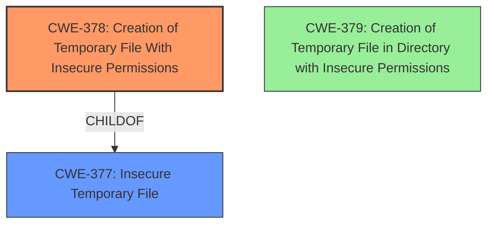

# Final Resolution for CVE-2021-25314

# Summary
| CWE ID | CWE Name | Confidence | CWE Abstraction Level | CWE Vulnerability Mapping Label | CWE-Vulnerability Mapping Notes |
|---|---|---|---|---|---|
| CWE-378 | Creation of Temporary File With Insecure Permissions | 1.0 | Base | Allowed | Primary CWE |
| CWE-276 | Installation of Files with Insecure Permissions | 0.6 | Base | Allowed | Secondary Candidate |
| CWE-379 | Creation of Temporary File in Directory with Insecure Permissions | 0.4 | Base | Allowed | Secondary Candidate |

## Evidence and Confidence

*   **Confidence Score:** 0.95
*   **Evidence Strength:** HIGH

## Relationship Analysis
The primary relationship that influenced the decision was the parent-child relationship between CWE-377 (Insecure Temporary File) and CWE-378 (**Creation of Temporary File With Insecure Permissions**). While CWE-377 is a Class, CWE-378 provides the specificity needed for this vulnerability.

Additionally, considered was the potential for CWE-379 (**Creation of Temporary File in Directory with Insecure Permissions**). While not the primary issue, the permissions of the directory where the temporary file is created can contribute to the vulnerability. This is classified as a secondary weakness.

## Vulnerability Chain
The vulnerability chain starts with the **ROOTCAUSE** of creating a temporary file with insecure permissions (**CWE-378**). This allows local attackers to read and write to the temporary file, leading to potential escalation of privileges to root.

## Summary of Analysis
The initial analysis correctly identified **CWE-378 (Creation of Temporary File With Insecure Permissions)** as the primary **WEAKNESS**. The vulnerability description states a "creation of temporary file with insecure permissions" which aligns directly with CWE-378. The CVE reference summary confirms temporary files are created with insecure permissions (0666), allowing local users to read and write them.

The criticism suggested considering **CWE-379 (Creation of Temporary File in Directory with Insecure Permissions)**. While the primary issue is the file permissions themselves, it's acknowledged that the directory permissions could exacerbate the problem. Therefore, CWE-379 is added as a secondary candidate with lower confidence.

The graph relationships influenced the selection by highlighting the parent-child relationship between CWE-377 and CWE-378, reinforcing the choice of CWE-378 for its specificity.

The selected CWEs are at the optimal level of specificity because CWE-378 directly addresses the **ROOTCAUSE** described in the vulnerability, while the secondary CWE accounts for potential contributing factors related to directory permissions.