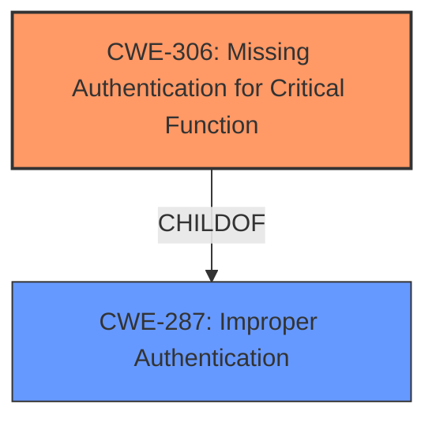

# Final Resolution for CVE-2021-25315

# Summary
| CWE ID | CWE Name | Confidence | CWE Abstraction Level | CWE Vulnerability Mapping Label | CWE-Vulnerability Mapping Notes |
|---|---|---|---|---|---|
| CWE-306 | Missing Authentication for Critical Function | 0.90 | Base | Primary | Allowed |
| CWE-287 | Improper Authentication | 0.50 | Class | Secondary | Allowed-with-Review |

## Evidence and Confidence

*   **Confidence Score:** 0.90
*   **Evidence Strength:** HIGH

## Relationship Analysis
The primary relationship considered was the parent-child relationship between CWE-287 and CWE-306. CWE-306 is a child of CWE-287, making it more specific. The vulnerability description points towards a complete bypass of authentication, making CWE-306 the more appropriate choice.

## Vulnerability Chain
The vulnerability chain starts with a patch overlap, which leads to a **missing authentication** for a critical function (**CWE-306**). The consequence is **unauthenticated** remote code execution, which allows local attackers to execute arbitrary code. This maps to **CWE-287** in a general sense.

## Summary of Analysis
The initial analysis identified **CWE-287 (Improper Authentication)** as the primary weakness and **CWE-303 (Incorrect Implementation of Authentication Algorithm)** as a possible secondary weakness. The criticism pointed out that **CWE-287** is a Class-level CWE and suggested **CWE-306 (Missing Authentication for Critical Function)** as a more specific alternative.

The vulnerability description, "CWE - CWE-287 Improper Authentication vulnerability in SUSE Linux Enterprise Server 15 SP 3 openSUSE Tumbleweed allows local attackers to execute arbitrary code via salt without the need to specify valid credentials," indicates an authentication issue. However, the phrase "without the need to specify valid credentials" strongly suggests a complete bypass of authentication rather than an incorrect implementation.

The relationship analysis shows that **CWE-306** is a child of **CWE-287**, making it a more specific and appropriate choice. The decision is primarily based on the evidence from the CVE description, which explicitly states the absence of the need for credentials. The retriever scores also support this decision. The mapping guidance for **CWE-306** allows its use, while the guidance for **CWE-287** discourages it.
**CWE-303** was removed as it was deemed speculative and not supported by the available evidence.
The selected CWEs are at the optimal level of specificity, with **CWE-306** representing the **root cause** and **CWE-287** capturing the general authentication failure.