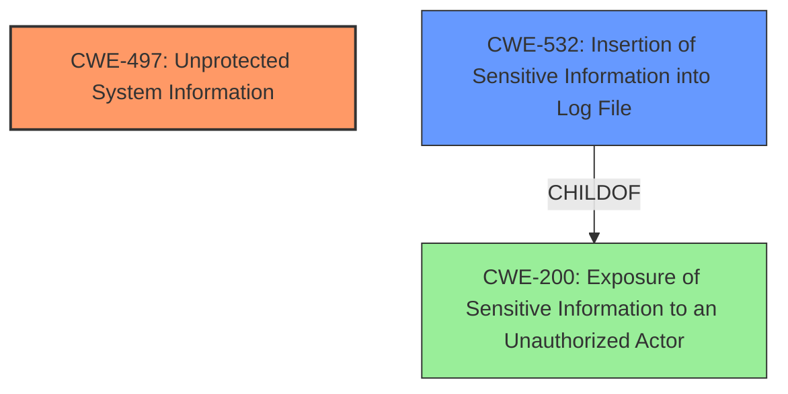

# Final Resolution for CVE-2021-25476

# Summary

| CWE ID | CWE Name | Confidence | CWE Abstraction Level | CWE Vulnerability Mapping Label | CWE-Vulnerability Mapping Notes |
|---|---|---|---|---|---|
| **CWE-497** | **Unprotected System Information** | 0.75 | Base | Allowed | Primary CWE: The vulnerability allows attackers to bypass ASLR, indicating a failure to properly protect system-level information. |
| CWE-532 | Insertion of Sensitive Information into Log File | 0.60 | Base | Allowed | Secondary Candidate: The vulnerability is within the Widevine TA **log**, suggesting that sensitive information is being written to the log file. |

## Evidence and Confidence

*   **Confidence Score:** 0.70
*   **Evidence Strength:** MEDIUM

## Relationship Analysis
The decision was influenced by the following CWE relationships:
  - CWE-497 is a base level weakness focused on exposing system level information
  - CWE-532 is a base level weakness and a child of CWE-200 that reflects a specific case of information exposure through logging.

## Vulnerability Chain
The vulnerability chain involves the following:
  - **ROOTCAUSE**: **CWE-497 Unprotected System Information**: The system fails to adequately protect sensitive system-level information, such as memory addresses needed to bypass ASLR.
  - **WEAKNESS**: **CWE-532 Insertion of Sensitive Information into Log File**: Sensitive information is written to a log file which is accessible to an attacker.
  - **IMPACT**: Attackers can bypass the ASLR protection mechanism in TEE.

## Summary of Analysis
The initial analysis correctly identified **CWE-497 Unprotected System Information** as the primary weakness. The criticism provided valuable insights, particularly the suggestion to consider **CWE-532 Insertion of Sensitive Information into Log File**.

The evidence from the vulnerability description states that it "allows attackers to bypass the ASLR protection mechanism in TEE". This indicates a failure to protect system-level information which is a core aspect of **CWE-497**. The addition of **CWE-532** is justified because the vulnerability occurs within the Widevine TA **log**, implying that sensitive information is being logged. This is a more specific scenario than simply exposing system information.

The graph relationships support the decision to prioritize **CWE-497** as it directly addresses the unprotected system information. **CWE-532** is included as a secondary candidate because it elaborates on *how* the information is being exposed (through logs). Both CWEs are at the Base level of abstraction, which is the recommended level.

The final decision is well-justified and reflects an optimal level of specificity by including both the general failure to protect system information (**CWE-497**) and the specific mechanism of exposure through logging (**CWE-532**).