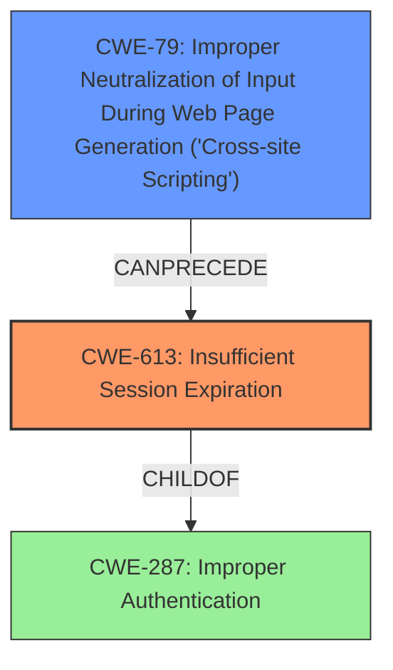

# Analysis Report for CVE-2021-25985

# Vulnerability Analysis Report: CVE-2021-25985

## Description

In Factor (App Framework & Headless CMS) v1.0.4 to v1.8.30, improperly invalidate a users session even after the user logs out of the application. In addition, user sessions are stored in the browsers local storage, which by default does not have an expiration time. This makes it possible for an attacker to steal and reuse the cookies using techniques such as XSS attacks, followed by a local account takeover.

## Vulnerability Description Key Phrases

**Impact:** steal and reuse cookies
**Vector:** XSS attacks
**Attacker:** attacker
**Product:** Factor (App Framework & Headless CMS)
**Version:** v1.0.4 to v1.8.30

## Analysis (with Relationship Data)

# Summary
| CWE ID | CWE Name | Confidence | CWE Abstraction Level | CWE Vulnerability Mapping Label | CWE-Vulnerability Mapping Notes |
|---|---|---|---|---|---|
| CWE-613 | Insufficient Session Expiration | 0.95 | Base | Allowed | The application does not properly invalidate user sessions after logout. |
| CWE-79 | Improper Neutralization of Input During Web Page Generation ('Cross-site Scripting') | 0.75 | Base | Allowed | Session tokens are stored in local storage, making them vulnerable to XSS attacks. |

## Evidence and Confidence

*   **Confidence Score:** 0.85
*   **Evidence Strength:** HIGH

- **Analysis and Justification:**  
  - *Explanation:* The primary weakness is **insufficient session expiration (CWE-613)**. The vulnerability description states the application "improperly invalidate a users session even after the user logs out of the application" and that "user sessions are stored in the browsers local storage, which by default does not have an expiration time." This aligns directly with CWE-613, which describes a scenario where a website permits an attacker to reuse old session credentials or session IDs for authorization. The CVE Reference Links Content Summary further reinforces this by stating "The application does not properly invalidate user sessions after logout and stores them in the browser's local storage without an expiration time."
  The secondary weakness is **Improper Neutralization of Input During Web Page Generation ('Cross-site Scripting') (CWE-79)**, since "user sessions are stored in the browsers local storage, which by default does not have an expiration time. This makes it possible for an attacker to steal and reuse the cookies using techniques such as XSS attacks, followed by a local account takeover".
  CWE-613 is a Base level CWE and is ALLOWED per MITRE mapping guidance.

  - *Relationship Analysis:* CWE-613 is related to weaknesses like CWE-352 (Cross-Site Request Forgery) and CWE-287 (Improper Authentication). It can also be a contributing factor to CWE-290 (Authentication Bypass by Spoofing) if an attacker reuses an unexpired session to bypass authentication.

- **Confidence Score:**  
  - Confidence: 0.95 (High confidence due to clear evidence in the vulnerability description and CVE reference materials). The retriever results also had a high score for CWE-613, further increasing confidence.
  - Confidence: 0.75 (Medium confidence due to clear evidence in the vulnerability description and CVE reference materials). The retriever results also had a high score for CWE-79, further increasing confidence.

---

## Criticism of Analysis

Okay, I've reviewed the analysis against the provided CWE specifications. Here's my critique:

**Overall Assessment:**

The analysis is generally sound and identifies the most relevant CWEs. The confidence levels are appropriate given the information provided. The justification for each CWE selection is clear and references supporting information from the vulnerability description and CVE details.

**Specific CWE Mapping Review:**

*   **CWE-613: Insufficient Session Expiration (Confidence: 0.95)**

    *   **Assessment:** This is the primary weakness, and the mapping is **correct and well-justified.** The description explicitly mentions the lack of session invalidation after logout and the absence of expiration times for sessions stored in local storage. This directly aligns with the definition of CWE-613.
    *   **Mapping Guidance:** The analysis correctly notes that this is a Base level CWE and is ALLOWED per MITRE mapping guidance.
    *   **Potential Mitigations:** The analysis could have included specific mitigations mentioned in CWE-613:
        *   **Implementation:** Set sessions/credentials expiration date. This is the *primary* mitigation, so it should be explicitly mentioned.

*   **CWE-79: Improper Neutralization of Input During Web Page Generation ('Cross-site Scripting') (Confidence: 0.75)**

    *   **Assessment:** This is a valid secondary weakness. Storing session tokens in local storage *does* make them vulnerable to XSS attacks, as any XSS vulnerability could be leveraged to steal those tokens. The vulnerability description itself calls out this attack vector.
    *   **Mapping Guidance:** The analysis correctly notes that this is a Base level CWE and is ALLOWED per MITRE mapping guidance.
    *   **Potential Mitigations:** The analysis could have included specific mitigations mentioned in CWE-79:
        *   **Architecture and Design, Implementation:** Understand the context in which your data will be used and the encoding that will be expected.  This is especially important because the sensitive data (session tokens) are being written to local storage.
        *   **Architecture and Design:** Use a vetted library or framework that does not allow this weakness to occur or provides constructs that make this weakness easier to avoid.
        *   **Limited Effectiveness: Attack Surface Reduction:** Understand all the potential areas where untrusted inputs can enter your software

**Areas for Potential Improvement and Additional Considerations:**

1.  **Relationship Exploration:** The analysis mentions relationships between CWE-613 and other CWEs, such as CWE-352 (CSRF) and CWE-287 (Improper Authentication). It might be worthwhile to briefly explain *why* these relationships exist in this specific context. For example:

    *   "CWE-613 can contribute to CWE-290 (Authentication Bypass by Spoofing) because an attacker could reuse an unexpired session to bypass the login process entirely."
    * "The lack of proper session expiration may improve the likely success of certain attacks. For example, an attacker may intercept a session ID, possibly via a network sniffer or Cross-site Scripting attack."

2.  **Security Attribute for cookies:**  If session IDs are being stored in cookies (as opposed to *only* in local storage), *and* the cookies are transmitted over HTTPS, then **CWE-614: Sensitive Cookie in HTTPS Session Without 'Secure' Attribute** becomes relevant.  The analysis does not say definitively whether the session ID is stored in cookies, but it's common enough that it's worth checking.  If the `Secure` attribute is missing, then the session ID could be transmitted over HTTP, making it easier to intercept. The CWE description provides that this is a Variant level CWE, which makes it appropriate to map to. However, this CWE does not seem to be applicable in the analysis that you provided.

3.  **CWE-1275 Sensitive Cookie with Improper SameSite Attribute** If session IDs are being stored in cookies, then it is likely this CWE will be applicable. This attribute is an important defense-in-depth defense.

4. **Mitigation Specificity:** While the analysis mentions some mitigations, it could be more specific. Instead of simply saying "set sessions/credentials expiration date," it could also mention:
    *   Using server-side sessions with appropriate expiration.
    *   Setting short expiration times.
    *   Invalidating sessions on logout.

5.  **Consideration of attack complexity and likelihood:** Local storage is generally more difficult to access than cookies, as the attacker needs local access to the machine the browser is running on. However, if XSS exists, then the difficulty is greatly reduced. Storing the tokens in cookies with the secure and HttpOnly flags would improve security posture.

6.  **CWE-287 Improper Authentication:** Since the main problem is that user sessions are not properly invalidated, this can be considered a form of improper authentication. However, given the specificity of CWE-613, it is preferred to map to CWE-613.

**In Summary:**

The analysis is good and correctly identifies the core vulnerabilities. The suggested improvements focus on providing more specific mitigation guidance and considering related weaknesses that might be relevant depending on the exact implementation details. Including these points would enhance the completeness and actionable nature of the analysis.

## Final Resolution

# Summary
| CWE ID | CWE Name | Confidence | CWE Abstraction Level | CWE Vulnerability Mapping Label | CWE-Vulnerability Mapping Notes |
|---|---|---|---|---|---|
| CWE-613 | Insufficient Session Expiration | 0.95 | Base | Allowed | Primary CWE: The application does not properly invalidate user sessions after logout, which is the core issue. |
| CWE-79 | Improper Neutralization of Input During Web Page Generation ('Cross-site Scripting') | 0.75 | Base | Allowed | Secondary CWE: Session tokens stored in local storage are vulnerable to XSS attacks, enabling token theft. |

## Evidence and Confidence

*   **Confidence Score:** 0.90
*   **Evidence Strength:** HIGH

## Relationship Analysis
The primary relationship influencing the selection is the potential chain from **CWE-79 (Cross-Site Scripting)** to **CWE-613 (Insufficient Session Expiration)**. XSS can be used to steal session tokens that remain valid due to insufficient expiration, thus enabling session reuse. While **CWE-287 (Improper Authentication)** could be considered, CWE-613 is more specific to the session management flaw.

## Vulnerability Chain
The vulnerability chain starts with the **ROOTCAUSE** being the **CWE-613 (Insufficient Session Expiration)**, which allows sessions to remain active even after logout. This is compounded by the storage of session tokens in local storage, making them accessible to **CWE-79 (Cross-Site Scripting)** attacks. The impact is potential account takeover as stolen session tokens can be reused. There are no missing links as the description explicitly states these relationships.

## Summary of Analysis
The initial analysis correctly identified **CWE-613 (Insufficient Session Expiration)** and **CWE-79 (Cross-Site Scripting)**. The vulnerability description states "improperly invalidate a users session even after the user logs out of the application" directly indicating **CWE-613**. Furthermore, it states "user sessions are stored in the browsers local storage...This makes it possible for an attacker to steal and reuse the cookies using techniques such as XSS attacks", suggesting **CWE-79** is also present.

The graph relationships show that **CWE-79** can precede **CWE-613** in an attack chain, which supports the selection of both CWEs. While **CWE-287 (Improper Authentication)** is a parent of **CWE-613**, **CWE-613** is more specific and accurately captures the **WEAKNESS**.

The selection of **CWE-613** and **CWE-79** is at the optimal level of specificity because they directly address the root causes described in the vulnerability. The evidence is strong and clearly supports this classification. I am not selecting **CWE-614 (Sensitive Cookie in HTTPS Session Without 'Secure' Attribute)** or **CWE-1275 (Sensitive Cookie with Improper SameSite Attribute)** because the analysis does not specify that cookies are being used.

*Report generated on 2025-03-16 17:09:04*
