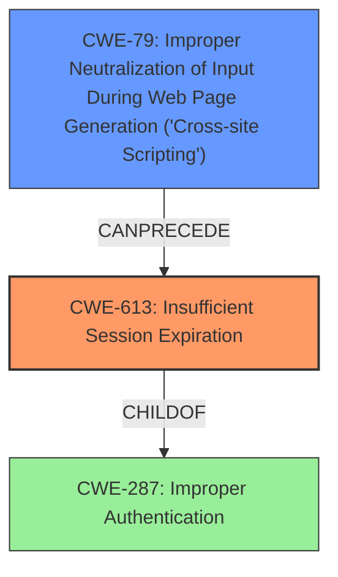

# Final Resolution for CVE-2021-25985

# Summary
| CWE ID | CWE Name | Confidence | CWE Abstraction Level | CWE Vulnerability Mapping Label | CWE-Vulnerability Mapping Notes |
|---|---|---|---|---|---|
| CWE-613 | Insufficient Session Expiration | 0.95 | Base | Allowed | Primary CWE: The application does not properly invalidate user sessions after logout, which is the core issue. |
| CWE-79 | Improper Neutralization of Input During Web Page Generation ('Cross-site Scripting') | 0.75 | Base | Allowed | Secondary CWE: Session tokens stored in local storage are vulnerable to XSS attacks, enabling token theft. |

## Evidence and Confidence

*   **Confidence Score:** 0.90
*   **Evidence Strength:** HIGH

## Relationship Analysis
The primary relationship influencing the selection is the potential chain from **CWE-79 (Cross-Site Scripting)** to **CWE-613 (Insufficient Session Expiration)**. XSS can be used to steal session tokens that remain valid due to insufficient expiration, thus enabling session reuse. While **CWE-287 (Improper Authentication)** could be considered, CWE-613 is more specific to the session management flaw.

## Vulnerability Chain
The vulnerability chain starts with the **ROOTCAUSE** being the **CWE-613 (Insufficient Session Expiration)**, which allows sessions to remain active even after logout. This is compounded by the storage of session tokens in local storage, making them accessible to **CWE-79 (Cross-Site Scripting)** attacks. The impact is potential account takeover as stolen session tokens can be reused. There are no missing links as the description explicitly states these relationships.

## Summary of Analysis
The initial analysis correctly identified **CWE-613 (Insufficient Session Expiration)** and **CWE-79 (Cross-Site Scripting)**. The vulnerability description states "improperly invalidate a users session even after the user logs out of the application" directly indicating **CWE-613**. Furthermore, it states "user sessions are stored in the browsers local storage...This makes it possible for an attacker to steal and reuse the cookies using techniques such as XSS attacks", suggesting **CWE-79** is also present.

The graph relationships show that **CWE-79** can precede **CWE-613** in an attack chain, which supports the selection of both CWEs. While **CWE-287 (Improper Authentication)** is a parent of **CWE-613**, **CWE-613** is more specific and accurately captures the **WEAKNESS**.

The selection of **CWE-613** and **CWE-79** is at the optimal level of specificity because they directly address the root causes described in the vulnerability. The evidence is strong and clearly supports this classification. I am not selecting **CWE-614 (Sensitive Cookie in HTTPS Session Without 'Secure' Attribute)** or **CWE-1275 (Sensitive Cookie with Improper SameSite Attribute)** because the analysis does not specify that cookies are being used.