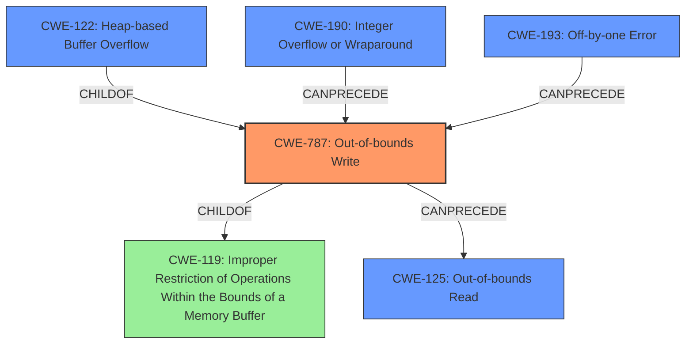

# Final Resolution for CVE-2021-26252

# Summary
| CWE ID | CWE Name | Confidence | CWE Abstraction Level | CWE Vulnerability Mapping Label | CWE-Vulnerability Mapping Notes |
|---|---|---|---|---|---|
| **CWE-787** | **Out-of-bounds Write** | 0.95 | Base | Primary | Allowed |
| **CWE-122** | **Heap-based Buffer Overflow** | 0.80 | Variant | Secondary | Allowed |
| **CWE-190** | **Integer Overflow or Wraparound** | 0.70 | Base | Secondary | Allowed - Unvalidated page number may be a large integer, causing an overflow when used to calculate buffer sizes or indices. |
| **CWE-125** | **Out-of-bounds Read** | 0.65 | Base | Secondary | Allowed - A crash can result from attempting to read from invalid memory after corruption due to the buffer overflow. |
| **CWE-193** | **Off-by-one Error** | 0.50 | Base | Secondary | Allowed - Off by one error involved in the calculation of buffer size when indexing the page number. |

## Evidence and Confidence

*   **Confidence Score:** 0.90
*   **Evidence Strength:** HIGH

## Relationship Analysis
The analysis considers the parent-child relationships, particularly how **CWE-122 (Heap-based Buffer Overflow)** is a specific type of **CWE-787 (Out-of-bounds Write)**. The inclusion of **CWE-190 (Integer Overflow or Wraparound)** suggests a vulnerability chain where an integer overflow could precede and contribute to the out-of-bounds write. **CWE-125 (Out-of-bounds Read)** is included as a potential consequence of the **out-of-bounds write**. The retriever results suggest **CWE-193 (Off-by-one Error)**.

## Vulnerability Chain
The vulnerability chain starts with a potential **CWE-190 (Integer Overflow or Wraparound)** when handling the page number. This can lead to incorrect buffer size calculation (**CWE-131**), potentially also involving **CWE-193 (Off-by-one Error)**. This leads to **CWE-787 (Out-of-bounds Write)**, specifically a **CWE-122 (Heap-based Buffer Overflow)**. As a consequence, there might be a **CWE-125 (Out-of-bounds Read)**, causing a crash and denial of service.

## Summary of Analysis
The initial analysis correctly identifies **CWE-787 (Out-of-bounds Write)** as the primary issue given the "heap buffer overflow" description. The criticism enhances the analysis by suggesting a potential vulnerability chain. The changes made to validate the page number before using it as an index, provides the evidence that **CWE-190 (Integer Overflow or Wraparound)** could be a contributing factor. The retriever results also support the inclusion of **CWE-193 (Off-by-one Error)**.

The final selection is based on the evidence of a heap buffer overflow and the relationships between the CWEs. **CWE-787** is a base CWE, and **CWE-122** is a more specific variant. **CWE-190, CWE-193, and CWE-125** are included as contributing factors or consequences. These CWEs are at the optimal level of specificity given the available information.