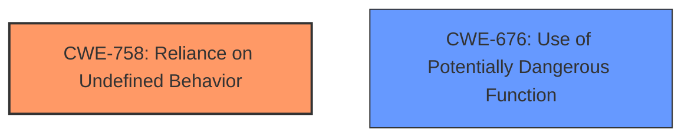

# Final Resolution for CVE-2021-26306

# Summary
| CWE ID | CWE Name | Confidence | CWE Abstraction Level | CWE Vulnerability Mapping Label | CWE-Vulnerability Mapping Notes |
|---|---|---|---|---|---|
| **CWE-758** | **Reliance on Undefined, Unspecified, or Implementation-Defined Behavior** | 0.75 | Class | Allowed-with-Review | **Primary CWE**: The vulnerability stems from the usage of `#[repr(Rust)]` structs without considering their undefined memory layout, directly leading to **reliance on undefined behavior**. While a more specific base-level CWE might exist (e.g., CWE-123), further code analysis is required to confirm whether the undefined behavior leads to controllable write-what-where conditions. |
| **CWE-676** | **Use of Potentially Dangerous Function** | 0.80 | Base | Allowed | Secondary CWE: The `native_cpuid::cpuid_count()` function's failure to validate CPU support before using the `__cpuid_count()` intrinsic exposes a dangerous function without proper safeguards, potentially leading to a crash. We considered CWE-824 but determined that the core issue is the unsafe usage of the intrinsic, not necessarily direct access to uninitialized memory as a first step. |

## Evidence and Confidence

*   **Confidence Score:** 0.80
*   **Evidence Strength:** HIGH

## Relationship Analysis
The primary CWE, **CWE-758 (Reliance on Undefined, Unspecified, or Implementation-Defined Behavior)**, is a Class-level CWE. While a more specific Base-level CWE would be preferable, **CWE-758** accurately captures the **reliance on undefined behavior** due to the use of `#[repr(Rust)]`. **CWE-676 (Use of Potentially Dangerous Function)** is related because the `native_cpuid::cpuid_count()` function's failure to validate CPU support before using the `__cpuid_count()` intrinsic exposes a dangerous function without proper safeguards. There are no direct relationships between these two CWEs, but they represent two distinct weaknesses contributing to the vulnerability.

## Vulnerability Chain
The vulnerability chain starts with the incorrect use of `#[repr(Rust)]` structs, leading to **CWE-758 (Reliance on Undefined, Unspecified, or Implementation-Defined Behavior)**. Separately, the `native_cpuid::cpuid_count()` function's failure to validate CPU support before using the `__cpuid_count()` intrinsic leads to **CWE-676 (Use of Potentially Dangerous Function)**. The combination of these two weaknesses can lead to memory corruption and denial of service.

## Summary of Analysis
The initial analysis correctly identified the main issues but needed refinement based on the CWE specifications' "Mapping Guidance". The critique suggested considering more direct Base-level CWEs.

For the first issue, the analysis correctly mapped the use of `#[repr(Rust)]` structs to **CWE-758 (Reliance on Undefined, Unspecified, or Implementation-Defined Behavior)**. The justification is that the memory layout of `#[repr(Rust)]` structs is not guaranteed. As noted in the criticism, while **CWE-758** is a Class-level CWE, a more specific Base-level CWE might be more appropriate. Specifically, **CWE-123 (Write-what-where Condition)** was suggested. While the "unsound transmute could lead to writing arbitrary data to arbitrary memory locations," the provided vulnerability description doesn't explicitly state this condition. Thus, I am keeping **CWE-758** but lowering the confidence to 0.75, acknowledging that a more specific CWE may exist with further code analysis.

For the second issue, the initial analysis mapped the `native_cpuid::cpuid_count()` function's failure to validate CPU support to **CWE-824 (Access of Uninitialized Pointer)**. While this is a potential consequence, the root cause is the unsafe usage of a potentially dangerous function without proper safeguards. Therefore, I am changing this mapping to **CWE-676 (Use of Potentially Dangerous Function)**, with a confidence of 0.80. This aligns with the critique suggestion to "Strongly consider CWE-676, CWE-703, or another more direct Base-level CWE that addresses the unsafe usage of the intrinsic." **CWE-676** is more direct and better represents the root cause. **CWE-824** would be more of a consequence than the root cause.

These decisions are based on both the vulnerability description and the relationship analysis provided in the CWE specifications. The selected CWEs are at the optimal level of specificity based on the available evidence.