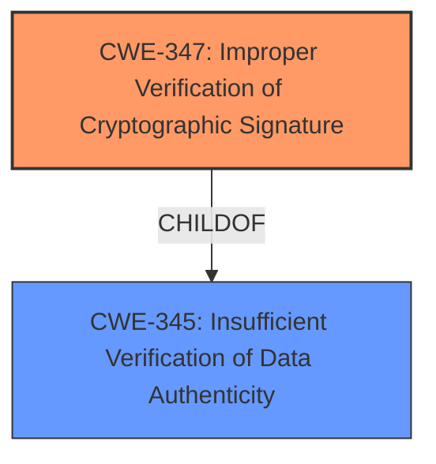

# Final Resolution for CVE-2021-26315

# Summary
| CWE ID | CWE Name | Confidence | CWE Abstraction Level | CWE Vulnerability Mapping Label | CWE-Vulnerability Mapping Notes |
|---|---|---|---|---|---|
| CWE-347 | Improper Verification of Cryptographic Signature | 0.8 | Base | Allowed | Primary CWE |
| CWE-345 | Insufficient Verification of Data Authenticity | 0.6 | Class | Allowed-with-Review | Secondary Candidate |

## Evidence and Confidence

*   **Confidence Score:** 0.8
*   **Evidence Strength:** MEDIUM

## Relationship Analysis
The primary CWE, **CWE-347 (Improper Verification of Cryptographic Signature)**, is a Base level CWE. The secondary CWE, **CWE-345 (Insufficient Verification of Data Authenticity)** is a Class level CWE and a parent of CWE-347. This relationship is important because it acknowledges that the specific issue of improper signature verification falls under a broader category of insufficient data authenticity verification. There are no chain relationships identified in the provided data.

## Vulnerability Chain
The vulnerability chain starts with the **ROOTCAUSE** of **CWE-347 (Improper Verification of Cryptographic Signature)**, leading to the acceptance of a potentially tampered firmware image. This results in arbitrary code execution within the PSP, representing the impact. The chain highlights the direct consequence of failing to properly validate the cryptographic signature. There is no missing link.

## Summary of Analysis
The initial analysis correctly identified **CWE-347 (Improper Verification of Cryptographic Signature)** as the primary **WEAKNESS**. The criticism suggested removing **CWE-252 (Improper Check for Unusual or Exceptional Conditions)** and considering **CWE-345 (Insufficient Verification of Data Authenticity)** as a secondary CWE. I agree with this assessment.

The vulnerability description states "insufficient verification of the integrity of decrypted image." This directly supports the selection of **CWE-347 (Improper Verification of Cryptographic Signature)**. The relationship between **CWE-347 (Improper Verification of Cryptographic Signature)** and **CWE-345 (Insufficient Verification of Data Authenticity)** influenced the decision to include **CWE-345 (Insufficient Verification of Data Authenticity)** as a secondary CWE, as it acknowledges the broader issue of data authenticity.

The selection of **CWE-347 (Improper Verification of Cryptographic Signature)** is at the optimal level of specificity because it directly addresses the core issue of signature verification.