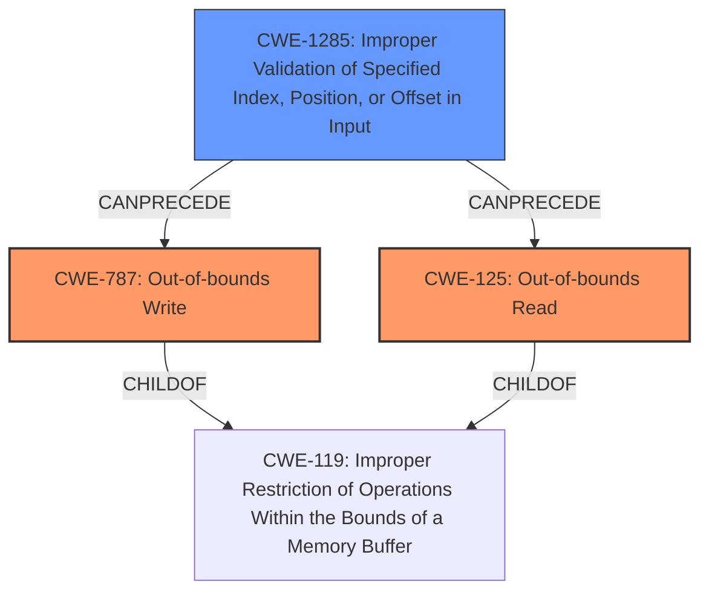

# Analysis Report for CVE-2021-26384

# Vulnerability Analysis Report: CVE-2021-26384

## Description

A malformed SMI (System Management Interface) command may allow an attacker to establish a corrupted SMI Trigger Info data structure, potentially leading to out-of-bounds memory reads and writes when triggering an SMI resulting in a potential loss of resources.

## Vulnerability Description Key Phrases

**Rootcause:** malformed SMI command
**Impact:** out-of-bounds memory reads and writes
**Vector:** SMI Trigger Info data structure
**Attacker:** attacker

## Analysis (with Relationship Data)

# Summary
| CWE ID | CWE Name | Confidence | CWE Abstraction Level | CWE Vulnerability Mapping Label | CWE-Vulnerability Mapping Notes |
|---|---|---|---|---|---|
| CWE-787 | Out-of-bounds Write | 0.9 | Base | Allowed | The vulnerability results in out-of-bounds memory writes. |
| CWE-125 | Out-of-bounds Read | 0.9 | Base | Allowed | The vulnerability results in out-of-bounds memory reads. |
| CWE-1285 | Improper Validation of Specified Index, Position, or Offset in Input | 0.7 | Base | Allowed | A **malformed SMI command** can lead to a corrupted SMI Trigger Info data structure. |

## Evidence and Confidence

*   **Confidence Score:** 0.9
*   **Evidence Strength:** HIGH

- **Analysis and Justification:**
  - *Explanation:* The vulnerability description clearly states that a **malformed SMI command** can lead to out-of-bounds memory reads and writes. **CWE-787 (Out-of-bounds Write)** is a direct match because the vulnerability results in writing data past the end of the intended buffer. **CWE-125 (Out-of-bounds Read)** is also a direct match, as the vulnerability description includes out-of-bounds memory reads. **CWE-1285 (Improper Validation of Specified Index, Position, or Offset in Input)** is included because the **root cause** is due to the **malformed SMI command** being able to corrupt the SMI Trigger Info data structure, likely due to a failure to properly validate the input.
  
  - *Relationship Analysis:* CWE-787 and CWE-125 are related to buffer overflows, which can often be caused by improper input validation. CWE-1285 is a parent of CWE-781, which deals with improper address validation in IOCTL, indicating that the vulnerability could involve issues with address handling.

- **Confidence Score:**
  - *Explanation:* Confidence: 0.9 (High evidence from the vulnerability description and CVE reference materials)

---

## Criticism of Analysis

Okay, here's a detailed review of the provided CWE analysis, considering the full CWE specifications, mapping guidance, potential mitigations, and observed examples:

**Summary of the Analysis:**

The analysis correctly identifies the main vulnerabilities: Out-of-bounds Read (CWE-125), Out-of-bounds Write (CWE-787), and Improper Validation of Specified Index, Position, or Offset in Input (CWE-1285).  The confidence levels are reasonable given the information provided in the vulnerability description.

**Detailed Review and Critique:**

| CWE ID  | CWE Name                       | Confidence | Assessment                                                                                                                                                                                                                                                                                                                                                                                       |
| :-------- | :------------------------------ | :--------- | :-------------------------------------------------------------------------------------------------------------------------------------------------------------------------------------------------------------------------------------------------------------------------------------------------------------------------------------------------------------------------------------------------- |
| CWE-787 | Out-of-bounds Write            | 0.9        | **Correct**. The vulnerability description explicitly mentions out-of-bounds memory writes.  The specification for CWE-787 aligns perfectly with this.  The high confidence level is justified.                                                                                                                                                                                                   |
| CWE-125 | Out-of-bounds Read             | 0.9        | **Correct**.  Similar to CWE-787, the description states out-of-bounds memory reads. The CWE-125 specification is a direct match. High confidence is justified.                                                                                                                                                                                                                              |
| CWE-1285 | Improper Validation of Specified Index, Position, or Offset in Input | 0.7        | **Correct, but could be improved**. The connection to a malformed SMI command causing corruption of the SMI Trigger Info data structure is sound.  However, the confidence level could be slightly increased with more justification. The description indicates that the malformed command results in an index or offset that's invalid, which is CWE-1285. |

**Specific Comments and Suggestions for Improvement:**

*   **CWE-1285 Justification:** While the inclusion of CWE-1285 is valid, the description of the vulnerability points to the need for more specific input validation failures that could trigger this problem. The 'SMI Trigger Info data structure' can become corrupted if the malformed command provides invalid offsets, indices, or positions. I would like to see that included in the description.
*   **Consider CWE-781 (Improper Address Validation in IOCTL with METHOD_NEITHER I/O Control Code):** Since the malformed SMI command can affect the SMI Trigger Info data structure, it is possible that the addresses that are provided are not validated or incorrectly validated, leading to vulnerabilities related to incorrect memory addressing. This CWE can be used as a variant for CWE-1285, but is only applicable if the IOCTL uses METHOD_NEITHER for I/O.
*   **High-Level CWE-20:** The analysis avoids the discouraged CWE-20 (Improper Input Validation) by directly mapping to CWE-1285. This is a good practice.  The mapping guidance for CWE-20 strongly discourages its use and recommends more specific children like CWE-1285.

**Mitigation Considerations:**

The analysis doesn't explicitly discuss mitigations, but it's crucial to consider them when providing a CWE mapping. Here's how the CWE specifications can inform mitigation strategies:

*   **CWE-787 & CWE-125 Mitigations:**
    *   **Language Selection:** Languages with automatic memory management (Java, C#, Perl) are beneficial to avoid buffer overflows, but may still be vulnerable to external or native code.
    *   **Libraries/Frameworks:** Safe string handling libraries (SafeStr, Strsafe.h) can prevent overflows during string manipulation.
    *   **Compiler/Environment Hardening:**  Using compiler flags like `/GS` (Microsoft Visual Studio) or `FORTIFY_SOURCE` (GCC) provides runtime buffer overflow detection.

*   **CWE-1285 Mitigations:**
    *   **Input Validation:**  Adopt a strict "accept known good" input validation strategy. Validate lengths, types, acceptable value ranges, and adherence to business rules.
    *   **Frameworks:** Using input validation frameworks such as Struts or the OWASP ESAPI Validation API.

**Review of Retriever Results:**

The retriever results included several interesting options.

*   **CWE-476 (NULL Pointer Dereference):** While not the primary vulnerability, it is plausible that the corrupted SMI Trigger Info data structure could lead to NULL pointer dereferences when the SMI is triggered. This would depend on how the structure is used after corruption.
*   **CWE-770 (Allocation of Resources Without Limits or Throttling):**  Less directly related, but a poorly formed SMI command *could* potentially trigger excessive resource allocation as a side effect. This is a much weaker possibility than the out-of-bounds read/write and improper validation issues.

**Overall Conclusion:**

The analysis is generally sound. The mapping to CWE-787 and CWE-125 are definite and well-justified. The mapping to CWE-1285 is valid, but the justification could be strengthened. The confidence levels are appropriate. The analysis would benefit from a discussion of potential mitigation strategies based on the CWE specifications. Also, consider CWE-781 to see if it fits the given vulnerability.

## Final Resolution

# Summary
| CWE ID | CWE Name | Confidence | CWE Abstraction Level | CWE Vulnerability Mapping Label | CWE-Vulnerability Mapping Notes |
|---|---|---|---|---|---|
| CWE-787 | **CWE-787: Out-of-bounds Write** | 0.9 | Base | Allowed | Primary CWE. The vulnerability results in out-of-bounds memory writes. |
| CWE-125 | **CWE-125: Out-of-bounds Read** | 0.9 | Base | Allowed | Primary CWE. The vulnerability results in out-of-bounds memory reads. |
| CWE-1285 | **CWE-1285: Improper Validation of Specified Index, Position, or Offset in Input** | 0.8 | Base | Allowed | Secondary candidate. A **malformed SMI command** can lead to a corrupted SMI Trigger Info data structure due to missing or improper input validation. |

## Evidence and Confidence

*   **Confidence Score:** 0.9
*   **Evidence Strength:** HIGH

## Relationship Analysis
The primary relationship is that **CWE-1285 (Improper Validation of Specified Index, Position, or Offset in Input)** can lead to **CWE-787 (Out-of-bounds Write)** and **CWE-125 (Out-of-bounds Read)**. The **malformed SMI command** is not properly validated, resulting in the ability to write or read past the buffer.

## Vulnerability Chain
The vulnerability chain starts with a **malformed SMI command** that is not properly validated (**CWE-1285**). This leads to a corrupted SMI Trigger Info data structure. When the SMI is triggered, this corrupted data structure results in out-of-bounds memory reads (**CWE-125**) and writes (**CWE-787**), potentially leading to a loss of resources.

## Summary of Analysis
The initial analysis correctly identified **CWE-787 (Out-of-bounds Write)** and **CWE-125 (Out-of-bounds Read)** as the primary issues based on the vulnerability description: "A **malformed SMI (System Management Interface) command** may allow an attacker to establish a corrupted SMI Trigger Info data structure, potentially leading to out-of-bounds memory reads and writes when triggering an SMI resulting in a potential loss of resources." The inclusion of **CWE-1285 (Improper Validation of Specified Index, Position, or Offset in Input)** is also accurate because the **root cause** stems from the **malformed SMI command** not being validated, allowing the corruption of the SMI Trigger Info data structure.

The suggestion to consider **CWE-781 (Improper Address Validation in IOCTL with METHOD_NEITHER I/O Control Code)** is reasonable, but without more information about the specific IOCTL usage (specifically, whether it uses METHOD_NEITHER), it cannot be definitively included.

The decision to avoid **CWE-20 (Improper Input Validation)** is correct, as **CWE-1285** provides a more specific description of the input validation issue.

The final selection of CWEs is at the optimal level of specificity based on the provided evidence. **CWE-787** and **CWE-125** directly describe the out-of-bounds read and write conditions, while **CWE-1285** captures the **root cause** related to the improper validation of the SMI command. The confidence score remains high at 0.9 due to the clear statements in the vulnerability description directly matching the CWE definitions. The justification for **CWE-1285** has been strengthened and the confidence increased to 0.8.

*Report generated on 2025-03-17 23:30:00*
