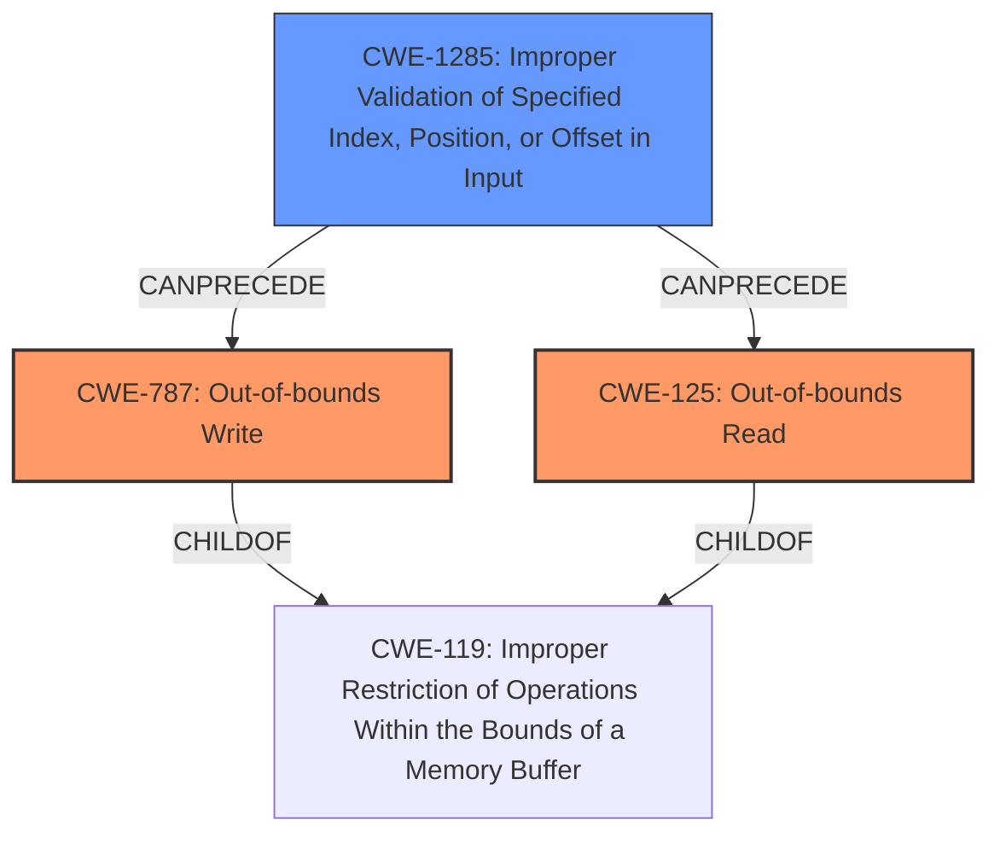

# Final Resolution for CVE-2021-26384

# Summary
| CWE ID | CWE Name | Confidence | CWE Abstraction Level | CWE Vulnerability Mapping Label | CWE-Vulnerability Mapping Notes |
|---|---|---|---|---|---|
| CWE-787 | **CWE-787: Out-of-bounds Write** | 0.9 | Base | Allowed | Primary CWE. The vulnerability results in out-of-bounds memory writes. |
| CWE-125 | **CWE-125: Out-of-bounds Read** | 0.9 | Base | Allowed | Primary CWE. The vulnerability results in out-of-bounds memory reads. |
| CWE-1285 | **CWE-1285: Improper Validation of Specified Index, Position, or Offset in Input** | 0.8 | Base | Allowed | Secondary candidate. A **malformed SMI command** can lead to a corrupted SMI Trigger Info data structure due to missing or improper input validation. |

## Evidence and Confidence

*   **Confidence Score:** 0.9
*   **Evidence Strength:** HIGH

## Relationship Analysis
The primary relationship is that **CWE-1285 (Improper Validation of Specified Index, Position, or Offset in Input)** can lead to **CWE-787 (Out-of-bounds Write)** and **CWE-125 (Out-of-bounds Read)**. The **malformed SMI command** is not properly validated, resulting in the ability to write or read past the buffer.

## Vulnerability Chain
The vulnerability chain starts with a **malformed SMI command** that is not properly validated (**CWE-1285**). This leads to a corrupted SMI Trigger Info data structure. When the SMI is triggered, this corrupted data structure results in out-of-bounds memory reads (**CWE-125**) and writes (**CWE-787**), potentially leading to a loss of resources.

## Summary of Analysis
The initial analysis correctly identified **CWE-787 (Out-of-bounds Write)** and **CWE-125 (Out-of-bounds Read)** as the primary issues based on the vulnerability description: "A **malformed SMI (System Management Interface) command** may allow an attacker to establish a corrupted SMI Trigger Info data structure, potentially leading to out-of-bounds memory reads and writes when triggering an SMI resulting in a potential loss of resources." The inclusion of **CWE-1285 (Improper Validation of Specified Index, Position, or Offset in Input)** is also accurate because the **root cause** stems from the **malformed SMI command** not being validated, allowing the corruption of the SMI Trigger Info data structure.

The suggestion to consider **CWE-781 (Improper Address Validation in IOCTL with METHOD_NEITHER I/O Control Code)** is reasonable, but without more information about the specific IOCTL usage (specifically, whether it uses METHOD_NEITHER), it cannot be definitively included.

The decision to avoid **CWE-20 (Improper Input Validation)** is correct, as **CWE-1285** provides a more specific description of the input validation issue.

The final selection of CWEs is at the optimal level of specificity based on the provided evidence. **CWE-787** and **CWE-125** directly describe the out-of-bounds read and write conditions, while **CWE-1285** captures the **root cause** related to the improper validation of the SMI command. The confidence score remains high at 0.9 due to the clear statements in the vulnerability description directly matching the CWE definitions. The justification for **CWE-1285** has been strengthened and the confidence increased to 0.8.