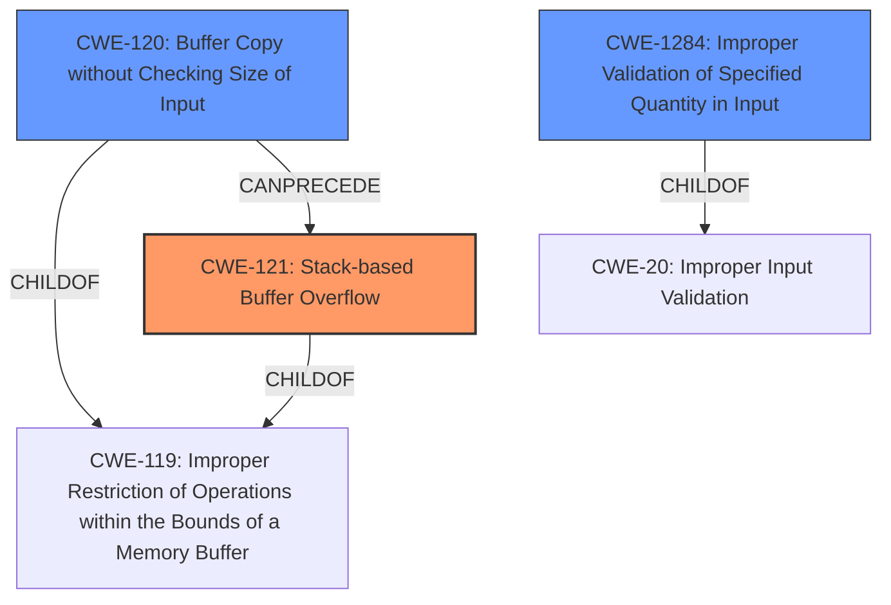

# Analysis Report for CVE-2021-26567

# Vulnerability Analysis Report: CVE-2021-26567

## Description

Stack-based buffer overflow vulnerability in frontend/main.c in faad2 before 2.2.7.1 allow local attackers to execute arbitrary code via filename and pathname options.

## Vulnerability Description Key Phrases

**Rootcause:** stack-based buffer overflow
**Impact:** execute arbitrary code
**Vector:** filename and pathname options
**Attacker:** local attackers
**Product:** faad2
**Version:** before 2.2.7.1
**Component:** frontend/main.c

## Analysis (with Relationship Data)

# Summary
| CWE ID | CWE Name | Confidence | CWE Abstraction Level | CWE Vulnerability Mapping Label | CWE-Vulnerability Mapping Notes |
|---|---|---|---|---|---|
| CWE-121 | Stack-based Buffer Overflow | 1.0 | Variant | Primary | Allowed |
| CWE-120 | Buffer Copy without Checking Size of Input ('Classic Buffer Overflow') | 0.6 | Base | Secondary | Allowed-with-Review |

## Evidence and Confidence

*   **Confidence Score:** 0.9
*   **Evidence Strength:** HIGH

- **Analysis and Justification:**  
  - *Explanation:* "The vulnerability description explicitly states a **stack-based buffer overflow**, making CWE-121 (Stack-based Buffer Overflow) the most accurate primary mapping. The description also states `frontend/main.c in faad2 before 2.2.7.1 allow local attackers to execute arbitrary code via filename and pathname options` indicating that an attacker can execute arbitrary code. The **rootcause** is a **stack-based buffer overflow**. This aligns with the CWE's characteristics, which involve writing data beyond the allocated buffer on the stack. This allows attackers to overwrite adjacent memory locations, potentially leading to arbitrary code execution. CWE-121 is a variant of CWE-119 (Improper Restriction of Operations within the Bounds of a Memory Buffer), which is a broader class. MITRE mapping guidance allows CWE-121 for stack-based buffer overflows."
  
  - *Relationship Analysis:* "CWE-121 is a variant of CWE-119 (Improper Restriction of Operations within the Bounds of a Memory Buffer). The vulnerability description and reference links content summary clearly points to a stack-based buffer overflow."

- **Confidence Score:**  
  - *Example:* Confidence: 1.0 (Direct evidence from vulnerability description and CVE reference materials)

---
- **Analysis and Justification:**  
  - *Explanation:* "CWE-120 (Buffer Copy without Checking Size of Input ('Classic Buffer Overflow')) is a possible secondary CWE because the vulnerability involves a buffer overflow due to potentially unbounded copy operations when handling filename and pathname options. The vulnerability description details that the **stack-based buffer overflow** is caused due to `filename and pathname options`. The lack of input validation can lead to a classic buffer overflow situation. However, CWE-121 is more specific because it explicitly defines the location of the buffer as on the stack. MITRE mapping guidance for CWE-120 is ALLOWED-with-Review and states that it's only appropriate for "Buffer Copy" operations, in which where there is no "Checking [the] Size of Input", and (by implication of the copy) writing past the end of the buffer."
  
  - *Relationship Analysis:* "CWE-120 is a child of CWE-119 (Improper Restriction of Operations within the Bounds of a Memory Buffer). CWE-120 can precede CWE-123 (Write-what-where Condition) since a buffer overflow can be used to overwrite arbitrary memory locations. It can also follow CWE-416 (Use After Free) or CWE-231 (Relative Path Traversal) if these actions create the condition for the buffer overflow. Since the description mentions stack, CWE-121 is more precise."

- **Confidence Score:**  
  - *Example:* Confidence: 0.6 (Supporting evidence from buffer overflow details, but CWE-121 is a more precise classification)

## Criticism of Analysis

Okay, let's review the provided CWE analysis for the faad2 stack-based buffer overflow vulnerability (CVE-2021-26567), considering the full CWE specifications.

**Overall Assessment**

The primary mapping of CWE-121 (Stack-based Buffer Overflow) is correct and well-justified. The secondary mapping of CWE-120 (Buffer Copy without Checking Size of Input) has some merit, however the justification could be clearer.

**Detailed Critique**

**1. CWE-121: Stack-based Buffer Overflow (Primary)**

*   **Overall Confidence:**  Excellent. This is the most appropriate primary CWE mapping.
*   **Justification:** The analysis correctly points out that the vulnerability description explicitly mentions a "stack-based buffer overflow." This aligns directly with the definition of CWE-121. The explanation is clear and concise, linking the vulnerability to the characteristics described in the CWE definition: writing beyond the allocated buffer on the stack and potentially achieving arbitrary code execution.
*   **Evidence Strength:** HIGH is accurate. The vulnerability description and the CVE references strongly support this classification.
*   **Relationship Analysis:** The analysis correctly positions CWE-121 as a Variant of the broader CWE-119 (Improper Restriction of Operations within the Bounds of a Memory Buffer). This is a standard relationship within the CWE hierarchy, and it's good that the analysis acknowledges it.
*   **Mapping Guidance:** The CWE specifications state that CWE-121 usage is "Allowed" which aligns perfectly with the suggested analysis.
*   **Mitigations:** The analysis would be strengthened by a brief mention of potential mitigations.  For example:  "Mitigations for CWE-121 include using compiler options like /GS (Microsoft Visual Studio) or FORTIFY_SOURCE (GCC) for stack protection, employing safer string handling functions, or using languages with built-in memory management."

**2. CWE-120: Buffer Copy without Checking Size of Input ('Classic Buffer Overflow') (Secondary)**

*   **Overall Confidence:**  Moderate. While not incorrect, the connection to CWE-120 could be stronger and more specific in its justification.
*   **Justification:** The analysis correctly identifies that a buffer overflow, due to unbounded copy operations related to filename and pathname options, is possible. However, it doesn't delve deeply enough into _why_ there's a lack of input size checking in the *copy* operation.  The analysis mentions `filename and pathname options` as causing the overflow, which implies a *copy* of these values into a buffer on the stack.
*   **Relationship Analysis:** The analysis of relationships is valid, but could be more focused.
    *   The analysis states that `CWE-120 can precede CWE-123 (Write-what-where Condition) since a buffer overflow can be used to overwrite arbitrary memory locations. It can also follow CWE-416 (Use After Free) or CWE-231 (Relative Path Traversal) if these actions create the condition for the buffer overflow.` this is technically accurate, but perhaps not as relevant or high-impact as other possible relationships in this specific case.
*   **Mapping Guidance:** CWE-120 is marked as "Allowed-with-Review". The analysis does show that there is a copy operation without checking the size of the input. The specification for CWE-120 states to `If there is any input validation, consider children of CWE-20 such as CWE-1284`.  A better analysis would consider input validation failures.
*   **Mitigations:** A stronger analysis would relate to potential mitigations for CWE-120. For example: "Potential mitigations include using safer buffer copy functions like `strncpy` or `strlcpy` that enforce size limits, or utilizing dynamic memory allocation with appropriate size checks before copying the data."

**Improvements and Alternatives**

1.  **Input Validation Focus:** Since the issue stems from handling filename and pathname options, consider including CWE-1284: Improper Validation of Specified Quantity in Input as a possible supplementary CWE. If the code does allocate space with `malloc` based on the *specified* size of the filename, but fails to validate the actual length *before the copy*, then CWE-1284 is an excellent addition. This would strengthen the analysis, and adhere to the mapping guidance for CWE-120.
2.  **Clarify the Copy Operation:** The analysis should explicitly state or assume the vulnerable code is copying the filename/pathname into a stack buffer. It would help if the code diff mentioned that the filename buffers are dynamically allocated using malloc, but there is no input validation prior to the buffer copy operation.
3.  **Strengthen Mitigations:** As mentioned in the detailed critique, explicitly linking potential mitigations for each CWE would improve the analysis.

**Revised Summary Table (with suggested addition):**

| CWE ID  | CWE Name                                                                 | Confidence | CWE Abstraction Level | CWE Vulnerability Mapping Label | CWE-Vulnerability Mapping Notes |
| :------ | :----------------------------------------------------------------------- | :--------- | :-------------------- | :------------------------------ | :------------------------------ |
| CWE-121 | Stack-based Buffer Overflow                                                  | 1.0        | Variant               | Primary                         | Allowed                       |
| CWE-120 | Buffer Copy without Checking Size of Input ('Classic Buffer Overflow') | 0.6        | Base                  | Secondary                       | Allowed-with-Review           |
| CWE-1284 | Improper Validation of Specified Quantity in Input                       | 0.4        | Base                  | Supporting                      | Allowed                       |

**Conclusion**

The analysis is largely accurate, particularly regarding the primary mapping to CWE-121. Strengthening the justification for the secondary mapping (CWE-120) and considering related weaknesses like CWE-1284, would improve the overall assessment. Adding mention of specific mitigations tied to each CWE makes the analysis more actionable.

## Final Resolution

# Summary
| CWE ID | CWE Name | Confidence | CWE Abstraction Level | CWE Vulnerability Mapping Label | CWE-Vulnerability Mapping Notes |
|---|---|---|---|---|---|
| CWE-121 | Stack-based Buffer Overflow | 1.0 | Variant | Primary | Allowed |
| CWE-120 | Buffer Copy without Checking Size of Input ('Classic Buffer Overflow') | 0.7 | Base | Secondary | Allowed-with-Review |
| CWE-1284 | Improper Validation of Specified Quantity in Input | 0.5 | Base | Supporting | Allowed |

  - The Primary CWE should be first and noted as the Primary CWEs
  - The secondary candidate CWEs should be next and noted as secondary candidates.
  - The confidence is a confidence score 0 to 1 to rate your confidence in your assessment for that CWE.
  - The CWE Abstraction Level as one of these values: Base, Variant, Pillar, Class, Compound
  - The Mapping Notes Usage as one of these values: Allowed, Allowed-with-Review, Prohibited, Discouraged

## Evidence and Confidence

*   **Confidence Score:** 0.9
*   **Evidence Strength:** MEDIUM

## Relationship Analysis
The primary CWE, CWE-121, is a variant of CWE-119, providing a more specific classification. CWE-120, as a base CWE, represents the classic buffer overflow scenario but is less specific than CWE-121 in this context. CWE-1284 highlights the lack of input validation that often leads to buffer overflows.

## Vulnerability Chain
The vulnerability chain starts with the lack of input validation (**CWE-1284**), leading to a buffer copy operation without proper size checks (**CWE-120**). This results in a stack-based buffer overflow (**CWE-121**), allowing attackers to potentially execute arbitrary code.

## Summary of Analysis
The initial analysis correctly identified **CWE-121 (Stack-based Buffer Overflow)** as the primary weakness, supported by the vulnerability description mentioning a "stack-based buffer overflow." The inclusion of **CWE-120 (Buffer Copy without Checking Size of Input ('Classic Buffer Overflow'))** is also reasonable, as the overflow likely occurs during a buffer copy operation.

The criticism suggests considering **CWE-1284 (Improper Validation of Specified Quantity in Input)**, which is a valuable addition. The filename and pathname options, if not properly validated for length, can lead to the buffer overflow. This highlights that the **ROOTCAUSE** isn't just the buffer copy but also the insufficient input validation.

The graph relationships support the selection of **CWE-121** as the most specific classification, being a variant of **CWE-119 (Improper Restriction of Operations within the Bounds of a Memory Buffer)**. The chain relationship shows how **CWE-1284** can lead to **CWE-120**, which in turn can lead to **CWE-121**.

The final decision is to include **CWE-1284** as a supporting CWE to represent the initial lack of input validation. This provides a more complete picture of the vulnerability's **ROOTCAUSE** and its progression. The confidence score for **CWE-120** has been raised slightly to 0.7, reflecting the better understanding of the copy operation involved, and the confidence score for **CWE-1284** is set to 0.5.

The selected CWEs are at the optimal level of specificity. **CWE-121** is a variant that directly matches the stack-based nature of the overflow. **CWE-120** is a base CWE that explains the overflow due to unchecked buffer copying. **CWE-1284** is a base CWE that describes the lack of input validation.

*Report generated on 2025-03-17 23:31:52*
