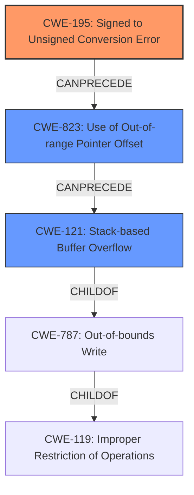

# Final Resolution for CVE-2021-26635

# Summary
| CWE ID | CWE Name | Confidence | CWE Abstraction Level | CWE Vulnerability Mapping Label | CWE-Vulnerability Mapping Notes |
|---|---|---|---|---|---|
| CWE-195 | Signed to Unsigned Conversion Error | 0.85 | Variant | Allowed | Primary CWE |
| CWE-823 | Use of Out-of-range Pointer Offset | 0.80 | Base | Allowed | Secondary Candidate CWE |
| CWE-121 | Stack-based Buffer Overflow | 0.90 | Variant | Allowed | Secondary Candidate CWE |

## Evidence and Confidence

*   **Confidence Score:** 0.85
*   **Evidence Strength:** MEDIUM

## Relationship Analysis
The primary relationship identified is a chain: CWE-195 (Signed to Unsigned Conversion Error) can lead to CWE-823 (Use of Out-of-range Pointer Offset), which in turn leads to CWE-121 (Stack-based Buffer Overflow). This chain accurately reflects how an incorrect type conversion can result in an invalid memory access, ultimately causing a buffer overflow on the stack. CWE-121 is a child of CWE-787 (Out-of-bounds Write), further solidifying its role as the final impact in the chain. The abstraction levels are appropriate, with CWE-195 and CWE-823 at the Base level and CWE-121 at the Variant level, providing suitable specificity.

## Vulnerability Chain
The vulnerability chain starts with an **incorrect data type usage**, specifically a signed integer being treated as unsigned (**ROOTCAUSE**: **CWE-195**). This leads to an out-of-range pointer offset (**WEAKNESS**: **CWE-823**), which results in a stack-based buffer overflow (**WEAKNESS**: **CWE-121**). The final impact is potential remote code execution.

## Summary of Analysis
The initial analysis correctly identified CWE-121 as the primary impact. However, it stopped short of fully identifying the **ROOTCAUSE**. The criticism correctly pointed out the need to investigate integer handling and consider alternatives like CWE-190, CWE-195, and CWE-131. Based on the vulnerability description mentioning "manipulating the offset read from the target file due to the wrong use of the data type," I have concluded that **CWE-195 (Signed to Unsigned Conversion Error)** is the most likely **ROOTCAUSE**, preceding the offset manipulation. This leads to CWE-823 (Use of Out-of-range Pointer Offset), which then causes the CWE-121 (Stack-based Buffer Overflow). This chain provides a more complete and accurate representation of the vulnerability.

The decision to prioritize CWE-195 is based on the following evidence:

1.  The vulnerability description explicitly mentions "the wrong use of the data type" and "manipulate the offset read from the target file."
2.  The criticism suggested investigating integer handling and specifically mentioned CWE-195 as a possibility.
3.  CWE-195's description directly aligns with the scenario where a signed integer is incorrectly interpreted as unsigned, leading to unexpected offset values.
4.  CWE-823 (Use of Out-of-range Pointer Offset) naturally follows CWE-195, as the incorrect conversion results in an invalid memory address.
5.  CWE-121 (Stack-based Buffer Overflow) is the direct consequence of using an out-of-range pointer offset to write data onto the stack.

Therefore, the selected CWEs are at the optimal level of specificity, providing a clear and well-justified classification of the vulnerability.