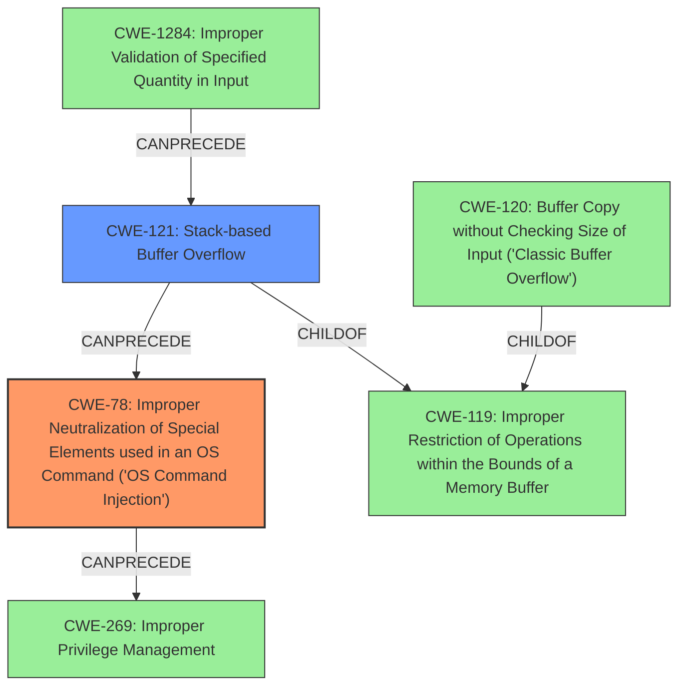

# Final Resolution for CVE-2021-26727

# Summary
| CWE ID | CWE Name | Confidence | CWE Abstraction Level | CWE Vulnerability Mapping Label | CWE-Vulnerability Mapping Notes |
|---|---|---|---|---|---|
| CWE-78 | Improper Neutralization of Special Elements used in an OS Command ('OS Command Injection') | 0.95 | Base | Allowed | Primary CWE: The vulnerability description clearly states command injection as a root cause. Mitigation: Use parameterized commands, input validation (allowlist), or avoid external processes. CanPrecede CWE-269 |
| CWE-121 | Stack-based Buffer Overflow | 0.95 | Variant | Allowed | Secondary Candidate: The vulnerability description clearly states stack-based buffer overflow as a root cause. Mitigation: Use compiler-based overflow protection, bounds checking, or safer string handling functions. While CWE-120 is related, CWE-121 is more specific to the stack. Can lead to CWE-78. |

## Evidence and Confidence

*   **Confidence Score:** 0.95
*   **Evidence Strength:** HIGH

## Relationship Analysis
The initial analysis correctly identified CWE-78 and CWE-121 as the primary and secondary candidates, respectively.
- Parent-child hierarchical relationships: CWE-121 is a variant of CWE-119. This relationship helps to refine the classification by specifying that the buffer overflow occurs on the stack.
- Chain relationships showing progression of vulnerability: The analysis notes that CWE-78 CanPrecede CWE-269, and CWE-121 can lead to CWE-78. It may be more accurate to say that if input is not validated for length, this directly leads to CWE-121. Then, the buffer overflow could overwrite the memory location of the program to inject OS commands (CWE-78).
- Peer relationships that offered alternative classifications: The criticism considered CWE-120 as an alternative to CWE-121 but correctly favored CWE-121 due to its greater specificity.
- How abstraction levels influenced your selection: The choice of base and variant level CWEs (CWE-78 and CWE-121) ensures that the classification is at an appropriate level of granularity, avoiding overly abstract or vague CWEs.

## Vulnerability Chain
The vulnerability chain starts with:
1.  **CWE-1284: Improper Validation of Specified Quantity in Input** (Missing Link - Suggested by critic but not explicitly in description)
2.  **CWE-121: Stack-based Buffer Overflow** - The program copies an externally controlled string into a fixed-size buffer on the stack without proper length validation.
3.  **CWE-78: Improper Neutralization of Special Elements used in an OS Command ('OS Command Injection')** - The buffer overflow overwrites memory locations, potentially injecting OS commands.
4.  **CWE-269: Improper Privilege Management** - The injected commands are executed with root privileges, leading to complete system compromise.

## Summary of Analysis
The initial analysis, along with the criticism, provides a strong basis for the final CWE selection. The vulnerability description explicitly mentions both command injection and stack-based buffer overflow, which directly correspond to CWE-78 and CWE-121, respectively. The CVE Reference Links Content Summary supports these classifications by detailing the lack of sanitization in the `safe_system` function and the uncontrolled string copy into a fixed-size buffer.

The graph relationships influenced the final selection by highlighting the hierarchical relationship between CWE-121 and CWE-119, reinforcing the specificity of the stack-based buffer overflow. The chain relationships emphasize the potential progression from buffer overflow to command injection and subsequent privilege escalation. The analysis also considered and justified the exclusion of alternative CWEs like CWE-120, further solidifying the chosen classifications.

The selected CWEs are at the optimal level of specificity, as they directly address the root causes described in the vulnerability. CWE-78 accurately captures the command injection aspect, while CWE-121 precisely identifies the stack-based nature of the buffer overflow. The analysis is heavily based on the provided evidence, particularly the vulnerability description and the CVE reference summary.
The high confidence is justified by the explicit mention of the vulnerabilities and the supporting evidence.