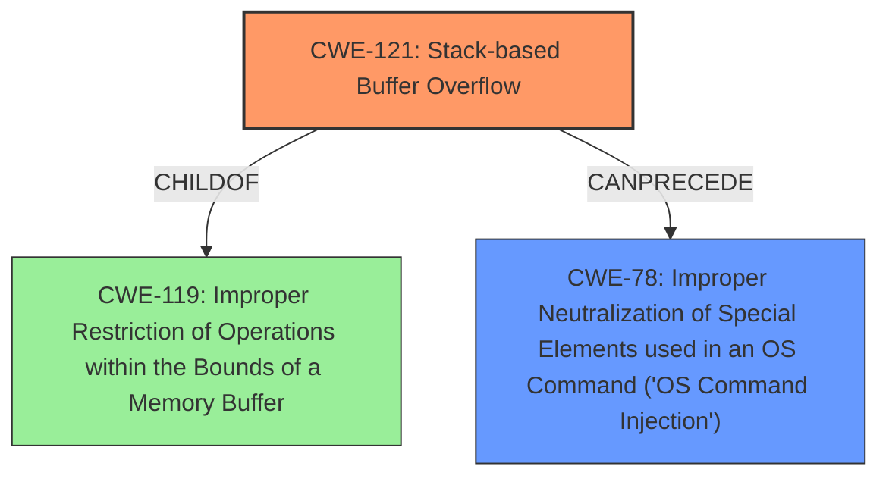

# Analysis Report for CVE-2021-26728

# Vulnerability Analysis Report: CVE-2021-26728

## Description

Command injection and stack-based buffer overflow vulnerabilities in the KillDupUsr_func function of spx_restservice allow an attacker to execute arbitrary code with the same privileges as the server user (root). This issue affects Lanner Inc IAC-AST2500A standard firmware version 1.10.0.

## Vulnerability Description Key Phrases

**Weakness:** ['command injection', 'stack-based buffer overflow']
**Impact:** execute arbitrary code with the same privileges as the server user (root)
**Attacker:** attacker
**Product:** Lanner Inc IAC-AST2500A
**Version:** standard firmware version 1.10.0
**Component:** KillDupUsr_func function of spx_restservice

## Analysis (with Relationship Data)

# Summary
| CWE ID  | CWE Name  | Confidence | CWE Abstraction Level | CWE Vulnerability Mapping Label | CWE-Vulnerability Mapping Notes |
|---|---|---|---|---|---|
| CWE-121 | Stack-based Buffer Overflow | 0.90 | Variant |  Primary | Allowed |
| CWE-78 | Improper Neutralization of Special Elements used in an OS Command ('OS Command Injection') | 0.85 | Base | Secondary Candidate | Allowed |

## Evidence and Confidence

*   **Confidence Score:** 0.88
*   **Evidence Strength:** HIGH

- **Analysis and Justification:**  
  - *Explanation:* The vulnerability description explicitly states a "**stack-based buffer overflow**" in the `KillDupUsr_func` function, directly matching CWE-121 (Stack-based Buffer Overflow). The CVE reference summary further confirms this by stating that `strcat` is used without proper length checks, leading to a buffer overflow on the stack. This allows an attacker to overwrite memory on the stack. CWE-121 is a Variant level CWE, which is preferred.
  - *Relationship Analysis:* CWE-121 is a child of CWE-119 (Improper Restriction of Operations within the Bounds of a Memory Buffer), but CWE-121 is more specific as it details the overflow occurring on the stack.

- **Confidence Score:**  
  - Confidence: 0.90 (High confidence due to explicit mention and confirmation from the CVE reference).

---

- **Analysis and Justification:**  
  - *Explanation:* The vulnerability description mentions "**command injection**" as another weakness. The CVE reference summary indicates that the overflowed buffer is executed by the `safe_system` function, allowing execution of arbitrary OS commands. This aligns with CWE-78 (Improper Neutralization of Special Elements used in an OS Command ('OS Command Injection')). The `safe_system` function executes the contents of the overflowed buffer without proper sanitization.
  - *Relationship Analysis:* CWE-78 is a child of CWE-77 (Improper Neutralization of Special Elements used in a Command), and CWE-74 (Improper Neutralization of Special Elements). CWE-78 is more specific since it directly involves OS commands. Command injection often leads to privilege escalation, so CWE-78 CanPrecede CWE-269 (Privilege Management).

- **Confidence Score:**  
  - Confidence: 0.85 (High evidence based on vulnerability details and confirmation from CVE reference).

## Criticism of Analysis

Okay, here's a review of the CWE analysis, incorporating the full CWE specifications:

**Overall Assessment:**

The analysis is generally good and provides a sound basis for identifying the primary and secondary CWEs. The confidence levels are justified. The explanations are clear and demonstrate a good understanding of the vulnerability. The use of CWE examples and relevant specifications enhances the credibility of the analysis.

**Specific Comments and Suggestions:**

**1. CWE-121: Stack-based Buffer Overflow**

*   **Confidence:** The confidence of 0.90 is appropriate given the explicit mention of "stack-based buffer overflow" in the description and the confirmation of `strcat` usage without bounds checking in the CVE reference summary.
*   **Abstraction Level:** The choice of CWE-121 (Variant) is preferable to CWE-119 (Class) because it's more specific. As stated in the mapping guidance of CWE-119: "Look at CWE-119's children and consider mapping to CWEs such as CWE-787: Out-of-bounds Write, CWE-125: Out-of-bounds Read, or others."
*   **Mitigations:** The listed mitigations are standard for buffer overflows. The inclusion of "Use automatic buffer overflow detection mechanisms" is particularly relevant for mitigating exploitable stack overflows.
*   **Observed Examples:** The observed examples provided are relevant and appropriate.
*   **Suggestion:** Consider briefly mentioning how stack canaries can be circumvented with techniques like information leaks.

**2. CWE-78: Improper Neutralization of Special Elements used in an OS Command ('OS Command Injection')**

*   **Confidence:** A confidence of 0.85 is suitable. The analysis correctly identifies the `safe_system` function executing the overflowed buffer as the source of command injection.
*   **Abstraction Level:** The choice of CWE-78 (Base) is preferred to CWE-77 (Class) as this is OS command injection. As stated in the mapping guidance for CWE-77: "Ensure that the analysis focuses on the root-cause error that allows the execution of commands... If the weakness involves a command language besides OS shell invocation, then CWE-77 could be used."
*   **Mitigations:** The suggested mitigations are pertinent, especially:
    *   "If at all possible, use library calls rather than external processes to recreate the desired functionality."  This avoids command construction altogether.
    *   "Run the code in a 'jail' or similar sandbox environment." This limits the impact of any injected commands.
*   **Observed Examples:** The observed examples provided are relevant and appropriate.
*   **Relationship:** The analysis mentions a CanPrecede relationship with CWE-269 (Privilege Management).  This is generally true, since command injection can often be used to escalate privileges, but it depends on the specific commands that can be executed.

**3. General Suggestions and Potential Improvements:**

*   **Chaining:** Explicitly mention the chain of events.  A more detailed description would be that CWE-121 leads to CWE-78. For example, `strcat`'s lack of bounds checking(CWE-121) creates the vulnerability, which is then exploited by crafting a malicious username that overflows the buffer and injects a command into the `safe_system` function (CWE-78).
*   **CWE-119 discussion:** The analysis could briefly discuss why CWE-119 was *not* chosen as the primary CWE. Mentioning that while it's a parent of CWE-121 and CWE-787, it is a discouraged CWE due to its generality.
*   **Mitigation Details:** While the mitigations are listed, consider adding brief explanations of *why* each mitigation is effective in this specific scenario. This demonstrates a deeper understanding.
*   **Prioritize parameterization:** When discussing command injection mitigations, place extra emphasis on parameterization as the *best* defense. Input validation and escaping can be bypassed, but parameterization avoids command construction entirely.
*   **CWE-120:** Although not assigned, CWE-120 (Buffer Copy without Checking Size of Input ('Classic Buffer Overflow')) is related. It could be briefly mentioned why CWE-120 isn't the primary CWE, with an explanation of that CWE's focus on buffer copy operations without size checking.

**Revised example of chain explanation:**
  - *Explanation:* The vulnerability description explicitly states a "**stack-based buffer overflow**" in the `KillDupUsr_func` function, directly matching CWE-121 (Stack-based Buffer Overflow). The CVE reference summary further confirms this by stating that `strcat` is used without proper length checks, leading to a buffer overflow on the stack. This allows an attacker to overwrite memory on the stack. The lack of input validation (CWE-20) of the username parameter allows the attacker to control the input to `strcat` (CWE-121), leading to an out-of-bounds write (CWE-787) on the stack and the ability to overwrite subsequent data. Because of the use of `safe_system`, this enables command execution (CWE-78) with elevated privileges.

**Summary Table Suggestion:**

Consider adding a column indicating the CWE's "Scope" (e.g., Code, Design, Architecture) to the summary table. This can provide a more holistic view of the weaknesses.

By incorporating these suggestions, the analysis can be made more comprehensive and informative.

## Final Resolution

# Summary
| CWE ID  | CWE Name  | Confidence | CWE Abstraction Level | CWE Vulnerability Mapping Label | CWE-Vulnerability Mapping Notes |
|---|---|---|---|---|---|
| CWE-121 | Stack-based Buffer Overflow | 0.95 | Variant |  Primary | Allowed |
| CWE-78 | Improper Neutralization of Special Elements used in an OS Command ('OS Command Injection') | 0.90 | Base | Secondary Candidate | Allowed |

## Evidence and Confidence

*   **Confidence Score:** 0.93
*   **Evidence Strength:** HIGH

## Relationship Analysis
The primary relationship impacting the decision is the child-parent relationship between CWE-121 (Stack-based Buffer Overflow) and CWE-119 (Improper Restriction of Operations within the Bounds of a Memory Buffer). CWE-121 is chosen for its specificity. The secondary relationship is the 'CanPrecede' relationship between CWE-121 and CWE-78, highlighting how a buffer overflow can lead to command injection. The base level of CWE-78 is appropriate as it directly describes the command injection vulnerability.

## Vulnerability Chain
The vulnerability chain starts with insufficient input validation (CWE-20) on the username parameter. This leads to a **stack-based buffer overflow** (CWE-121) due to the use of `strcat` without proper length checks. This allows overwriting data on the stack (CWE-787), including the return address. Because the overflowed buffer is then executed by the `safe_system` function, this results in **command injection** (CWE-78), enabling arbitrary command execution with root privileges.

## Summary of Analysis
The initial analysis correctly identified CWE-121 and CWE-78 as primary and secondary candidates respectively. The criticism provided valuable suggestions for strengthening the analysis.

The vulnerability description states "**stack-based buffer overflow**" and "**command injection**," which directly supports the selection of CWE-121 and CWE-78. The CVE reference summary further confirms the `strcat` usage without length checks, leading to the **buffer overflow**.

The graph relationships reinforced the choice of CWE-121 for its specificity as a variant of CWE-119. The 'CanPrecede' relationship between CWE-121 and CWE-78 clarifies the vulnerability chain.

The selected CWEs are at the optimal level of specificity. CWE-121 provides a more precise description of the overflow's location (stack) compared to the more general CWE-119. CWE-78 accurately describes the command injection vulnerability resulting from the overflow.

Based on the evidence and relationship analysis, the final determination is to classify this vulnerability as primarily CWE-121 (Stack-based Buffer Overflow) and secondarily as CWE-78 (Improper Neutralization of Special Elements used in an OS Command ('OS Command Injection')). The confidence scores are increased to reflect the strengthened analysis.

*Report generated on 2025-03-17 23:34:22*
