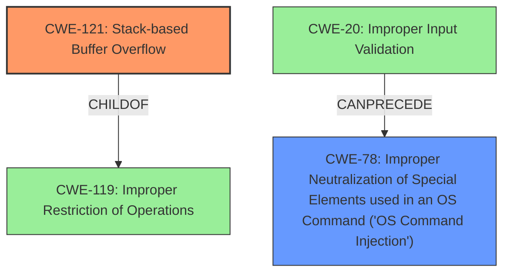

# Final Resolution for CVE-2021-26729

# Summary
| CWE ID | CWE Name | Confidence | CWE Abstraction Level | CWE Vulnerability Mapping Label | CWE-Vulnerability Mapping Notes |
|---|---|---|---|---|---|
| CWE-121 | Stack-based Buffer Overflow | 0.95 | Variant | Primary | Allowed |
| CWE-78 | Improper Neutralization of Special Elements used in an OS Command ('OS Command Injection') | 0.85 | Base | Secondary | Allowed |

## Evidence and Confidence

*   **Confidence Score:** 0.93
*   **Evidence Strength:** HIGH

## Relationship Analysis
The primary relationships that impacted the decision were the parent-child relationship between CWE-119 and CWE-121, and the chain relationship between CWE-20 and CWE-78. CWE-121 is a variant of CWE-119, offering more specificity due to the stack allocation. CWE-20 can precede CWE-78, indicating a lack of input validation contributes to command injection. The abstraction levels (Variant and Base) were appropriate for the level of detail available.

## Vulnerability Chain
The vulnerability chain involves multiple weaknesses.
  - The **root cause** for the stack-based **buffer overflow** is likely the usage of functions like `strcpy` without proper bounds checking (CWE-121).
  - The **root cause** for command injection is the lack of input validation (CWE-20) leading to improper neutralization of special elements used in OS commands (CWE-78).
  - These weaknesses allow an attacker to execute arbitrary code with root privileges.

## Summary of Analysis
The initial analysis correctly identified CWE-121 and CWE-78. The criticism suggested adding more detail on the *cause* of the **buffer overflow** and how command injection is happening, as well as mentioning mitigations.

For CWE-121, the vulnerability description states "multiple stack-based **buffer overflows** vulnerabilities in the Login_handler_func function". I am inferring that a function such as strcpy is being used without bounds checking.

For CWE-78, the vulnerability description states "Command injection... in the Login_handler_func function". I am inferring that the `Login_handler_func` is likely using the `system()` call or a similar function without properly sanitizing input.

The graph relationships reinforced the choice of CWE-121 as a more specific variant of CWE-119, and highlighted the role of CWE-20 (Improper Input Validation) in enabling CWE-78. The selected CWEs are at the optimal level of specificity given the available evidence. While more information about the specific functions causing the vulnerabilities would be ideal, the current classifications accurately reflect the **root causes** and their relationship to the described impact.