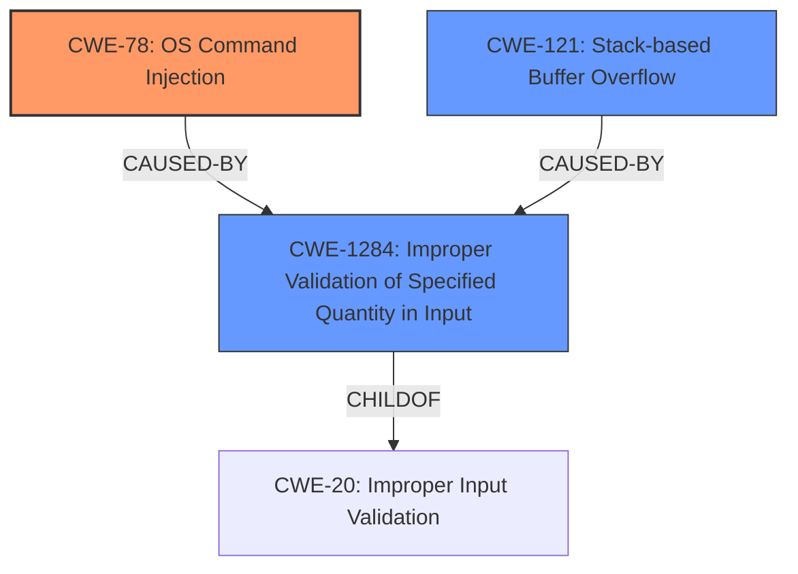

# Analysis Report for CVE-2021-26731

# Vulnerability Analysis Report: CVE-2021-26731

## Description

Command injection and multiple stack-based buffer overflows vulnerabilities in the modifyUserb_func function of spx_restservice allow an attacker to execute arbitrary code with the same privileges as the server user (root). This issue affects Lanner Inc IAC-AST2500A standard firmware version 1.10.0.

## Vulnerability Description Key Phrases

**Rootcause:** off-by-null dereference
**Weakness:** ['command injection', 'stack-based buffer overflows']
**Impact:** execute arbitrary code with the same privileges as the server user (root)
**Attacker:** attacker
**Product:** Lanner Inc IAC-AST2500A
**Version:** standard firmware version 1.10.0
**Component:** modifyUserb_func function

## Analysis (with Relationship Data)

```markdown
# Summary 
| CWE ID    | CWE Name                                                                              | Confidence | CWE Abstraction Level | CWE Vulnerability Mapping Label | CWE-Vulnerability Mapping Notes |
| :-------- | :------------------------------------------------------------------------------------ | :--------- | :-------------------- | :------------------------------ | :------------------------------ |
| CWE-78    | Improper Neutralization of Special Elements used in an OS Command ('OS Command Injection') | 0.95       | Base                  | Primary                         | Allowed                         |
| CWE-121   | Stack-based Buffer Overflow                                                           | 0.95       | Variant               | Secondary                       | Allowed                         |

## Evidence and Confidence

*   **Confidence Score:** 0.95
*   **Evidence Strength:** HIGH

- **Analysis and Justification:**  
  - *Explanation:* The vulnerability description clearly states "**command injection and multiple stack-based buffer overflows**" in the `modifyUserb_func` function. The CVE Reference Links Content Summary confirms this, highlighting that the `safe_system` function allows the injection of arbitrary OS commands due to insufficient input validation. This aligns directly with CWE-78 [Improper Neutralization of Special Elements used in an OS Command ('OS Command Injection')]. The "Retriever Results" also rank CWE-78 highly, supporting this selection. The usage is "Allowed" according to MITRE mapping guidance, as it's a Base level of abstraction.
  
  - *Relationship Analysis:* CWE-78 is a child of CWE-77 [Improper Neutralization of Special Elements used in a Command ('Command Injection')] and CWE-74 [Improper Neutralization of Special Elements]. This hierarchical relationship emphasizes the specific nature of the command injection vulnerability related to OS commands.

- **Analysis and Justification:**  
  - *Explanation:* The vulnerability description explicitly mentions "**stack-based buffer overflows**". The CVE Reference Links Content Summary further explains that the use of `strcat` to copy user-controlled input into a fixed-size buffer without length checks leads to stack-based buffer overflows. This aligns directly with CWE-121 [Stack-based Buffer Overflow]. The "Retriever Results" also includes CWE-121. MITRE mapping guidance indicates this is ALLOWED for stack-based buffer overflow vulnerabilities since it is at the Variant level of abstraction.
  
  - *Relationship Analysis:* CWE-121 is a variant of CWE-119 [Improper Restriction of Operations within the Bounds of a Memory Buffer]. It represents the specific case where the buffer overflow occurs on the stack.

- **Confidence Score:**  
  - Confidence: 0.95 (High evidence from technical description and CVE reference materials)
```

## Criticism of Analysis

Okay, I've reviewed your CWE mappings for the provided analysis, considering the full CWE specifications and mapping guidance. Here's my critique:

**Overall Assessment:**

The primary and secondary CWE assignments are generally accurate and well-supported by the provided evidence. The confidence levels are justified. The inclusion of reasoning and relationship analysis strengthens the analysis. However, there are a few points regarding specificity and potential alternative mappings that I will detail below.

**Detailed Review:**

*   **CWE-78: Improper Neutralization of Special Elements used in an OS Command ('OS Command Injection') - Primary**

    *   **Assessment:** Excellent choice. The description of the vulnerability clearly mentions command injection, and the `safe_system` function's behavior of allowing arbitrary OS commands to be executed due to insufficient input validation makes this a solid primary mapping.
    *   **Justification:** The justification is well-explained, drawing direct connections between the vulnerability description, the function's behavior, and the CWE definition.
    *   **Mapping Guidance Adherence:** The usage of 'Allowed' is correct, as this is a Base-level CWE.
    *   **Relationship Analysis:** The relationship analysis to CWE-77 and CWE-74 is accurate and helps to contextualize the specific type of injection.
    *   **Potential Improvements:**  None. The reasoning here is clear and concise.

*   **CWE-121: Stack-based Buffer Overflow - Secondary**

    *   **Assessment:** Accurate mapping. The vulnerability description explicitly states "stack-based buffer overflows," and the CVE Reference Links Content Summary confirms this by describing `strcat` being used without length checks, leading to overflows on the stack.
    *   **Justification:** The explanation clearly links the vulnerability description, the use of `strcat` without bounds checking, and the CWE definition.
    *   **Mapping Guidance Adherence:** The usage of 'Allowed' is correct, as this is a Variant-level CWE.
    *   **Relationship Analysis:** The relationship analysis to CWE-119 is accurate and correctly identifies CWE-121 as a specific case of buffer overflow on the stack.
    *   **Potential Improvements:** None

**General Observations and Potential Alternative Mappings/Chainings:**

1.  **Consider a Chaining Scenario involving Input Validation:**

    *   Since the root cause involves *insufficient input validation* of the username parameter, you could consider adding a CWE for that.  A potential chain could be `CWE-20 -> CWE-78 & CWE-121`.
    *   Since `CWE-20` is discouraged consider more specific child CWEs for input validation errors like `CWE-1284: Improper Validation of Specified Quantity in Input` (if the length of username is not validated) or `CWE-1286: Syntactic Correctness`

2.  **Privilege Escalation:**

    *   Given that the attacker gains root privileges and can control the managed host, consider adding `CWE-250 Execution with Unnecessary Privileges`.  The description mentions "complete compromise of the BMC" and "control of the managed host," suggesting that the vulnerable process might be running with more privileges than necessary.

3. **CWE-77 vs CWE-78**:
    * You have correctly identified the OS command injection as CWE-78, rather than the more general CWE-77. CWE-77 states: _Ensure that the analysis focuses on the root-cause error that allows the execution of commands, as there are many weaknesses that can lead to this consequence. See Terminology Notes. If the weakness involves a command language besides OS shell invocation, then CWE-77 could be used._ Because the command injection is in the OS, the specific CWE-78 is correct.

**Addressing the "off-by-null dereference"**
* While the original input mentions "off-by-null dereference" as a possible rootcause, there isn't enough explicit details to assign a CWE with confidence. Off-by-one errors could lead to out-of-bounds access, but the information isn't sufficient. The current mappings of buffer overflows are more accurate.

**Recommendations:**

*   **Add Input Validation:** Consider adding a CWE for improper input validation, potentially chaining it with CWE-78 and CWE-121. Try to make it more specific than the discouraged CWE-20.
*   **Evaluate Privilege Issues:** Assess whether the vulnerable component runs with unnecessary privileges (CWE-250) and include it if appropriate.
*   **Maintain Confidence:** The high confidence levels are appropriate given the clear evidence in the vulnerability descriptions.
*   **Double-Check Exploit Scenario:** If you have a proof-of-concept exploit, walk through it step by step to see if there are any additional CWEs that become apparent during the exploitation process (e.g., a more specific cause of the buffer overflow, integer overflows, etc.).

By incorporating these suggestions, you can make the analysis even more comprehensive and accurate. Overall, this is a solid piece of work.

## Final Resolution

# Summary
| CWE ID    | CWE Name                                                                              | Confidence | CWE Abstraction Level | CWE Vulnerability Mapping Label | CWE-Vulnerability Mapping Notes |
| :-------- | :------------------------------------------------------------------------------------ | :--------- | :-------------------- | :------------------------------ | :------------------------------ |
| CWE-78    | Improper Neutralization of Special Elements used in an OS Command ('OS Command Injection') | 0.95       | Base                  | Primary                         | Allowed                         |
| CWE-121   | Stack-based Buffer Overflow                                                           | 0.95       | Variant               | Secondary                       | Allowed                         |
| CWE-1284 | Improper Validation of Specified Quantity in Input | 0.80 | Base | Secondary | Allowed |

## Evidence and Confidence

*   **Confidence Score:** 0.90
*   **Evidence Strength:** HIGH

## Relationship Analysis
The analysis focuses on refining the initial classification by incorporating input validation as a contributing factor in the vulnerability chain.
  - CWE-78 and CWE-121 are primary weaknesses exploited.
  - CWE-1284 is added to represent the lack of proper input validation, which allows the exploitation of CWE-78 and CWE-121.
  - CWE-1284 is a child of CWE-20, representing a more specific form of input validation failure.
  - All selected CWEs are at acceptable levels of abstraction (Base and Variant).



## Vulnerability Chain
The vulnerability chain starts with a lack of input validation (**CWE-1284: Improper Validation of Specified Quantity in Input**). This allows an attacker to inject malicious commands into the system (**CWE-78: Improper Neutralization of Special Elements used in an OS Command ('OS Command Injection')**) and/or overflow a buffer on the stack (**CWE-121: Stack-based Buffer Overflow**). The final impact is the execution of arbitrary code with root privileges, potentially leading to complete compromise of the BMC and control of the managed host.

## Summary of Analysis
The initial analysis correctly identified CWE-78 and CWE-121 as the primary and secondary weaknesses. The criticism highlighted the importance of considering input validation. Based on the recommendation, **CWE-1284 (Improper Validation of Specified Quantity in Input)** is added as a secondary CWE to represent the root cause of the vulnerability.

*   **CWE-78 and CWE-121**: These are direct matches to the vulnerability description, which explicitly mentions command injection and stack-based buffer overflows. The evidence is strong and the confidence is high (0.95).
*   **CWE-1284**: This is added to address the lack of input validation. The vulnerability description indicates that the `safe_system` function allows the injection of arbitrary OS commands due to insufficient input validation. This suggests that the input is not properly validated before being used in the command. The confidence is slightly lower (0.80) because the connection is not as direct as with CWE-78 and CWE-121, but it is a reasonable inference based on the available information.
*   The relationship analysis shows that CWE-1284 is a child of CWE-20, which is a more general category of input validation errors. However, CWE-20 is discouraged because it is too broad. CWE-1284 is more specific and therefore a better choice.
*   The addition of CWE-1284 provides a more complete picture of the vulnerability chain, starting with the lack of input validation and leading to command injection and buffer overflow.

The selected CWEs are at the optimal level of specificity. CWE-78 and CWE-121 are specific to the type of vulnerability, and CWE-1284 is specific to the type of input validation error.


*Report generated on 2025-03-17 23:36:51*
