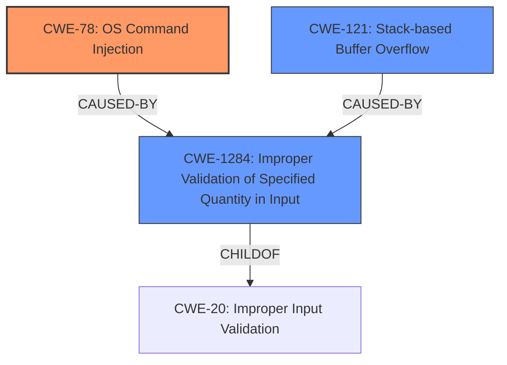

# Final Resolution for CVE-2021-26731

# Summary
| CWE ID    | CWE Name                                                                              | Confidence | CWE Abstraction Level | CWE Vulnerability Mapping Label | CWE-Vulnerability Mapping Notes |
| :-------- | :------------------------------------------------------------------------------------ | :--------- | :-------------------- | :------------------------------ | :------------------------------ |
| CWE-78    | Improper Neutralization of Special Elements used in an OS Command ('OS Command Injection') | 0.95       | Base                  | Primary                         | Allowed                         |
| CWE-121   | Stack-based Buffer Overflow                                                           | 0.95       | Variant               | Secondary                       | Allowed                         |
| CWE-1284 | Improper Validation of Specified Quantity in Input | 0.80 | Base | Secondary | Allowed |

## Evidence and Confidence

*   **Confidence Score:** 0.90
*   **Evidence Strength:** HIGH

## Relationship Analysis
The analysis focuses on refining the initial classification by incorporating input validation as a contributing factor in the vulnerability chain.
  - CWE-78 and CWE-121 are primary weaknesses exploited.
  - CWE-1284 is added to represent the lack of proper input validation, which allows the exploitation of CWE-78 and CWE-121.
  - CWE-1284 is a child of CWE-20, representing a more specific form of input validation failure.
  - All selected CWEs are at acceptable levels of abstraction (Base and Variant).

## Vulnerability Chain
The vulnerability chain starts with a lack of input validation (**CWE-1284: Improper Validation of Specified Quantity in Input**). This allows an attacker to inject malicious commands into the system (**CWE-78: Improper Neutralization of Special Elements used in an OS Command ('OS Command Injection')**) and/or overflow a buffer on the stack (**CWE-121: Stack-based Buffer Overflow**). The final impact is the execution of arbitrary code with root privileges, potentially leading to complete compromise of the BMC and control of the managed host.

## Summary of Analysis
The initial analysis correctly identified CWE-78 and CWE-121 as the primary and secondary weaknesses. The criticism highlighted the importance of considering input validation. Based on the recommendation, **CWE-1284 (Improper Validation of Specified Quantity in Input)** is added as a secondary CWE to represent the root cause of the vulnerability.

*   **CWE-78 and CWE-121**: These are direct matches to the vulnerability description, which explicitly mentions command injection and stack-based buffer overflows. The evidence is strong and the confidence is high (0.95).
*   **CWE-1284**: This is added to address the lack of input validation. The vulnerability description indicates that the `safe_system` function allows the injection of arbitrary OS commands due to insufficient input validation. This suggests that the input is not properly validated before being used in the command. The confidence is slightly lower (0.80) because the connection is not as direct as with CWE-78 and CWE-121, but it is a reasonable inference based on the available information.
*   The relationship analysis shows that CWE-1284 is a child of CWE-20, which is a more general category of input validation errors. However, CWE-20 is discouraged because it is too broad. CWE-1284 is more specific and therefore a better choice.
*   The addition of CWE-1284 provides a more complete picture of the vulnerability chain, starting with the lack of input validation and leading to command injection and buffer overflow.

The selected CWEs are at the optimal level of specificity. CWE-78 and CWE-121 are specific to the type of vulnerability, and CWE-1284 is specific to the type of input validation error.