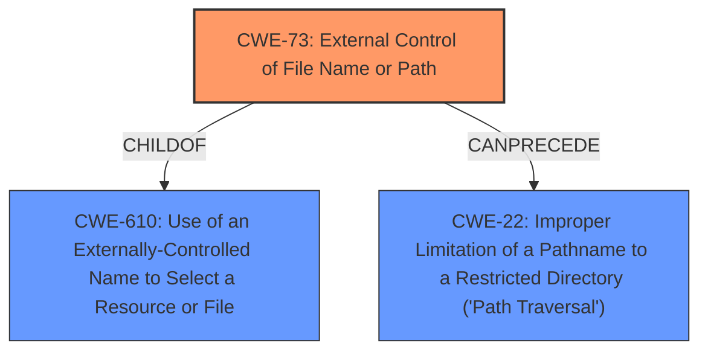

# Final Resolution for CVE-2021-26920

# Summary
| CWE ID | CWE Name | Confidence | CWE Abstraction Level | CWE Vulnerability Mapping Label | CWE-Vulnerability Mapping Notes |
|---|---|---|---|---|---|
| CWE-73 | External Control of File Name or Path | 0.75 | Base | Primary CWE | Allows authenticated users to read data from unintended sources, such as the local file system, by specifying file URLs to the HTTP InputSource. |
| CWE-22 | Improper Limitation of a Pathname to a Restricted Directory ('Path Traversal') | 0.60 | Base | Secondary Candidate | Only applicable if attacker can influence portions of the file path that would lead to path traversal. |

## Evidence and Confidence

*   **Confidence Score:** 0.75
*   **Evidence Strength:** MEDIUM

## Relationship Analysis
The primary change involves shifting from CWE-610 to CWE-73. CWE-73 is a child of CWE-610, representing a more specific case of external control focused on filenames and paths. This aligns with the vulnerability where the file URL directly influences file system operations. CWE-22 remains a secondary concern, contingent on the presence of path traversal attempts within the file URL.

## Vulnerability Chain
The vulnerability chain begins with **CWE-73** [External Control of File Name or Path], where the HTTP InputSource allows user-controlled URLs. This leads to the potential for reading arbitrary files on the system. If the URL includes path traversal sequences, it can further result in **CWE-22** [Improper Limitation of a Pathname to a Restricted Directory ('Path Traversal')], allowing access to files outside the intended directories. The final impact is the disclosure of sensitive information.

## Summary of Analysis
The initial analysis correctly identified the core issues but used a less specific CWE. The criticism highlighted the appropriateness of CWE-73 as a **ROOTCAUSE**, given its focus on file paths and the vulnerability's direct manipulation of file system operations via URLs.

The vulnerability description states: "the HTTP InputSource allows authenticated users to read data from other sources than intended, such as the local file system, with the privileges of the Druid server process...users could bypass the application-level restriction by passing a file URL to the HTTP InputSource." This directly supports **CWE-73** [External Control of File Name or Path] since the user is controlling the file path.

CWE-73 is at the Base level of abstraction, which is preferred. Furthermore, mitigations for CWE-73, such as input validation and sandboxing, are directly applicable to this vulnerability.

The decision to switch to CWE-73 is based on its greater specificity and alignment with the vulnerability description, making it a more accurate representation of the **WEAKNESS**. CWE-22 remains a secondary concern contingent on path traversal attempts.