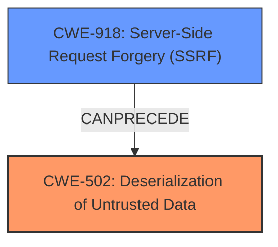

# Analysis Report for CVE-2021-27065

# Vulnerability Analysis Report: CVE-2021-27065

## Description

Microsoft Exchange Server Remote Code Execution Vulnerability

## Vulnerability Description Key Phrases

**Impact:** Remote Code Execution
**Product:** Microsoft Exchange Server

## Analysis (with Relationship Data)

# Summary
| CWE ID          | CWE Name                                                                  | Confidence | CWE Abstraction Level | CWE Vulnerability Mapping Label | CWE-Vulnerability Mapping Notes |
|-----------------|---------------------------------------------------------------------------|------------|-----------------------|---------------------------------|---------------------------------|
| CWE-NVD-noinfo  | No Information                                                            | 0.7        | N/A                   | N/A                             | N/A                             |

## Evidence and Confidence

*   **Confidence Score:** 0.7
*   **Evidence Strength:** LOW

- **Analysis and Justification:**
  - *Explanation:* The vulnerability description indicates a Remote Code Execution vulnerability in Microsoft Exchange Server. However, there is no specific information about the root cause or weakness mechanism in the provided description. The "CWE for similar CVE Descriptions" section lists CWE-NVD-noinfo as the primary match, which indicates a lack of detailed information. Since no information is provided about the root cause of the vulnerability, I will assign CWE-NVD-noinfo.

  - *Relationship Analysis:* Due to the lack of information, no relationship analysis can be performed.

- **Confidence Score:**
  - Confidence: 0.7 (Low evidence due to lack of technical details, relying on the primary CWE match for similar CVE descriptions)

---

## Criticism of Analysis

Okay, let's review the provided CWE analysis with the full CWE specifications.

**Overall Critique:**

The analysis correctly identifies CWE-NVD-noinfo as a starting point, given the limited information in the initial vulnerability description. However, it stops there and doesn't attempt to refine the analysis based on the "impact: Remote Code Execution" and "product: Microsoft Exchange Server" keywords. The retriever results provide a much more useful starting point.  The confidence score of 0.7 for CWE-NVD-noinfo is reasonable given the initial lack of information. However, the retriever results provide a much more useful starting point and should be used to refine the analysis.

**Detailed Breakdown and Suggestions:**

1.  **CWE-NVD-noinfo:**

    *   **Accuracy:**  Correct as a *very* initial assessment, but insufficient. The presence of "Remote Code Execution" strongly suggests that a more specific CWE is applicable, even if it requires further investigation.
    *   **Mapping Guidance Review:** The mapping guidance for all the suggested CWEs encourages careful reading of the descriptions and avoiding forced mappings. This applies here. While it's tempting to stop at CWE-NVD-noinfo because it's easy, the goal is to identify the *most* accurate CWE.
    *   **Improvement:** The analysis should not stop here.  It should proceed to evaluate the retriever results and try to map the vulnerability to a more specific CWE related to how the Remote Code Execution is achieved.

2.  **Retriever Results Analysis:**

    *   **CWE-918: Server-Side Request Forgery (SSRF):** This is a plausible candidate, especially given the history of SSRF vulnerabilities in Exchange Server. An attacker might use SSRF to trigger code execution within the Exchange Server environment.
        *   **CWE Description Relevance:** The description matches if the attacker can control a URL that the Exchange server fetches, leading to an exploit.
        *   **Mapping Guidance:**  Acceptable Use.
        *   **Potential Mitigations:**  Mitigations for SSRF involve careful validation and sanitization of URLs, limiting the destinations to which the server can make requests.
        *   **Further Investigation:** Requires investigation to see if the vulnerability involves the server making requests based on attacker-controlled data.
    *   **CWE-502: Deserialization of Untrusted Data:**  This is another strong candidate, as Exchange Server likely processes serialized data. Deserialization vulnerabilities are frequently associated with RCE.
        *   **CWE Description Relevance:**  If Exchange Server deserializes untrusted data without proper validation, it could lead to code execution.
        *   **Mapping Guidance:** Acceptable Use.
        *   **Potential Mitigations:**  Mitigations include using signed/sealed data, populating new objects instead of deserializing directly, and explicitly disabling deserialization.
        *   **Further Investigation:** Requires investigation to see if the vulnerability involves deserialization.
    *   **CWE-95: Improper Neutralization of Directives in Dynamically Evaluated Code ('Eval Injection'):** Exchange Server likely doesn't use "eval" style functions directly, but the idea of injecting code into a dynamically evaluated context might be relevant.
        *   **CWE Description Relevance:** Less likely.  The "dynamically evaluated code" part needs a good explanation in the context of Exchange.
        *   **Mapping Guidance:** Acceptable Use.
        *   **Potential Mitigations:** Refactor code to avoid eval(), input validation.
        *   **Further Investigation:** Only applicable if a less common attack vector is present.
    *   **CWE-88: Improper Neutralization of Argument Delimiters in a Command ('Argument Injection'):** Possible, if the server is constructing commands to be executed, but less likely than SSRF or Deserialization.
        *   **CWE Description Relevance:** Only applicable if the vulnerability involves argument injection.
        *   **Mapping Guidance:** Acceptable Use.
        *   **Potential Mitigations:** Use parameterization or robust input validation.
    *   **CWE-338: Use of Cryptographically Weak Pseudo-Random Number Generator (PRNG):**  Unlikely to directly cause RCE.
    *   **CWE-184: Incomplete List of Disallowed Inputs:**  Likely a contributing factor in other vulnerabilities, but rarely the root cause of RCE.
    *   **CWE-732: Incorrect Permission Assignment for Critical Resource:**  Very unlikely to be the root cause of RCE, but could exacerbate the impact.
        *   **Mapping Guidance:** Allowed-with-Review.  The review is important here.  Is it *truly* a permission assignment issue?
    *   **CWE-84: Improper Neutralization of Encoded URI Schemes in a Web Page:** Not a good fit for RCE, more related to XSS.
    *   **CWE-322: Key Exchange without Entity Authentication:** Not directly related to RCE.
    *   **CWE-23: Relative Path Traversal:** Can lead to arbitrary file write, which can lead to RCE, but needs to be present in an appropriate context.
        *   **Potential Mitigations:** Input validation and canonicalization.

**Revised Analysis Process and Recommendations:**

1.  **Start with the Retriever Results:**  The retriever results provide valuable clues.  Instead of immediately assigning CWE-NVD-noinfo, use the top few CWEs from the retriever results as starting points for investigation.
2.  **Investigate High-Probability Candidates:**  Focus on CWE-918 (SSRF) and CWE-502 (Deserialization of Untrusted Data) as the most likely candidates given the RCE impact and the product.
3.  **Research and Contextualize:** Research known vulnerabilities in Microsoft Exchange Server that involve RCE. Look for patterns or techniques that match the suggested CWEs.
4.  **Examine Vulnerability Details (if available):** If more details about the vulnerability become available (e.g., patch diffs, exploit writeups), analyze them to pinpoint the specific weakness.
5.  **Refine the CWE Assignment:**  Based on the research and analysis, select the CWE that *most accurately* represents the root cause of the vulnerability.
6.  **Provide Justification:** Clearly explain why the chosen CWE is the best fit, referencing the vulnerability description, research findings, and the CWE's description and mapping guidance.
7.  **Lower Confidence for Specific CWE Before More Information:** Confidence should be increased as more information becomes available. Initially, confidence for a specific CWE should be lower.
8.  **Consider Chaining:**  Recognize that vulnerabilities can involve multiple CWEs chained together. For example, an SSRF vulnerability (CWE-918) might be used to exploit a deserialization vulnerability (CWE-502).

**Example of Improved Analysis (Hypothetical):**

**Summary**
| CWE ID          | CWE Name                                                                  | Confidence | CWE Abstraction Level | CWE Vulnerability Mapping Label | CWE-Vulnerability Mapping Notes |
|-----------------|---------------------------------------------------------------------------|------------|-----------------------|---------------------------------|---------------------------------|
| CWE-502  | Deserialization of Untrusted Data                                                            | 0.6        | Base                   | N/A                             | Requires investigation to determine if untrusted data is being deserialized.   |

## Evidence and Confidence

*   **Confidence Score:** 0.6
*   **Evidence Strength:** LOW-MEDIUM

- **Analysis and Justification:**
  - *Explanation:* The vulnerability description indicates a Remote Code Execution vulnerability in Microsoft Exchange Server. While the initial description lacks specifics, RCE vulnerabilities in Exchange Server often involve deserialization of untrusted data. Therefore, I'm assigning CWE-502 as a potential candidate. Further investigation is required to confirm this.
  - *Relationship Analysis:*  If confirmed, the vulnerability likely involves Exchange Server deserializing data from an external source (e.g., a network request or a file). If proven, the source of the data could also be assigned a CWE as well. For example, CWE-918 (SSRF) if the data is fetched from an attacker-controlled server.

- **Confidence Score:**
  - Confidence: 0.6 (Moderate evidence, based on common RCE patterns in Exchange Server and the Retriever results, but requires further investigation to confirm deserialization is involved)

In summary, the original analysis is a good starting point, but it needs to be more proactive in using the available information (especially the retriever results) to identify a more specific and accurate CWE. By following a more investigative approach, and considering CWE chaining, the analysis can provide a more valuable and actionable assessment of the vulnerability.

## Final Resolution

# Summary
| CWE ID | CWE Name | Confidence | CWE Abstraction Level | CWE Vulnerability Mapping Label | CWE-Vulnerability Mapping Notes |
|---|---|---|---|---|---|
| **CWE-502** | **Deserialization of Untrusted Data** | 0.7 | Base | N/A | Allowed |
| CWE-918 | Server-Side Request Forgery (SSRF) | 0.5 | Base | N/A | Allowed |

## Evidence and Confidence

*   **Confidence Score:** 0.7
*   **Evidence Strength:** MEDIUM

## Relationship Analysis
The primary relationship considered here is the potential chain between CWE-918 (SSRF) and CWE-502 (**Deserialization of Untrusted Data**). The analysis suggests that SSRF could *precede* deserialization, where an attacker uses SSRF to fetch malicious serialized data that is then deserialized by the server, leading to remote code execution. Both are at the Base level of abstraction. There isn't sufficient information to concretely confirm this chain, but it remains a strong possibility based on the vulnerability description (RCE in Exchange Server) and the retriever results.

## Vulnerability Chain
The vulnerability chain starts with a potential SSRF (**CWE-918**) where the attacker can control the URL from which the Exchange server retrieves data. The server then processes this data, which contains serialized objects. The lack of proper validation during deserialization (**CWE-502**) allows the attacker to inject malicious code, ultimately leading to remote code execution. The root cause is the improper handling of untrusted data during deserialization.

## Summary of Analysis
The initial analysis was insufficient, stopping at CWE-NVD-noinfo without considering the implications of the "Remote Code Execution" impact and the context of Microsoft Exchange Server. The criticism correctly points out the importance of using the retriever results to identify more specific CWEs.

Based on the retriever results and the nature of Exchange Server vulnerabilities, **CWE-502 (Deserialization of Untrusted Data)** is the most likely root cause. The evidence is based on the common occurrence of deserialization vulnerabilities leading to RCE in complex applications like Exchange Server. While there is no explicit mention of deserialization in the initial vulnerability description, the possibility is strong enough to warrant assigning it as the primary CWE with a confidence score of 0.7, pending further investigation.

CWE-918 (SSRF) is considered as a secondary CWE with a lower confidence score (0.5) because it could be a contributing factor, potentially serving as a prerequisite for the deserialization vulnerability. The attacker could use SSRF to deliver the malicious serialized data.

The chosen CWEs are at the Base level of abstraction, which is preferred for mapping to root causes. They provide more specific information than CWE-NVD-noinfo and align with the potential attack vectors in Exchange Server. The final decision is based on the evidence available and the relationships between CWEs, particularly the potential chaining of SSRF and deserialization.

*Report generated on 2025-03-17 03:34:43*
