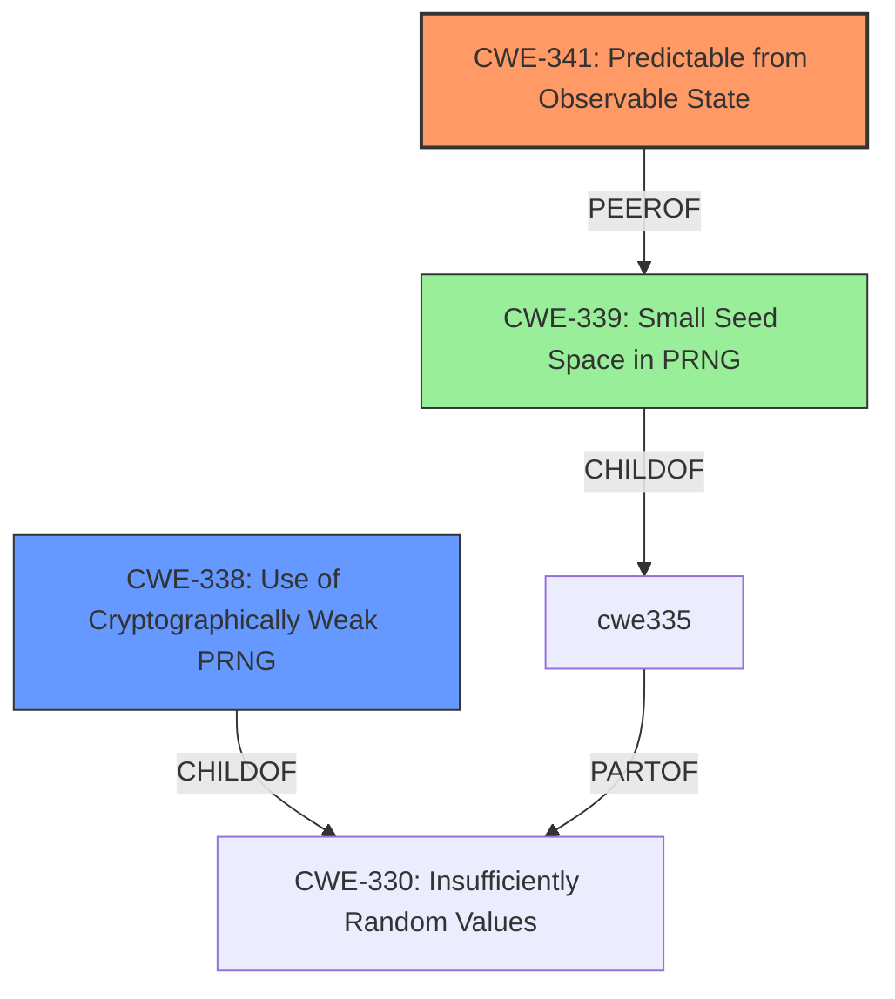

# Final Resolution for CVE-2021-27200

# Summary

| CWE ID | CWE Name | Confidence | CWE Abstraction Level | CWE Vulnerability Mapping Label | CWE-Vulnerability Mapping Notes |
|---|---|---|---|---|---|
| CWE-341 | Predictable from Observable State | 0.95 | Base | Allowed | Primary CWE |
| CWE-338 | Use of Cryptographically Weak Pseudo-Random Number Generator (PRNG) | 0.8 | Base | Allowed | Secondary Candidate |
| CWE-339 | Small Seed Space in PRNG | 0.6 | Variant | Allowed | Tertiary Candidate |

## Evidence and Confidence

*   **Confidence Score:** 0.9
*   **Evidence Strength:** HIGH

## Relationship Analysis
The primary relationship influencing the decision is that CWE-338 (Weak PRNG) and CWE-339 (Small Seed Space) are related to CWE-330 (Insufficient Randomness), which in turn is related to CWE-341 (Predictable from Observable State). CWE-339 is also a peer of CWE-341. The decision favored the more specific Base and Variant level CWEs to accurately reflect the vulnerability.

## Vulnerability Chain
The vulnerability chain begins with the **weak cryptographic algorithm** using time as a component. This leads to a **weak PRNG** (CWE-338) and a **small seed space** (CWE-339), ultimately resulting in a **predictable code** (CWE-341) that allows for account takeover.

## Summary of Analysis
The initial analysis and criticism both identified CWE-341 as the primary issue, which is the predictability of the code. The criticism suggested strengthening the justification for CWE-338 and considering CWE-339. The decision to include CWE-338 and CWE-339 is based on the evidence that the time component contributes to a weak PRNG and a small seed space, making the code predictable. CWE-327 was removed because the core issue is predictability and not a fundamentally broken algorithm. The selected CWEs are at the optimal level of specificity because they accurately reflect the root cause (predictability) and contributing factors (weak PRNG, small seed space).

The vulnerability description states: "In WoWonder 3.0.4, remote attackers can take over any account due to the **weak cryptographic algorithm** in recover.php. The code parameter is easily predicted from the time of day." This directly supports CWE-341. The "CVE Reference Links Content Summary" stating that the code is derived by combining the password reset link time with a small range random number supports CWE-338 and CWE-339.