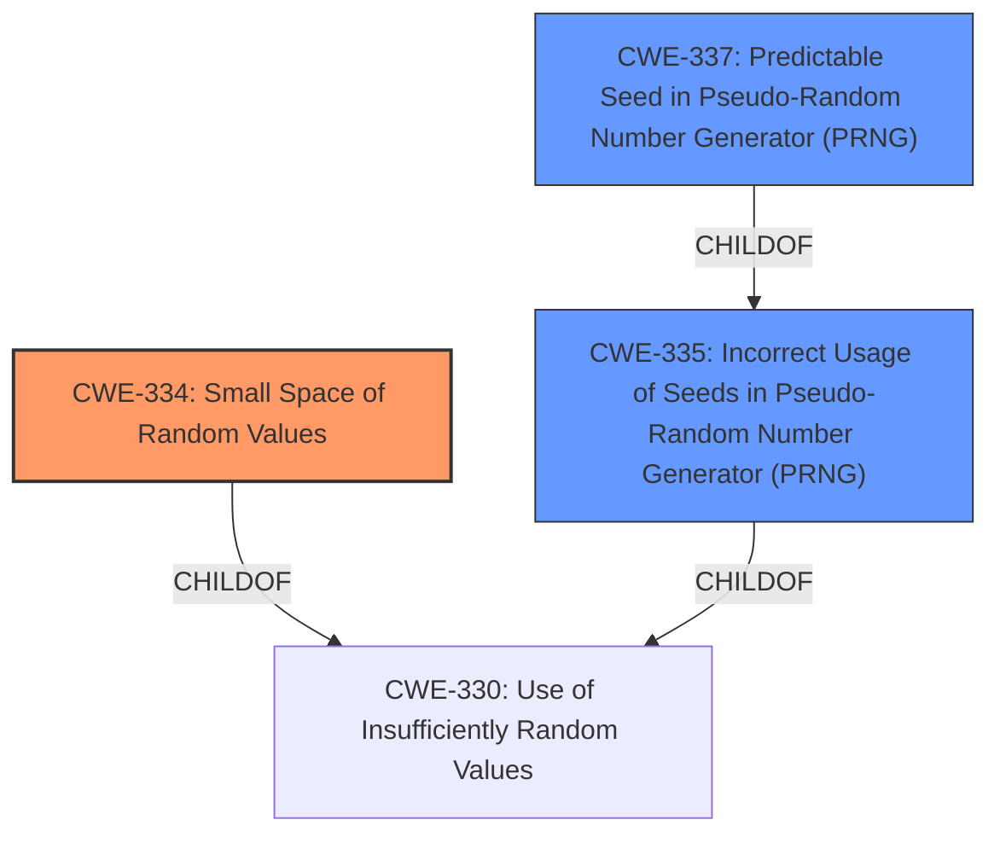

# Analysis Report for CVE-2021-27211

# Vulnerability Analysis Report: CVE-2021-27211

## Description

steghide 0.5.1 relies on a certain 32-bit seed value, which makes it easier for attackers to detect hidden data.

## Vulnerability Description Key Phrases

**Rootcause:** reliance on a certain 32-bit seed value
**Impact:** detect hidden data
**Attacker:** attackers
**Product:** steghide
**Version:** 0.5.1

## Analysis (with Relationship Data)

# Summary
| CWE ID  | CWE Name  | Confidence | CWE Abstraction Level | CWE Vulnerability Mapping Label | CWE-Vulnerability Mapping Notes |
|---|---|---|---|---|---|
| CWE-334 | Small Space of Random Values | 0.95 | Base | Allowed | Primary CWE |
| CWE-335 | Incorrect Usage of Seeds in Pseudo-Random Number Generator (PRNG) | 0.80 | Base | Allowed | Secondary Candidate |
| CWE-337 | Predictable Seed in Pseudo-Random Number Generator (PRNG) | 0.70 | Variant | Allowed | Secondary Candidate |

## Evidence and Confidence

*   **Confidence Score:** 0.90
*   **Evidence Strength:** HIGH

- **Analysis and Justification:**  
  - *Explanation:* The vulnerability description and CVE reference clearly point to the **rootcause** being the **reliance on a certain 32-bit seed value**, which leads to a small space of random values. This aligns directly with CWE-334 (Small Space of Random Values). The attacker can brute-force this limited seed space to detect hidden data. The CVE reference specifies that the MD5 hash is split into four 32-bit chunks and XORed, reducing the password's complexity and making it brute-forceable. The `stegcrack` tool exploits this by iterating through possible seeds. While CWE-335 (Incorrect Usage of Seeds in Pseudo-Random Number Generator (PRNG)) and CWE-337 (Predictable Seed in Pseudo-Random Number Generator (PRNG)) are also relevant, CWE-334 best captures the core issue of the limited seed space that enables the attack. MITRE mapping guidance allows the use of CWE-334 because it is at the Base level of abstraction.
  
  - *Relationship Analysis:* CWE-334 is a Base level CWE. It is related to CWE-335 (Incorrect Usage of Seeds in Pseudo-Random Number Generator (PRNG)), which has variants like CWE-337 (Predictable Seed in Pseudo-Random Number Generator (PRNG)). CWE-330 (Use of Insufficiently Random Values) is a parent Class of CWE-334, but CWE-334 is more specific to the small seed space.

- **Confidence Score:**  
  - Confidence: 0.95 (High confidence due to explicit mention of the small seed value and brute-force attack in the CVE reference)

---

## Criticism of Analysis

Okay, let's review the provided CWE analysis for the Steghide vulnerability (CVE-2021-27211) in detail, considering the complete CWE specifications.

**Overall Assessment:**

The analysis correctly identifies CWE-334 (Small Space of Random Values) as the primary weakness and provides a strong justification.  The secondary candidates, CWE-335 and CWE-337, are also relevant. The confidence scores are appropriate. The evidence strength is reasonable.  The explanation is well-structured and aligns with the CVE description and the Steghide implementation details.

**Detailed Critique:**

1.  **CWE-334: Small Space of Random Values (Primary CWE)**

    *   **Correctness:** The selection of CWE-334 as the primary weakness is accurate. The vulnerability's root cause is the limited 32-bit seed space, which makes it susceptible to brute-force attacks. This directly aligns with the description of CWE-334.
    *   **Justification Strength:** The justification provided is strong. It explicitly mentions the brute-force attack vector, the limited seed space, and the mechanism Steghide uses to derive the seed from the password (MD5 hashing and XORing).  The `stegcrack` tool's exploitation of this weakness is also mentioned.
    *   **Abstraction Level:** CWE-334 is a Base level CWE, which is a preferred level.
    *   **Mapping Guidance Compliance:**  The analysis correctly states that MITRE mapping guidance allows the use of CWE-334 because it is at the Base level of abstraction.
    *   **Observed Examples:** The provided observed examples are generally relevant. Some examples, such as the one related to SYN cookies, are particularly illustrative of brute-force attacks on limited key spaces.
    *   **Potential Mitigations:** The provided mitigation (using FIPS 140-2 compliant modules) is a general recommendation for ensuring sufficient entropy.  A more specific mitigation in this case would be to increase the seed size to at least 128 bits, and use a cryptographically secure method to derive the seed from the password.

2.  **CWE-335: Incorrect Usage of Seeds in Pseudo-Random Number Generator (PRNG) (Secondary Candidate)**

    *   **Relevance:** CWE-335 is relevant because Steghide is using a PRNG (implicitly) and the manner in which it's seeding that PRNG is flawed.  The transformation of the password to the seed is incorrect.
    *   **Justification:** The justification would be strengthened by explicitly stating that the process of hashing with MD5 and then XORing the result to form a 32-bit seed is an incorrect usage of seeds because it significantly reduces the entropy of the password.
    *   **Abstraction Level:** CWE-335 is a Base level CWE, which is a preferred level.
    *   **Observed Examples:** The listed examples are relevant.
    *   **Potential Mitigations:** The potential mitigations are relevant. Specifically, "protecting seeds as cryptographic material" is not happening, and "using a uniquely generated seed from a cryptographically secure source" is not occurring.
    *   **Relationship:** It would be helpful to explicitly mention that the MD5 hashing and XOR operation are the "incorrect usage" that leads to the small seed space.

3.  **CWE-337: Predictable Seed in Pseudo-Random Number Generator (PRNG) (Secondary Candidate)**

    *   **Relevance:** This CWE is also relevant, as the process used to derive the seed from the password makes the seed predictable, given the MD5 hashing and XOR reduction to 32-bits. An attacker could potentially reverse the MD5 hash to find possible passwords (although difficult), or more easily brute-force the 32 bit seed.
    *   **Justification:** The justification would be strengthened by explicitly linking the MD5 and XOR operations to the predictability of the seed.
    *   **Abstraction Level:** CWE-337 is a Variant level CWE, which is a preferred level.
    *   **Observed Examples:** The observed examples are relevant.
    *   **Potential Mitigations:**  The mitigations are relevant. Specifically, "Use non-predictable inputs for seed generation."
    *   **Relationship:**  It would be helpful to explicitly mention that the MD5 hashing and XOR operation are the "incorrect usage" that leads to the small seed space.

**Additional Considerations & Suggestions:**

*   **CWE-338: Use of Cryptographically Weak Pseudo-Random Number Generator (PRNG):**  While not selected, the Retriever Results highlight this as a candidate. Although not the *primary* problem, the reliance on MD5 and XOR operations could also be considered a weak PRNG component. If Steghide were relying on the MD5 hash beyond seeding to provide some form of randomness, then this would be more relevant.
*   **CWE-339: Small Seed Space in PRNG:** This is a Variant of CWE-335 and could be considered as a secondary candidate, although CWE-334 already captures the "Small Space" aspect well.

**Revised Summary:**

| CWE ID  | CWE Name  | Confidence | CWE Abstraction Level | CWE Vulnerability Mapping Label | CWE-Vulnerability Mapping Notes |
|---|---|---|---|---|---|
| CWE-334 | Small Space of Random Values | 0.95 | Base | Allowed | Primary CWE |
| CWE-335 | Incorrect Usage of Seeds in Pseudo-Random Number Generator (PRNG) | 0.80 | Base | Allowed | Secondary Candidate |
| CWE-337 | Predictable Seed in Pseudo-Random Number Generator (PRNG) | 0.70 | Variant | Allowed | Secondary Candidate |

**Improvements to Justifications:**

*   **CWE-335:** "The process of hashing with MD5 and then XORing the result to form a 32-bit seed is an incorrect usage of seeds because it significantly reduces the entropy of the password, making it easier to brute-force."
*   **CWE-337:** "The process of deriving a 32-bit seed from the password using MD5 and XOR operations results in a predictable seed because an attacker can exhaustively search the relatively small 32-bit seed space."

**In Conclusion:**

The initial analysis is sound and well-justified. The suggested revisions and clarifications will further strengthen the connection between the vulnerability and the selected CWEs, particularly in explaining *why* CWE-335 and CWE-337 are relevant. The analysis correctly identifies the core issue as the small seed space (CWE-334) and supports it with appropriate secondary CWEs that highlight the incorrect and predictable nature of the seed generation process.

## Final Resolution

# Summary
| CWE ID  | CWE Name  | Confidence | CWE Abstraction Level | CWE Vulnerability Mapping Label | CWE-Vulnerability Mapping Notes |
|---|---|---|---|---|---|
| CWE-334 | Small Space of Random Values | 0.95 | Base | Allowed | Primary CWE |
| CWE-335 | Incorrect Usage of Seeds in Pseudo-Random Number Generator (PRNG) | 0.85 | Base | Allowed | Secondary Candidate |
| CWE-337 | Predictable Seed in Pseudo-Random Number Generator (PRNG) | 0.80 | Variant | Allowed | Secondary Candidate |

## Evidence and Confidence

*   **Confidence Score:** 0.95
*   **Evidence Strength:** HIGH

## Relationship Analysis
The primary weakness is **CWE-334 (Small Space of Random Values)**. It's a Base CWE, offering good specificity. **CWE-335 (Incorrect Usage of Seeds in Pseudo-Random Number Generator (PRNG))** and **CWE-337 (Predictable Seed in Pseudo-Random Number Generator (PRNG))** are related to **CWE-334** through the shared context of PRNG seeding. **CWE-337** is a Variant of **CWE-335**, indicating a more specific case of incorrect seed usage. **CWE-330 (Use of Insufficiently Random Values)** is a parent Class of **CWE-334** and **CWE-335**, but it's less specific.

## Vulnerability Chain
The vulnerability chain starts with the **ROOTCAUSE** of using a 32-bit seed value, which corresponds to **CWE-334 (Small Space of Random Values)**. The incorrect usage of seeds through MD5 hashing and XORing, represented by **CWE-335 (Incorrect Usage of Seeds in Pseudo-Random Number Generator (PRNG))**, leads to a predictable seed, as described in **CWE-337 (Predictable Seed in Pseudo-Random Number Generator (PRNG))**. This predictability allows attackers to brute-force the seed and detect hidden data, ultimately leading to information disclosure.

## Summary of Analysis
The initial analysis and the provided criticism both converge on **CWE-334 (Small Space of Random Values)** as the primary weakness due to the reliance on a 32-bit seed value in Steghide. The criticism strengthens the justification for including **CWE-335 (Incorrect Usage of Seeds in Pseudo-Random Number Generator (PRNG))** and **CWE-337 (Predictable Seed in Pseudo-Random Number Generator (PRNG))** as secondary candidates by explicitly linking the MD5 hashing and XOR operations to the reduced entropy and predictability of the seed. The provided evidence, particularly the CVE description and the existence of the `stegcrack` tool, strongly supports this assessment.

The graph relationships highlight that **CWE-334** is the most specific Base CWE that captures the core issue, while **CWE-335** and **CWE-337** provide additional context regarding the incorrect and predictable nature of the seed generation process. **CWE-330** is too abstract, and choosing it would lose valuable specificity.

I've increased the confidence in **CWE-335** and **CWE-337** slightly due to the improved justifications suggested in the criticism, particularly the explanation of how MD5 hashing and XORing reduce entropy and increase predictability.

The selected CWEs are at the optimal level of specificity because they directly address the **ROOTCAUSE** of the vulnerability (small seed space) and the factors that contribute to its exploitability (incorrect seed usage and predictability). Using a more general CWE would obscure the specific technical details of the vulnerability.

The final decision is based on the following evidence:

*   "steghide 0.5.1 relies on a certain 32-bit seed value, which makes it easier for attackers to detect hidden data." (Vulnerability Description)
*   The existence of the `stegcrack` tool, which exploits the limited seed space.

These pieces of evidence, combined with the relationship analysis and the mapping guidance, justify the selection of **CWE-334**, **CWE-335**, and **CWE-337** as the most appropriate classifications.

*Report generated on 2025-03-16 23:50:03*
