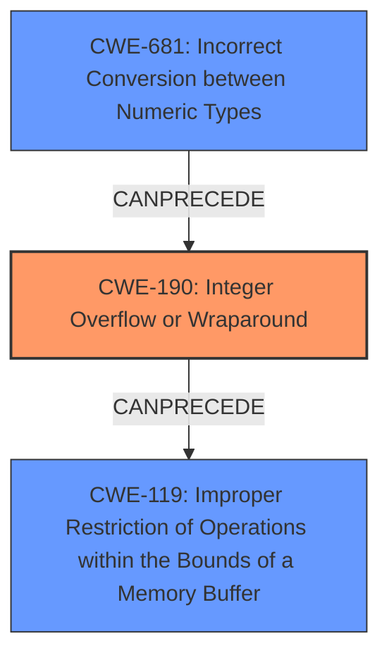

# Analysis Report for CVE-2021-27219

# Vulnerability Analysis Report: CVE-2021-27219

## Description

An issue was discovered in GNOME GLib before 2.66.6 and 2.67.x before 2.67.3. The function g_bytes_new has an integer overflow on 64-bit platforms due to an implicit cast from 64 bits to 32 bits. The overflow could potentially lead to memory corruption.

## Vulnerability Description Key Phrases

**Rootcause:** integer overflow
**Impact:** memory corruption
**Product:** GNOME GLib
**Version:** before 2.66.6 and 2.67.x before 2.67.3
**Component:** g_bytes_new function

## Analysis (with Relationship Data)

# Summary
| CWE ID | CWE Name | Confidence | CWE Abstraction Level | CWE Vulnerability Mapping Label | CWE-Vulnerability Mapping Notes |
|---|---|---|---|---|---|
| CWE-190 | Integer Overflow or Wraparound | 0.95 | Base | Allowed | Primary CWE |
| CWE-131 | Incorrect Calculation of Buffer Size | 0.70 | Base | Allowed | Secondary Candidate |
| CWE-789 | Uncontrolled Memory Allocation | 0.60 | Variant | Allowed | Secondary Candidate |

## Evidence and Confidence

*   **Confidence Score:** 0.85
*   **Evidence Strength:** HIGH

- **Analysis and Justification:**  
  - *Explanation:* The vulnerability description explicitly states "**integer overflow** on 64-bit platforms due to an implicit cast from 64 bits to 32 bits" in the `g_bytes_new` function, leading to memory corruption. This directly aligns with CWE-190 [Integer Overflow or Wraparound]. The "CVE Reference Links Content Summary" further reinforces this by mentioning "Integer overflow in the `g_bytes_new` function due to an implicit cast from 64-bit `gsize` to 32-bit `guint` when calling `g_memdup`." The impact is "memory corruption," which is a typical consequence of integer overflows when used to calculate buffer sizes. While other CWEs like CWE-131 [Incorrect Calculation of Buffer Size] or CWE-789 [Uncontrolled Memory Allocation] could be considered, CWE-190 is the most direct root cause. The MITRE mapping guidance for CWE-190 indicates this is ALLOWED.

  - *Relationship Analysis:* CWE-190 is a Base level CWE. It can lead to other weaknesses such as buffer overflows (CWE-119) and memory corruption. CWE-131 [Incorrect Calculation of Buffer Size] and CWE-789 [Uncontrolled Memory Allocation] are consequences in the vulnerability description.

- **Confidence Score:**  
  - Confidence: 0.95 (High evidence from technical description and CVE reference materials)

## Criticism of Analysis

Okay, I've reviewed your analysis of the GLib vulnerability CVE-2021-27219 along with the complete CWE specifications you provided. Here's my critique:

**Overall Assessment:**

Your analysis is generally good and correctly identifies the primary CWE as CWE-190 (Integer Overflow or Wraparound). The evidence and justification are solid. However, the secondary CWEs could be refined for better accuracy and alignment with CWE guidelines.

**Detailed Review:**

*   **CWE-190: Integer Overflow or Wraparound (Primary CWE):**
    *   **Confidence:** 0.95 - Appropriate. The vulnerability description explicitly mentions the "integer overflow" as the root cause. The CVE reference summary reinforces this.
    *   **CWE Abstraction Level:** Base - Correct. CWE-190 is a Base-level CWE and thus appropriate for a root cause analysis.
    *   **CWE Vulnerability Mapping Label:** Allowed - Correct. The mapping guidance for CWE-190 states "Usage: Allowed" with a rationale that it is at the base level.
    *   **CWE-Vulnerability Mapping Notes:** Correct.
    *   **Observed Examples for CWE-190:** The provided examples are relevant and demonstrate real-world integer overflow vulnerabilities.
*   **CWE-131: Incorrect Calculation of Buffer Size (Secondary Candidate):**
    *   **Confidence:** 0.70 - Justification needed. While an incorrect buffer size *is* calculated as a *result* of the overflow, the root cause of the vulnerability isn't a simple calculation error. The calculation *would* be correct if the input size wasn't overflowing. The overflow *leads* to the incorrect size. For these reasons, this CWE should be removed.
    *   **Mapping Guidance Consideration:** While "Usage: Allowed" for CWE-131, the comments about "simple math errors" and "layering or perspective differences" are relevant. The primary driver is not a math error; it's the integer overflow that *results* in a buffer overflow.

*   **CWE-789: Uncontrolled Memory Allocation (Secondary Candidate):**
    *   **Confidence:** 0.60 - Reduce the confidence or remove. This CWE is generally used when the *attacker* can directly influence the memory allocation size, leading to excessive memory consumption (DoS). Here, the attacker provides a large value, but the overflow causes *less* memory to be allocated than intended by the programmer. While excessive memory allocation might be a *potential* consequence, the primary driver is not an attacker's ability to cause excessive allocation directly, but the overflow causing undersized allocation. For this reason, this CWE should be removed.

**Recommendations:**

1.  **Remove CWE-131 and CWE-789:** They are consequences of the integer overflow (CWE-190) rather than independent contributing factors.
2.  **Consider CWE-681: Incorrect Conversion between Numeric Types:** The analysis mentions that the integer overflow occurs due to an implicit cast from 64-bit to 32-bit. This directly relates to CWE-681. The examples for CWE-681 include "CVE-2021-43537: Chain: in a web browser, an unsigned 64-bit integer is forcibly cast to a 32-bit integer (CWE-681) and potentially leading to an integer overflow (CWE-190)." Because of this close relationship to the root cause, it would be appropriate to include CWE-681 as a secondary candidate. It should be noted that this CWE is related to the root cause (implicit casting) and that the explicit impact of the vulnerability is still CWE-190 (integer overflow).
3.  **Relationship Analysis:** Provide specific details of the software flow of how the implicit cast leads to the overflow. For example, "The 64-bit value is implicitly cast to a 32-bit value, which overflows if the original value is larger than the maximum value of the 32-bit integer. This overflowed value is then used to size the g_memdup, which leads to allocating smaller sized memory."
4.  **Mitigation Selection:**
    *   For CWE-190, emphasize mitigations involving input validation (limiting the maximum size) and language/compiler options that provide overflow checking.
    *   If you include CWE-681, mention the importance of avoiding implicit conversions and checking for range limitations during explicit conversions.
5.  **Impact Chain:** It would be helpful to explicitly state that the integer overflow then leads to a heap-based buffer overflow, possibly leading to code execution.

**Revised Summary:**

| CWE ID | CWE Name | Confidence | CWE Abstraction Level | CWE Vulnerability Mapping Label | CWE-Vulnerability Mapping Notes |
|---|---|---|---|---|---|
| CWE-190 | Integer Overflow or Wraparound | 0.95 | Base | Allowed | Primary CWE |
| CWE-681 | Incorrect Conversion between Numeric Types | 0.70 | Base | Allowed | Secondary Candidate |

**Revised Confidence Scores:**
*   CWE-190: 0.95
*   CWE-681: 0.70

By refining the secondary CWEs and strengthening the relationship analysis, your assessment will be even more accurate and useful.

## Final Resolution

# Summary
| CWE ID | CWE Name | Confidence | CWE Abstraction Level | CWE Vulnerability Mapping Label | CWE-Vulnerability Mapping Notes |
|---|---|---|---|---|---|
| CWE-190 | Integer Overflow or Wraparound | 0.95 | Base | Allowed | Primary CWE |
| CWE-681 | Incorrect Conversion between Numeric Types | 0.70 | Base | Allowed | Secondary Candidate |

## Evidence and Confidence

*   **Confidence Score:** 0.90
*   **Evidence Strength:** HIGH

## Relationship Analysis
The primary **WEAKNESS** is **CWE-190** (Integer Overflow or Wraparound), which is caused by **CWE-681** (Incorrect Conversion between Numeric Types). Specifically, the implicit cast from a 64-bit value to a 32-bit value leads to the overflow. The overflow then causes an incorrect buffer size calculation, potentially leading to a buffer overflow and memory corruption.

## Vulnerability Chain
The vulnerability chain starts with an implicit cast from a 64-bit `gsize` to a 32-bit `guint` (**CWE-681**). This conversion is incorrect because it does not account for values that exceed the maximum value of a 32-bit integer. If a large 64-bit value is cast, it results in an integer overflow (**CWE-190**). The overflowed value is then used in the `g_memdup` function to allocate memory. Because of the overflow, the allocated buffer is smaller than expected. Consequently, when data is copied into this buffer, a heap-based buffer overflow can occur (**CWE-119**), potentially leading to arbitrary code execution or other security impacts. The **ROOTCAUSE** is the type conversion done without appropriate checks, thus causing the integer overflow.

## Summary of Analysis
The initial analysis correctly identified **CWE-190** as the primary **WEAKNESS**, given the explicit mention of "integer overflow" in the vulnerability description and CVE reference. However, the criticism correctly pointed out that **CWE-131** and **CWE-789** were more consequences of the overflow rather than contributing factors. The suggestion to include **CWE-681** is valuable, as the implicit cast is the direct cause of the integer overflow.

The vulnerability description states: "The function g_bytes_new has an integer overflow on 64-bit platforms due to an implicit cast from 64 bits to 32 bits." This clearly indicates that the implicit cast is the **ROOTCAUSE** that leads to the integer overflow, and then consequently, a buffer overflow.

The graph relationships influenced the final selection by clarifying the chain of events. **CWE-681** (Incorrect Conversion between Numeric Types) `CANPRECEDE` **CWE-190** (Integer Overflow or Wraparound), which in turn `CANPRECEDE` **CWE-119** (Improper Restriction of Operations within the Bounds of a Memory Buffer). This chain accurately reflects the vulnerability's progression.

The selected CWEs are at the optimal level of specificity because they directly address the **ROOTCAUSE** (**CWE-681**: the incorrect type conversion) and the immediate result (**CWE-190**: the integer overflow).

*Report generated on 2025-03-16 16:24:09*
