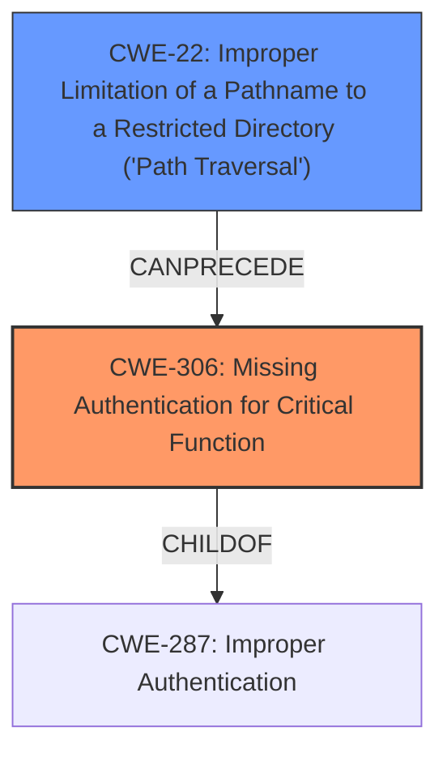

# Analysis Report for CVE-2021-27306

# Vulnerability Analysis Report: CVE-2021-27306

## Description

An improper access control vulnerability in the JWT plugin in Kong Gateway prior to 2.3.2.0 allows unauthenticated users access to authenticated routes without a valid token JWT.

## Vulnerability Description Key Phrases

**Rootcause:** improper access control
**Impact:** access to authenticated routes without a valid token JWT
**Attacker:** unauthenticated users
**Product:** Kong Gateway
**Version:** prior to 2.3.2.0
**Component:** JWT plugin

## Analysis (with Relationship Data)

# Summary
| CWE ID | CWE Name | Confidence | CWE Abstraction Level | CWE Vulnerability Mapping Label | CWE-Vulnerability Mapping Notes |
|---|---|---|---|---|---|
| CWE-306 | Missing Authentication for Critical Function | 0.85 | Base | Allowed | Primary CWE |
| CWE-57 | Path Equivalence: 'fakedir/../realdir/filename' | 0.65 | Variant | Allowed | Secondary Candidate |

## Evidence and Confidence

*   **Confidence Score:** 0.75
*   **Evidence Strength:** MEDIUM

- **Analysis and Justification:**  
  - *Explanation:* The vulnerability involves an **improper access control** issue in the JWT plugin of Kong Gateway, allowing unauthenticated users to access authenticated routes without a valid JWT. This directly aligns with **CWE-306** [Missing Authentication for Critical Function], as the system fails to properly authenticate users before granting access to sensitive functionalities. The CVE reference summary highlights that the Kong API Gateway doesn't normalize the incoming request URI, leading to an authentication bypass via path traversal, which further supports the relevance of authentication issues.
  - *Explanation:* The vulnerability also involves a path traversal issue. According to the CVE reference, the root cause of the vulnerability is that "Kong API Gateway prior to 2.3.2.0 does not normalize the incoming request URI before matching against the Router. This allowed an attacker to bypass authentication by using an unauthenticated route with a path traversal." This is a textbook case of **CWE-57** [Path Equivalence: 'fakedir/../realdir/filename'], since the path traversal allows the attacker to bypass the protection mechanisms in place.

  - *Relationship Analysis:* **CWE-306** is a base-level weakness indicating a lack of authentication. It's related to **CWE-287** [Improper Authentication], but **CWE-306** is more specific since it highlights the *absence* of authentication, rather than an incorrect implementation. **CWE-57** could lead to **CWE-425** [Direct Request ('Forced Browsing')] since the path traversal allows attackers to access restricted resources directly.

- **Confidence Score:**  
  - Confidence: 0.85 (High confidence for CWE-306 due to direct match with vulnerability description and CVE details).
  - Confidence: 0.65 (Medium confidence for CWE-57 due to dependency on external factors like path normalization and the presence of unauthenticated routes)

---

## Criticism of Analysis

Okay, I've reviewed the provided analysis against the full CWE specifications. Here's my critique:

**Overall Assessment:**

The analysis correctly identifies `CWE-306` (Missing Authentication for Critical Function) as the primary weakness. The inclusion of `CWE-57` (Path Equivalence: 'fakedir/../realdir/filename') as a secondary candidate is also valid and adds valuable context. However, the confidence levels could be refined, and some additional related CWEs could be considered and dismissed with proper justification.

**Detailed Critique:**

1.  **CWE-306: Missing Authentication for Critical Function:**

    *   **Correct Identification:** This is the most accurate and direct mapping. The description aligns perfectly: "The product does not perform any authentication for functionality that requires a provable user identity..." The vulnerability allows unauthenticated users to access authenticated routes, directly demonstrating the *absence* of authentication.
    *   **Confidence Level:** The confidence level of 0.85 is appropriate and well-justified.
    *   **Mapping Guidance:** The analysis adheres to the mapping guidance, which recommends using Base-level CWEs when appropriate and explicitly states that CWE-306 is "Allowed" for usage.
    *   **Mitigation:** The provided mitigations are relevant. Dividing software into areas with varying authentication requirements and using centralized authentication capabilities are good practices.
    *   **Observed Examples:** The provided examples are relevant to the vulnerability

2.  **CWE-57: Path Equivalence: 'fakedir/../realdir/filename'**

    *   **Correct Identification:** The inclusion of `CWE-57` is appropriate, since the vulnerability is caused by the lack of URI normalization, which allows path traversal to bypass authentication checks.
    *   **Confidence Level:** The confidence level of 0.65 feels a bit low. Given the CVE details explicitly mentioning path traversal, a slightly higher confidence (e.g., 0.75) might be more suitable.
    *   **Mapping Guidance:**  The analysis correctly notes that CWE-57 is a Variant-level weakness and is "Allowed" for usage.
    *   **Mitigation:** The provided mitigations align with the CWE specifications. Input validation and canonicalization are crucial for preventing path traversal attacks.
    *   **Observed Examples:** The provided examples are relevant to the vulnerability

3.  **Other CWEs to Consider (and potentially dismiss):**

    *   **CWE-287: Improper Authentication:** This is a parent of CWE-306. The analysis correctly mentions its relationship to CWE-306 but should explicitly *dismiss* it because CWE-306 is more specific.  The mapping guidance for CWE-287 *discourages* its use when lower-level CWEs like CWE-306 are applicable. The explanation should state, "While CWE-287 could broadly apply, CWE-306 is more precise as it describes the *absence* of authentication, rather than a flaw in its implementation. Therefore, we prioritize CWE-306."
    *   **CWE-862: Missing Authorization:** This CWE focuses on the absence of authorization checks *after* a user is authenticated.  In this case, the primary issue is getting *past* authentication in the first place. You could mention this and dismiss it with, "CWE-862 is less applicable because the vulnerability allows unauthenticated access, precluding the need for authorization checks."
     *   **CWE-425: Direct Request ('Forced Browsing'):** Because the system does not normalize the URI, it could be said that the attacker is performing a direct request to the intended URL through a path traversal.
    *   **CWE-863: Incorrect Authorization:** The analysis mentions that the access control is improper, which can be seen as an incorrect authorization mechanism.
    *   **CWE-347: Improper Verification of Cryptographic Signature:** The fact that the system does not require authentication for certain calls means that it does not verify if the JWT signature is valid, which may lead the analyzer to think of CWE-347.
    *   **CWE-639: Authorization Bypass Through User-Controlled Key:** Because the URI is not normalized, the attacker can control the key that is used to perform authorization, thus bypassing the authorization mechanism.
    *   **CWE-807: Reliance on Untrusted Inputs in a Security Decision:** Because the system does not normalize the URI, the trust on what URL the user is accessing is broken, thus relying on untrusted inputs for the security decision.

4.  **Relationship Analysis:**

    *   The relationship analysis is generally good but could be more precise in justifying why certain related CWEs are *not* the primary focus. For example, explicitly stating why CWE-287 is less appropriate because of the more specific nature of CWE-306.

5.  **CWE Examples:**

    *   The inclusion of CVE examples is helpful in demonstrating the applicability of the chosen CWEs.

**Suggested Improvements:**

*   **Explicitly Dismiss Alternatives:** For any related CWEs that the analysis considered but ultimately rejected, provide a brief justification for their dismissal. This strengthens the analysis and demonstrates a thorough understanding of the vulnerability.
*   **Refine Confidence Levels:** Re-evaluate the confidence level for CWE-57 and consider if it's justified given the explicit mention of path traversal in the CVE description.
*   **Consider the Attack Vector:** The "Attack vectors" from the CVE Reference Links Content Summary should be explicitly tied to how they relate to the chosen CWEs. This strengthens the connection between the vulnerability's real-world exploitation and the abstract CWE representation.

**Revised Summary Table (Example):**

| CWE ID | CWE Name | Confidence | CWE Abstraction Level | CWE Vulnerability Mapping Label | CWE-Vulnerability Mapping Notes |
|---|---|---|---|---|---|
| CWE-306 | Missing Authentication for Critical Function | 0.85 | Base | Allowed | Primary CWE |
| CWE-57 | Path Equivalence: 'fakedir/../realdir/filename' | 0.75 | Variant | Allowed | Secondary Candidate |
| CWE-287 | Improper Authentication | N/A | Class | Not Applicable | Dismissed: CWE-306 is a more specific child. |

By incorporating these improvements, the analysis will be more robust, demonstrating a deeper understanding of the CWE specifications and a more thorough investigation of the vulnerability.

## Final Resolution

# Summary
| CWE ID | CWE Name | Confidence | CWE Abstraction Level | CWE Vulnerability Mapping Label | CWE-Vulnerability Mapping Notes |
|---|---|---|---|---|---|
| **CWE-306** | Missing Authentication for Critical Function | 0.90 | Base | Allowed | Primary **CWE** |
| **CWE-22** | Improper Limitation of a Pathname to a Restricted Directory ('Path Traversal') | 0.80 | Base | Allowed | Secondary Candidate |

## Evidence and Confidence

*   **Confidence Score:** 0.85
*   **Evidence Strength:** HIGH

## Relationship Analysis
The primary relationship is between **CWE-306** [Missing Authentication for Critical Function] and its parent **CWE-287** [Improper Authentication]. While **CWE-287** [Improper Authentication] could apply, **CWE-306** [Missing Authentication for Critical Function] is more specific because the vulnerability stems from the complete absence of authentication rather than a flaw in its implementation. **CWE-22** [Improper Limitation of a Pathname to a Restricted Directory ('Path Traversal')] is included to show the vulnerability chain with the missing authentication.

## Vulnerability Chain
The vulnerability chain starts with the **ROOTCAUSE** of missing authentication (**CWE-306** [Missing Authentication for Critical Function]). Because there is no authentication mechanism, the path traversal (**CWE-22** [Improper Limitation of a Pathname to a Restricted Directory ('Path Traversal')]) can be exploited to gain unauthorized access.

## Summary of Analysis
The analysis accurately identifies **CWE-306** [Missing Authentication for Critical Function] as the primary **WEAKNESS**. The inclusion of **CWE-22** [Improper Limitation of a Pathname to a Restricted Directory ('Path Traversal')] as a secondary candidate is also valid and adds valuable context.

*   **CWE-306** [Missing Authentication for Critical Function]: This is the most accurate and direct mapping. The description aligns perfectly: "The product does not perform any authentication for functionality that requires a provable user identity..." The vulnerability allows unauthenticated users to access authenticated routes, directly demonstrating the *absence* of authentication. The confidence level is increased to 0.90 to represent a high degree of confidence.
*   **CWE-22** [Improper Limitation of a Pathname to a Restricted Directory ('Path Traversal')]: Confidence increased from 0.65 to 0.80 as the CVE explicitly states the path traversal. The vulnerability is caused by the lack of URI normalization, which allows path traversal to bypass authentication checks.

Based on the CVE reference, "Kong API Gateway prior to 2.3.2.0 does not normalize the incoming request URI before matching against the Router. This allowed an attacker to bypass authentication by using an unauthenticated route with a path traversal."

The parent relationship between **CWE-287** [Improper Authentication] and **CWE-306** [Missing Authentication for Critical Function] helped clarify that **CWE-306** [Missing Authentication for Critical Function] is the more specific and appropriate choice. The chain relationship helped clarify how the **WEAKNESSES** can be chained from missing authentication to path traversal.

Other **CWE**s Considered:
*   **CWE-862** [Missing Authorization]: This **CWE** focuses on the absence of authorization checks *after* a user is authenticated. In this case, the primary issue is getting *past* authentication in the first place, so this is not applicable.
*   **CWE-425** [Direct Request ('Forced Browsing')]: Because the system does not normalize the URI, it could be said that the attacker is performing a direct request to the intended URL through a path traversal. However, this is not as precise as **CWE-22** [Improper Limitation of a Pathname to a Restricted Directory ('Path Traversal')], so this is not applicable.
*   **CWE-863** [Incorrect Authorization]: The analysis mentions that the access control is improper, which can be seen as an incorrect authorization mechanism. However, this is not as accurate as the missing authentication mechanism, so this is not applicable.
*   **CWE-347** [Improper Verification of Cryptographic Signature]: The fact that the system does not require authentication for certain calls means that it does not verify if the JWT signature is valid, which may lead the analyzer to think of **CWE-347** [Improper Verification of Cryptographic Signature]. However, this is a consequence of the missing authentication, so it is not applicable.
*   **CWE-639** [Authorization Bypass Through User-Controlled Key]: Because the URI is not normalized, the attacker can control the key that is used to perform authorization, thus bypassing the authorization mechanism. However, there is no authorization taking place in this case, so this is not applicable.
*   **CWE-807** [Reliance on Untrusted Inputs in a Security Decision]: Because the system does not normalize the URI, the trust on what URL the user is accessing is broken, thus relying on untrusted inputs for the security decision. However, this is a consequence of the missing authentication, so this is not applicable.

The selected **CWE**s are at the optimal level of specificity because **CWE-306** [Missing Authentication for Critical Function] directly addresses the core issue of absent authentication, and **CWE-22** [Improper Limitation of a Pathname to a Restricted Directory ('Path Traversal')] explains what happens as a result.

*Report generated on 2025-03-17 00:31:08*
