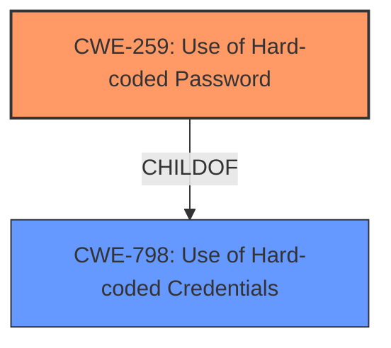

# Final Resolution for CVE-2021-27438

# Summary
| CWE ID | CWE Name | Confidence | CWE Abstraction Level | CWE Vulnerability Mapping Label | CWE-Vulnerability Mapping Notes |
|---|---|---|---|---|---|
| **CWE-259** | **Use of Hard-coded Password** | 0.95 | Variant | Allowed | Primary CWE. Further investigation is needed to determine if the **hard-coded password** is used for inbound or outbound authentication. Potential mitigations include storing passwords securely, enforcing initial password changes, and access control checks. CWE-321, CWE-916, and CWE-1391 are less appropriate due to the specific nature of the vulnerability as a **hard-coded password**, rather than a cryptographic key, a weak hashing algorithm, or a general weak credential issue. |

## Evidence and Confidence

*   **Confidence Score:** 0.95
*   **Evidence Strength:** HIGH

## Relationship Analysis
The primary relationship that influenced the decision was the parent-child relationship between CWE-798 (**Use of Hard-coded Credentials**) and CWE-259 (**Use of Hard-coded Password**). CWE-259 is a variant of CWE-798, offering a more specific classification given that the vulnerability description explicitly mentions a **hard-coded password**. There aren't any relevant chain relationships to consider in this particular case as the primary weakness directly leads to potential unauthorized access. There also aren't any compelling peer relationships that would suggest an alternative classification. The variant level of CWE-259 provides the optimal level of specificity for this vulnerability.

## Vulnerability Chain
The vulnerability chain is straightforward: The **ROOTCAUSE** is the **hard-coded password** (CWE-259) which directly leads to the potential for unauthorized access or compromised outbound communication, resulting in a security vulnerability. There are no missing links in this chain, as the presence of the **hard-coded password** immediately creates the risk.

## Summary of Analysis
The initial analysis correctly identified CWE-259 (**Use of Hard-coded Password**) as the primary CWE. The vulnerability description explicitly states the presence of a **hard-coded password**, which aligns perfectly with the definition of CWE-259.

The choice of CWE-259 is further justified by its relationship to CWE-798 (**Use of Hard-coded Credentials**). While CWE-798 is a valid classification, CWE-259 offers a more specific characterization of the weakness, making it the preferred choice.

The analysis could be improved by mentioning *how* the **hard-coded password** is used (inbound or outbound authentication), as this might affect the specific attack vectors and mitigations. For instance, if it's used for inbound authentication to the device itself, the impact could be higher. If it's used for outbound communication to a less critical external component, the impact might be lower. Adding this contextual information strengthens the analysis and provides better information for future tasks.

Additionally, consider mentioning *why* other CWEs in the retriever results are *not* as appropriate. For example:
*   "CWE-321 (Use of **Hard-coded Cryptographic Key**) is less appropriate because the description explicitly mentions a *password*, not a cryptographic key."
*   "CWE-916 (Use of Password Hash With Insufficient Computational Effort) would only be relevant if the **hard-coded password** was being *hashed* before being stored or used. There is no indication of this in the description."
*   "CWE-1391 (Use of Weak Credentials) is a class level CWE, making it too general. CWE-259 is a child of CWE-1391, and is much more specific."

The high confidence score of 0.95 is appropriate given the direct match. The chosen CWE is at the optimal level of specificity, providing sufficient information about the nature of the vulnerability without being overly broad.