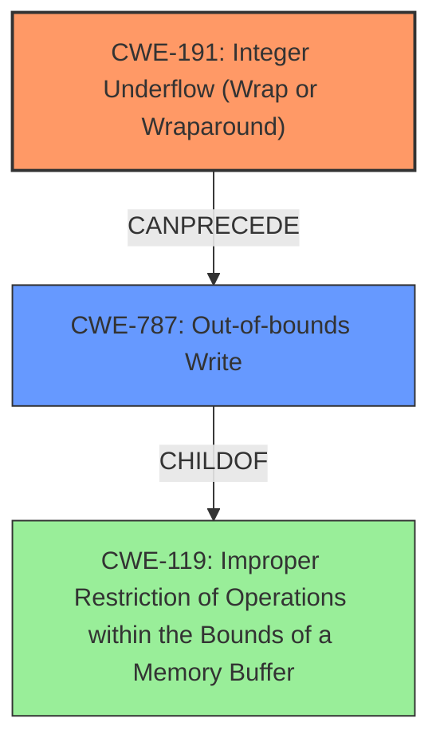

# Analysis Report for CVE-2021-27486

# Vulnerability Analysis Report: CVE-2021-27486

## Description

FATEK Automation WinProladder Versions 3.30 and prior is vulnerable to an integer underflow, which may cause an out-of-bounds write and allow an attacker to execute arbitrary code.

## Vulnerability Description Key Phrases

**Rootcause:** integer underflow
**Weakness:** out-of-bounds write
**Impact:** execute arbitrary code
**Attacker:** attacker
**Product:** FATEK Automation WinProladder
**Version:** Versions 3.30 and prior

## Analysis (with Relationship Data)

# Summary
| CWE ID | CWE Name | Confidence | CWE Abstraction Level | CWE Vulnerability Mapping Label | CWE-Vulnerability Mapping Notes |
|---|---|---|---|---|---|
| CWE-191 | Integer Underflow (Wrap or Wraparound) | 0.9 | Base | Allowed | Primary CWE: The vulnerability is caused by an integer underflow. |
| CWE-787 | Out-of-bounds Write | 0.7 | Base | Allowed | Secondary Candidate: The integer underflow leads to an out-of-bounds write. |

## Evidence and Confidence

*   **Confidence Score:** 0.8
*   **Evidence Strength:** HIGH

- **Analysis and Justification:**  
  - *Explanation:* "The vulnerability description explicitly states that the root cause is an **integer underflow** which can lead to an **out-of-bounds write**. CWE-191 (Integer Underflow) directly matches the **root cause**. The description also indicates that this **integer underflow** results in an **out-of-bounds write**, aligning with CWE-787. Both CWEs are at the Base level of abstraction, which is preferred. The advisory states that successful exploitation can lead to the execution of arbitrary code."
  
  - *Relationship Analysis:* "CWE-191 can lead to CWE-787 as the underflow is the root cause of the out-of-bounds write. CWE-787 is a parent of multiple buffer overflow variants."

- **Confidence Score:**  
  - Confidence: 0.9 (High confidence due to explicit mention of Integer Underflow and Out-of-bounds Write)

---

## Criticism of Analysis

Okay, I've reviewed the provided analysis against the full CWE specifications you've included. Here's my critique:

**Overall Assessment:**

The analysis is generally sound and well-justified. The mapping of CWE-191 (Integer Underflow) as the primary cause and CWE-787 (Out-of-bounds Write) as a secondary consequence is accurate based on the vulnerability description. The confidence levels are appropriate.

**Detailed Review:**

*   **CWE-191: Integer Underflow (Wrap or Wraparound)**

    *   **Mapping:** Correct. The description explicitly states an integer underflow as the root cause. This aligns perfectly with the CWE-191 description: "The product subtracts one value from another, such that the result is less than the minimum allowable integer value, which produces a value that is not equal to the correct result."
    *   **Abstraction Level:** Correct. CWE-191 is a Base level CWE, which is preferred for root cause analysis.
    *   **Confidence:** Justified. A confidence of 0.9 is reasonable given the direct statement in the vulnerability description.
    *   **CWE Examples:** the provided examples align with what is expected, and CVE-2021-27486 is specifically named as an example.
    *   **Mitigations:** The included mitigations from the CWE specification are also appropriate. Using a language with built-in overflow/underflow protection or using libraries with safe integer handling are valid suggestions.

*   **CWE-787: Out-of-bounds Write**

    *   **Mapping:** Correct. The vulnerability description clearly states the *consequence* of the integer underflow is an out-of-bounds write.
    *   **Abstraction Level:** Correct. CWE-787 is a Base level CWE.
    *   **Confidence:** Justified. A confidence of 0.7 is reasonable, as it's a consequence of the underflow rather than the direct cause.
    *   **Relationships:** The "CanFollow" relationships are relevant here, as CWE-787 can follow from issues like uninitialized pointers (CWE-824). Although not directly applicable to this specific case.
    *   **Mitigations:** The listed mitigations are suitable for addressing out-of-bounds writes, such as using memory-safe languages, safe string handling libraries, and compiler-based buffer overflow detection.

**Review of Retriever Results:**

The Retriever Results table presents a list of potential CWEs, and it's useful to consider why some of the higher-ranked ones were *not* chosen:

*   **CWE-190: Integer Overflow or Wraparound:** While related, the vulnerability is specifically an *underflow*, not an overflow.  The tool correctly distinguished this.
*   **CWE-824: Access of Uninitialized Pointer:** While an out-of-bounds write *could* be related to an uninitialized pointer, the description doesn't indicate that's the case here. The integer underflow is the explicit cause.
*   **CWE-193: Off-by-one Error:** This is a *possible* contributing factor, but less directly relevant than the integer underflow. It might be involved in how the underflow leads to the out-of-bounds write, but it's not explicitly mentioned.
*   **CWE-125: Out-of-bounds Read:** This is *not* the described vulnerability. The problem is writing outside the buffer, not reading.
*   **CWE-129: Improper Validation of Array Index:**  Possibly relevant, but the root cause isn't *specifically* an improper validation of an array index, but the integer underflow itself that leads to it.
*   **CWE-1285: Improper Validation of Specified Index, Position, or Offset in Input:** Similar to CWE-129, it's a possible contributing factor, but not the primary cause.
*   **CWE-121: Stack-based Buffer Overflow:** While the out-of-bounds write *could* lead to a stack-based buffer overflow, the analysis doesn't have enough information to specify where the buffer is located, so it's not a strong mapping.
*   **CWE-170: Improper Null Termination:** Not relevant to this specific vulnerability.

**Suggestions for Improvement:**

*   **Chain of Causation:** While the analysis notes the relationship between CWE-191 and CWE-787, elaborating slightly on the specific *mechanism* by which the integer underflow leads to the out-of-bounds write would strengthen the analysis. For instance, does the underflow result in a negative index being used, or a small, incorrect size calculation for a memory allocation? Knowing the *how* would further validate the chosen CWEs. If the index is calculated based on the potentially underflowed value, consider including CWE-682 (Incorrect Calculation) in the chain.
*   **Consider specific CWE-119 children:** Since CWE-787 is a child of CWE-119, if there were more details regarding the type of memory corruption, more specific children could have been more appropriate.
*   **Exploitation Details:** The analysis is based on the vulnerability *description*. If more details were available about how the vulnerability is exploited in practice (e.g., buffer location - heap vs. stack), the confidence in the CWE-787 mapping could be increased, and potentially more specific CWEs could be selected (e.g., CWE-121 Stack-based Buffer Overflow or CWE-122 Heap-based Buffer Overflow).

**Conclusion:**

The analysis is well-reasoned and accurately reflects the vulnerability description. The choice of CWE-191 and CWE-787 is correct and justified. Incorporating more specific details about the underflow-to-out-of-bounds write mechanism and potential exploitation scenarios, if available, would further enhance the analysis. The provided scores seem appropriate, but could be adjusted slightly based on the suggestions above.

## Final Resolution

# Summary
| CWE ID | CWE Name | Confidence | CWE Abstraction Level | CWE Vulnerability Mapping Label | CWE-Vulnerability Mapping Notes |
|---|---|---|---|---|---|
| CWE-191 | Integer Underflow (Wrap or Wraparound) | 0.9 | Base | Allowed | Primary CWE: The vulnerability is caused by an integer underflow. |
| CWE-787 | Out-of-bounds Write | 0.7 | Base | Allowed | Secondary Candidate: The integer underflow leads to an out-of-bounds write. |

## Evidence and Confidence

*   **Confidence Score:** 0.85
*   **Evidence Strength:** HIGH

## Relationship Analysis
The primary relationship is a chain where **CWE-191** (Integer Underflow) *CanPrecede* **CWE-787** (Out-of-bounds Write). The underflow results in an incorrect calculation or index that is then used in a write operation, leading to the out-of-bounds write. **CWE-787** is a *ChildOf* **CWE-119** (Improper Restriction of Operations within the Bounds of a Memory Buffer), indicating that it's a specific type of buffer-related issue. No peer relationships significantly impacted the decision, as the other potential CWEs identified by the retriever were less directly relevant than **CWE-191** and **CWE-787**. Both selected CWEs are at the Base level, which is the preferred level of abstraction.

## Vulnerability Chain
The vulnerability chain starts with **CWE-191** (**Integer Underflow**). This underflow leads to an incorrect calculation or index, which then results in **CWE-787** (**Out-of-bounds Write**). The final impact is the ability to execute arbitrary code. There are no missing links in the chain based on the provided information.

## Summary of Analysis
The initial analysis and criticism both agree on the primary and secondary CWE assignments, with the primary **WEAKNESS** being **CWE-191** and the secondary being **CWE-787**.

The vulnerability description explicitly states "FATEK Automation WinProladder Versions 3.30 and prior is vulnerable to an **integer underflow**, which may cause an **out-of-bounds write** and allow an attacker to execute arbitrary code." This statement provides direct evidence for both **CWE-191** and **CWE-787**.

The graph relationships influenced the selection by confirming that **CWE-787** is a valid consequence of **CWE-191**. Both selected CWEs are at the optimal level of specificity (Base), providing a clear and accurate representation of the vulnerability. The choice of Base level CWEs allows for direct mapping to the **root cause** and its immediate consequence, avoiding overly broad or abstract classifications.

*Report generated on 2025-03-16 16:24:52*
