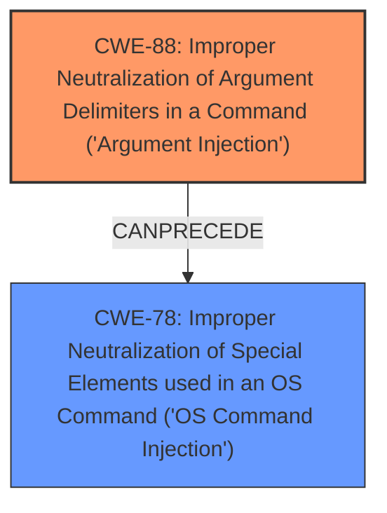

# Final Resolution for CVE-2021-27730

# Summary
| CWE ID | CWE Name | Confidence | CWE Abstraction Level | CWE Vulnerability Mapping Label | CWE-Vulnerability Mapping Notes |
|---|---|---|---|---|---|
| CWE-88 | Improper Neutralization of Argument Delimiters in a Command ('Argument Injection') | 0.95 | Base | Allowed | Primary CWE. The **argument injection** vulnerability in Accellion FTA aligns directly with this CWE, which describes the improper handling of argument delimiters in commands. |
| CWE-78 | Improper Neutralization of Special Elements used in an OS Command ('OS Command Injection') | 0.7 | Base | Allowed | Secondary CWE. While the primary issue is **argument injection**, this could potentially lead to OS command injection if the injected arguments are used to construct OS commands, depending on how the injected arguments are used by the vulnerable code. |

## Evidence and Confidence

*   **Confidence Score:** 0.9
*   **Evidence Strength:** HIGH

## Relationship Analysis
The primary weakness is **CWE-88** (**Improper Neutralization of Argument Delimiters in a Command ('Argument Injection')**). This is a base-level CWE, providing a good level of specificity. **CWE-78** (**Improper Neutralization of Special Elements used in an OS Command ('OS Command Injection')**) is included as a secondary weakness because **CWE-88** can precede **CWE-78**, where successful **argument injection** could potentially lead to OS command injection if the injected arguments are used in OS commands.

## Vulnerability Chain
The vulnerability chain starts with the **ROOTCAUSE** of improper neutralization of argument delimiters (**CWE-88**). If an attacker successfully injects malicious arguments, and those arguments are used to construct an OS command, it leads to **CWE-78** (**Improper Neutralization of Special Elements used in an OS Command ('OS Command Injection')**). The final impact is arbitrary command execution on the server.

## Summary of Analysis
The initial analysis and the criticism both agree that **CWE-88** is the most appropriate primary CWE for this vulnerability. The vulnerability description clearly states that the Accellion FTA is affected by **argument injection**. The criticism correctly points out that **CWE-78** is only applicable if the **argument injection** actually results in OS command execution, which is a reasonable condition. The criticism also rightly suggests removing **CWE-77** and **CWE-74** due to their higher level of abstraction.

The final decision is to classify the vulnerability as primarily **CWE-88** with **CWE-78** as a secondary CWE when the injected arguments are used to construct an OS command. This provides the optimal level of specificity based on the available evidence. The vulnerability description explicitly mentions **argument injection**, and the retriever results confirm that **CWE-88** is a relevant CWE.