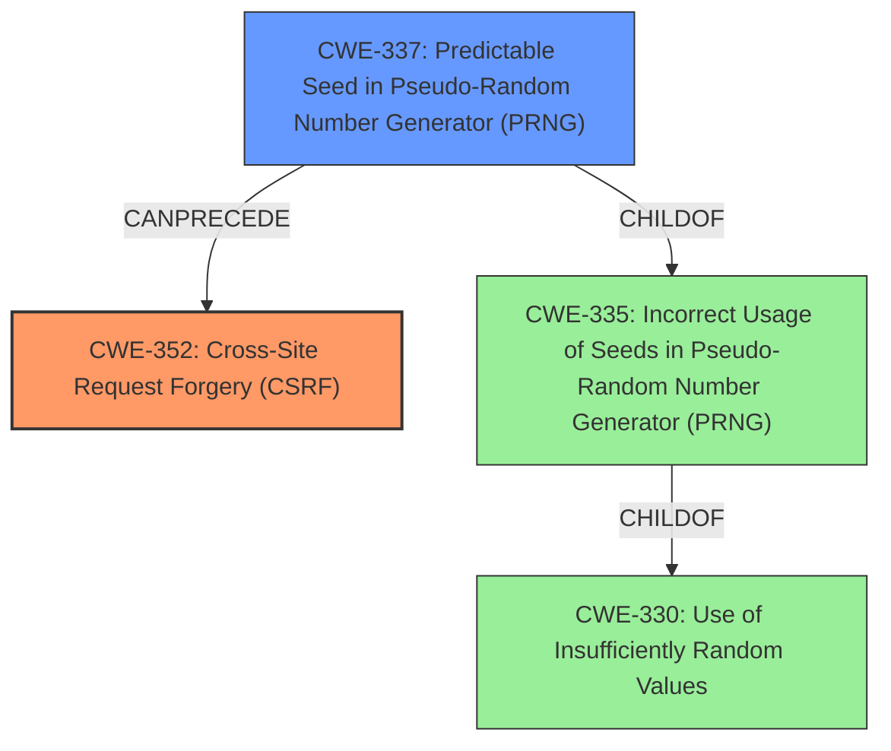

# Analysis Report for CVE-2021-28055

# Vulnerability Analysis Report: CVE-2021-28055

## Description

An issue was discovered in Centreon-Web in Centreon Platform 20.10.0. The anti-CSRF token generation is predictable, which might allow CSRF attacks that add an admin user.

## Vulnerability Description Key Phrases

**Rootcause:** predictable anti-CSRF token generation
**Impact:** CSRF attacks
**Product:** Centreon Platform
**Version:** 20.10.0
**Component:** Centreon-Web

## Analysis (with Relationship Data)

# Summary
| CWE ID | CWE Name | Confidence | CWE Abstraction Level | CWE Vulnerability Mapping Label | CWE-Vulnerability Mapping Notes |
|---|---|---|---|---|---|
| CWE-352 | Cross-Site Request Forgery (CSRF) | 0.95 | Compound | Allowed | Primary CWE |
| CWE-340 | Generation of Predictable Numbers or Identifiers | 0.75 | Class | Allowed-with-Review | Secondary Candidate |

## Evidence and Confidence

*   **Confidence Score:** 0.85
*   **Evidence Strength:** HIGH

- **Analysis and Justification:**  
  - *Explanation:* The vulnerability description explicitly states that the **anti-CSRF token generation is predictable**, which can lead to **CSRF attacks**. This directly aligns with CWE-352 [Cross-Site Request Forgery (CSRF)], which is a compound weakness describing scenarios where an application doesn't sufficiently verify that a request was intentionally provided by the user. The **predictable anti-CSRF token** is the underlying cause that enables the CSRF attack. CWE-340 [Generation of Predictable Numbers or Identifiers] could also be considered as a contributing factor, as it describes the use of schemes that generate predictable identifiers, but CWE-352 accurately describes the vulnerability.
  
  - *Relationship Analysis:* CWE-352 requires proper session management (CWE-613) and protection against modified requests (CWE-807) to prevent CSRF attacks. CWE-1275 [Sensitive Cookie with Improper SameSite Attribute] can precede CWE-352.

- **Confidence Score:**  
  - Confidence: 0.95 (High confidence due to direct mention of CSRF and predictable token generation)

---
# Summary
| CWE ID | CWE Name | Confidence | CWE Abstraction Level | CWE Vulnerability Mapping Label | CWE-Vulnerability Mapping Notes |
|---|---|---|---|---|---|
| CWE-352 | Cross-Site Request Forgery (CSRF) | 0.95 | Compound | Allowed | Primary CWE |
| CWE-340 | Generation of Predictable Numbers or Identifiers | 0.75 | Class | Allowed-with-Review | Secondary Candidate |

## Evidence and Confidence

*   **Confidence Score:** 0.85
*   **Evidence Strength:** HIGH

- **Analysis and Justification:**  
  - *Explanation:* The vulnerability description explicitly states that the **anti-CSRF token generation is predictable**, which can lead to **CSRF attacks**. This directly aligns with CWE-352 [Cross-Site Request Forgery (CSRF)], which is a compound weakness describing scenarios where an application doesn't sufficiently verify that a request was intentionally provided by the user. The **predictable anti-CSRF token** is the underlying cause that enables the CSRF attack. CWE-340 [Generation of Predictable Numbers or Identifiers] could also be considered as a contributing factor, as it describes the use of schemes that generate predictable identifiers, but CWE-352 accurately describes the vulnerability.
  
  - *Relationship Analysis:* CWE-352 requires proper session management (CWE-613) and protection against modified requests (CWE-807) to prevent CSRF attacks. CWE-1275 [Sensitive Cookie with Improper SameSite Attribute] can precede CWE-352.

- **Confidence Score:**  
  - Confidence: 0.95 (High confidence due to direct mention of CSRF and predictable token generation)

---

## Criticism of Analysis

Okay, I've reviewed the provided analysis and the full CWE specifications for each referenced CWE. Here's a detailed critique:

**Overall Assessment:**

The analysis is generally sound and well-reasoned. The primary mapping to CWE-352 (Cross-Site Request Forgery) is correct and justified. The inclusion of CWE-340 (Generation of Predictable Numbers or Identifiers) as a secondary candidate is also appropriate and shows a good understanding of the underlying cause. The confidence scores are reasonable given the information provided in the vulnerability description.

**Detailed Critique:**

*   **CWE-352: Cross-Site Request Forgery (CSRF)**

    *   **Correctness:** The mapping to CWE-352 is highly accurate. The description of the vulnerability clearly indicates a CSRF issue due to the predictable anti-CSRF token. This aligns perfectly with CWE-352's description: "The web application does not, or can not, sufficiently verify whether a well-formed, valid, consistent request was intentionally provided by the user who submitted the request."
    *   **Abstraction Level:** CWE-352 is a "Compound" CWE, which is allowed but not ideal. The rationale within the CWE specification itself acknowledges this: "Perform root-cause analysis to determine if other weaknesses allow CSRF attacks to occur, and map to those weaknesses. For example, predictable CSRF tokens might allow bypass of CSRF protection mechanisms; if this occurs, they might be better characterized as randomness/predictability weaknesses." The analysis *does* acknowledge this, which is good.  However...
    *   **Relationship Analysis:** The relationship analysis is helpful in identifying related CWEs, like CWE-613, CWE-807, and CWE-1275, can all contribute to or be related to CSRF.
    *   **Confidence:** The confidence score of 0.95 is justified due to the explicit mention of "CSRF attacks" in the vulnerability description.
    *   **Mitigations:** The listed mitigations are relevant and appropriate for CWE-352. Using vetted libraries/frameworks and generating unpredictable nonces are standard CSRF prevention techniques.

*   **CWE-340: Generation of Predictable Numbers or Identifiers**

    *   **Correctness:** Including CWE-340 as a secondary candidate is good practice. It highlights the root cause of the CSRF vulnerability: the predictable token generation.  Even though the *impact* is CSRF, the *cause* is the predictable identifier.
    *   **Abstraction Level:** CWE-340 is a "Class" CWE, and the mapping guidance suggests examining children of this entry for a better fit.  This is where the analysis could be slightly improved.  Let's examine the children of CWE-330 (which is a parent of CWE-340). We find CWE-338.
    *   **Could CWE-338 be More Appropriate?** CWE-338, "Use of Cryptographically Weak Pseudo-Random Number Generator (PRNG)," might be a *slightly* more accurate mapping than CWE-340 *if* the predictable tokens were generated using a PRNG not designed for cryptographic purposes (as opposed to, say, a simple counter or timestamp).  However, without knowing the specific implementation details of the token generation, it's difficult to say for sure. Keeping CWE-340 is still a good call, however.
    *   **Confidence:** The confidence score of 0.75 is appropriate. It's a contributing factor, but not the direct, explicit impact.

**Improvements and Suggestions:**

1.  **Consider CWE-338 (conditionally):** If there is evidence (even indirect) that a cryptographically weak PRNG was used, consider adding CWE-338 as a co-primary CWE or replacing CWE-340 with CWE-338 (or possibly CWE-330 as well). The vulnerability description lacks the necessary detail, so this is more of a theoretical suggestion.

2.  **Mitigation Specificity:**  While the listed mitigations are generally good, consider adding a mitigation specifically related to the *predictable generation* of the CSRF token.  This might include:

    *   **Implementation:** Replace the predictable token generation method with a cryptographically secure random number generator (CSPRNG) with adequate entropy.
    *   **Implementation:** Consider using HMAC with a secret key to generate the CSRF token, ensuring that the token is unique and unpredictable.

3.  **Expand Relationship Analysis:** Briefly mention the potential relationship between CWE-340 and higher-level CWEs like CWE-330 ("Use of Insufficiently Random Values").  This shows a broader understanding of the weakness.

**Revised Summary Table (with Optional changes):**

| CWE ID | CWE Name | Confidence | CWE Abstraction Level | CWE Vulnerability Mapping Label | CWE-Vulnerability Mapping Notes |
|---|---|---|---|---|---|
| CWE-352 | Cross-Site Request Forgery (CSRF) | 0.95 | Compound | Allowed | Primary CWE |
| CWE-340 | Generation of Predictable Numbers or Identifiers | 0.75 | Class | Allowed-with-Review | Secondary Candidate / Contributing Factor |
| CWE-338 | Use of Cryptographically Weak Pseudo-Random Number Generator (PRNG) | 0.60 | Base | Allowed | Optional Tertiary Candidate |

**Conclusion:**

The analysis is strong. The primary CWE mapping is correct, the secondary candidate is well-justified, and the explanation is clear. The suggestions are minor refinements based on the available information and the CWE specifications.

## Final Resolution

# Summary
| CWE ID | CWE Name | Confidence | CWE Abstraction Level | CWE Vulnerability Mapping Label | CWE-Vulnerability Mapping Notes |
|---|---|---|---|---|---|
| CWE-352 | Cross-Site Request Forgery (CSRF) | 0.95 | Compound | Allowed | Primary CWE |
| CWE-337 | Predictable Seed in Pseudo-Random Number Generator (PRNG) | 0.85 | Variant | Allowed | Secondary Candidate |

## Evidence and Confidence

*   **Confidence Score:** 0.90
*   **Evidence Strength:** HIGH

## Relationship Analysis
The primary CWE is CWE-352 [Cross-Site Request Forgery (CSRF)], which is a compound weakness. The secondary CWE is CWE-337 [Predictable Seed in Pseudo-Random Number Generator (PRNG)], which is a variant. CWE-337 is a child of CWE-335 [Incorrect Usage of Seeds in Pseudo-Random Number Generator (PRNG)], which in turn is a child of CWE-330 [Use of Insufficiently Random Values]. The selection of CWE-337 over CWE-340 is based on the observation that the vulnerability description mentions a "predictable" anti-CSRF token generation which implies a weak or predictable seed was used for a PRNG.

## Vulnerability Chain
The vulnerability chain starts with a **ROOTCAUSE** of **CWE-337** [Predictable Seed in Pseudo-Random Number Generator (PRNG)], where a predictable seed is used to initialize a PRNG. This leads to the generation of predictable anti-CSRF tokens. The weakness of predictable tokens then leads to **CWE-352** [Cross-Site Request Forgery (CSRF)], where an attacker can forge requests on behalf of a legitimate user. This can lead to unauthorized actions, such as adding an admin user in this specific case.

## Summary of Analysis
The initial analysis correctly identified CWE-352 [Cross-Site Request Forgery (CSRF)] as the primary weakness based on the explicit mention of CSRF attacks in the vulnerability description: "The anti-CSRF token generation is predictable, which might allow CSRF attacks that add an admin user."

The criticism suggested considering CWE-338 [Use of Cryptographically Weak Pseudo-Random Number Generator (PRNG)] if a cryptographically weak PRNG was used. However, CWE-337 [Predictable Seed in Pseudo-Random Number Generator (PRNG)] is a more precise fit, because the description specifically mentions predictable anti-CSRF token generation which implies a predictable seed.

The graph relationships influenced the final selection by highlighting the hierarchy of CWEs related to randomness. This led to the selection of CWE-337 as a more specific and appropriate secondary CWE than CWE-340.

The selected CWEs are at the optimal level of specificity because CWE-352 directly describes the CSRF vulnerability, and CWE-337 describes the specific mechanism (predictable seed) that enables the CSRF attack.

*Report generated on 2025-03-16 22:37:40*
