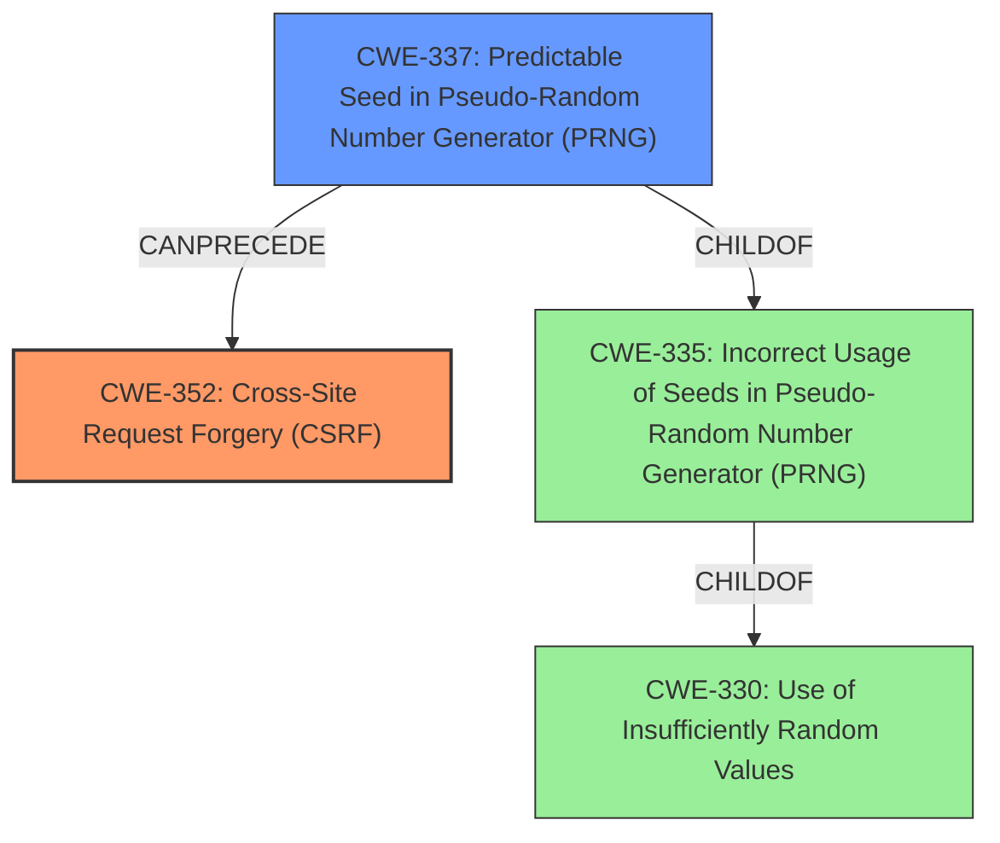

# Final Resolution for CVE-2021-28055

# Summary
| CWE ID | CWE Name | Confidence | CWE Abstraction Level | CWE Vulnerability Mapping Label | CWE-Vulnerability Mapping Notes |
|---|---|---|---|---|---|
| CWE-352 | Cross-Site Request Forgery (CSRF) | 0.95 | Compound | Allowed | Primary CWE |
| CWE-337 | Predictable Seed in Pseudo-Random Number Generator (PRNG) | 0.85 | Variant | Allowed | Secondary Candidate |

## Evidence and Confidence

*   **Confidence Score:** 0.90
*   **Evidence Strength:** HIGH

## Relationship Analysis
The primary CWE is CWE-352 [Cross-Site Request Forgery (CSRF)], which is a compound weakness. The secondary CWE is CWE-337 [Predictable Seed in Pseudo-Random Number Generator (PRNG)], which is a variant. CWE-337 is a child of CWE-335 [Incorrect Usage of Seeds in Pseudo-Random Number Generator (PRNG)], which in turn is a child of CWE-330 [Use of Insufficiently Random Values]. The selection of CWE-337 over CWE-340 is based on the observation that the vulnerability description mentions a "predictable" anti-CSRF token generation which implies a weak or predictable seed was used for a PRNG.

## Vulnerability Chain
The vulnerability chain starts with a **ROOTCAUSE** of **CWE-337** [Predictable Seed in Pseudo-Random Number Generator (PRNG)], where a predictable seed is used to initialize a PRNG. This leads to the generation of predictable anti-CSRF tokens. The weakness of predictable tokens then leads to **CWE-352** [Cross-Site Request Forgery (CSRF)], where an attacker can forge requests on behalf of a legitimate user. This can lead to unauthorized actions, such as adding an admin user in this specific case.

## Summary of Analysis
The initial analysis correctly identified CWE-352 [Cross-Site Request Forgery (CSRF)] as the primary weakness based on the explicit mention of CSRF attacks in the vulnerability description: "The anti-CSRF token generation is predictable, which might allow CSRF attacks that add an admin user."

The criticism suggested considering CWE-338 [Use of Cryptographically Weak Pseudo-Random Number Generator (PRNG)] if a cryptographically weak PRNG was used. However, CWE-337 [Predictable Seed in Pseudo-Random Number Generator (PRNG)] is a more precise fit, because the description specifically mentions predictable anti-CSRF token generation which implies a predictable seed.

The graph relationships influenced the final selection by highlighting the hierarchy of CWEs related to randomness. This led to the selection of CWE-337 as a more specific and appropriate secondary CWE than CWE-340.

The selected CWEs are at the optimal level of specificity because CWE-352 directly describes the CSRF vulnerability, and CWE-337 describes the specific mechanism (predictable seed) that enables the CSRF attack.