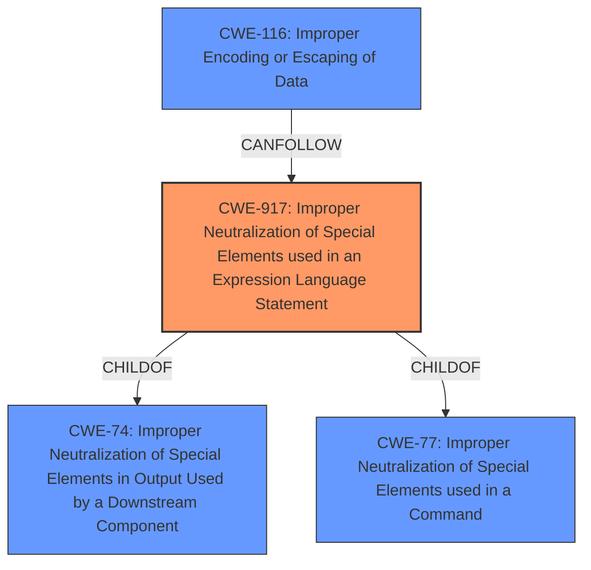

# Analysis Report for CVE-2021-28170

# Vulnerability Analysis Report: CVE-2021-28170

## Description

In the Jakarta Expression Language implementation 3.0.3 and earlier, a bug in the ELParserTokenManager enables invalid EL expressions to be evaluated as if they were valid.

## Vulnerability Description Key Phrases

**Rootcause:** bug in the ELParserTokenManager
**Impact:** evaluate invalid EL expressions
**Product:** Jakarta Expression Language
**Version:** 3.0.3 and earlier

## Analysis (with Relationship Data)

# Summary
| CWE ID | CWE Name | Confidence | CWE Abstraction Level | CWE Vulnerability Mapping Label | CWE-Vulnerability Mapping Notes |
|---|---|---|---|---|---|
| CWE-917 | Improper Neutralization of Special Elements used in an Expression Language Statement ('Expression Language Injection') | 0.9 | Base | Allowed | Primary CWE. The vulnerability involves a bug in the ELParserTokenManager that allows invalid EL expressions to be evaluated, aligning with the CWE's description. |
| CWE-116 | Improper Encoding or Escaping of Data | 0.6 | Class | Allowed-with-Review | Secondary CWE. The vulnerability allows attackers to bypass input sanitization controls, which suggests a problem with encoding or escaping data. |

## Evidence and Confidence

*   **Confidence Score:** 0.75
*   **Evidence Strength:** MEDIUM

- **Analysis and Justification:**  
  - *Explanation:* The vulnerability description clearly indicates a **bug in the ELParserTokenManager** that allows invalid EL expressions to be evaluated as if they were valid. This directly aligns with CWE-917 (Improper Neutralization of Special Elements used in an Expression Language Statement ('Expression Language Injection')), as the **root cause** is the **improper handling of special elements within the EL expression**. The CVE reference summary further supports this by mentioning "Incorrect EL expression tokenization." The **impact** is that attackers can bypass input sanitization controls, potentially leading to RCE. The Retriever results also list CWE-917 as the top candidate.
  - *Explanation:* CWE-116 (Improper Encoding or Escaping of Data) is also considered since the vulnerability allows attackers to bypass input sanitization controls that developers may have put in place, which suggests a problem with encoding or escaping data. The CVE Summary refers to "Improper Input Sanitization". This CWE is secondary since it represents a consequence of the primary weakness.

  - *Relationship Analysis:* CWE-917 is a child of CWE-77 (Command Injection) and CWE-74 (Improper Neutralization of Special Elements). CWE-116 is a Class-level CWE, and its usage is Allowed-with-Review.

- **Confidence Score:**  
  - Confidence: 0.9 (High confidence due to direct evidence from the vulnerability description, CVE reference and Retriever Results)
  - Confidence: 0.6 (Medium confidence in CWE-116 due to the broader nature of the description and the indirect connection to the root cause)

---

## Criticism of Analysis

Okay, here's a review of the provided CWE analysis, incorporating the full CWE specifications:

**Overall Assessment:**

The analysis is generally good, providing a solid justification for the primary CWE selection (CWE-917). The inclusion of CWE-116 as a secondary weakness is also reasonable. However, some aspects can be refined, particularly regarding the confidence scores and the relationship between CWEs.

**Detailed Review:**

*   **CWE-917: Improper Neutralization of Special Elements used in an Expression Language Statement ('Expression Language Injection')**
    *   **Confidence:** The initial analysis assigned a confidence of 0.9, which is high and justified. The description of the vulnerability directly maps to CWE-917's definition. The `ELParserTokenManager` bug directly leads to the improper handling of special elements within EL expressions, allowing attackers to inject malicious expressions.
    *   **Abstraction Level:** The analysis correctly identifies CWE-917 as a "Base" level CWE. This is crucial because the mapping guidance specifically states, "This CWE entry is at the Base level of abstraction, which is a preferred level of abstraction for mapping to the root causes of vulnerabilities."
    *   **Mitigation:** The analysis doesn't explicitly discuss mitigations, but it's implied through "input sanitization controls". The CWE specification provides more specific mitigation strategies:
        *   **Architecture and Design:** "Avoid adding user-controlled data into an expression interpreter when possible." This is a good principle.
        *   **Implementation:**  "If user-controlled data must be added to an expression interpreter, one or more of the following should be performed:
            *   Validate that the user input will not evaluate as an expression.
            *   Encode the user input in a way that ensures it is not evaluated as an expression." These are key preventative measures.
        *   **System Configuration, Operation:** "The framework or tooling might allow the developer to disable or deactivate the processing of EL expressions, such as setting the isELIgnored attribute for a JSP page to 'true'." Consider if the EL interpreter needs to be turned on at all.

    *   **Relationships:** The specification correctly notes that CWE-917 is a child of CWE-77 and CWE-74. Understanding these parent relationships helps to contextualize the vulnerability within the broader landscape of injection flaws. The peer relationship with CWE-1336 is also important to be aware of, and the note about further clarification is relevant.
    *   **Observed Examples:** The inclusion of CVE-2021-44228 (Log4Shell) as an observed example for CWE-917 is extremely relevant and strengthens the analysis.

*   **CWE-116: Improper Encoding or Escaping of Output**
    *   **Confidence:** The initial analysis assigned a confidence of 0.6, which is reasonable. While the vulnerability allows bypass of input sanitization controls, the *root cause* is the failure of the EL parser to correctly tokenize the EL expression. The specification of CVE-2021-28170 emphasizes "Incorrect EL expression tokenization." The analysis accurately identifies that attackers can bypass input sanitization controls.
    *   **Abstraction Level:** The analysis correctly identifies CWE-116 as a Class level. This is important to note, and, as it is a Class, it is not preferred as the primary root cause mapping. The analysis is also correct that its usage is "Allowed-with-Review."
    *   **Mitigation:**  The analysis should consider the more specific mitigations provided in the CWE specification:
        *   **Architecture and Design, Strategy:** Libraries or Frameworks "Use a vetted library or framework that does not allow this weakness to occur or provides constructs that make this weakness easier to avoid."
        *   **Architecture and Design, Strategy:** Parameterization "If available, use structured mechanisms that automatically enforce the separation between data and code. These mechanisms may be able to provide the relevant quoting, encoding, and validation automatically, instead of relying on the developer to provide this capability at every point where output is generated."
        *   **Architecture and Design, Implementation:** "Understand the context in which your data will be used and the encoding that will be expected."

    *   **Relationships:** The specification notes that this weakness is primary to all weaknesses related to injection (CWE-74) since the inherent nature of injection involves the violation of structured messages.

**Recommendations for Improvement:**

1.  **Strengthen the Relationship Analysis:** While the analysis mentions parent/child relationships, it could benefit from a deeper exploration of how the vulnerabilities relate to each other. Is CWE-116 a direct consequence of CWE-917? For example, if the parser *correctly* tokenized the EL expression, would proper escaping be more effective?
2.  **Consider CWE-77 and CWE-78:** Considering the relationships of CWE-917 and CWE-1336, specifically, their children are CWE-77 (Improper Neutralization of Special Elements used in a Command) which is a child of CWE-74 (Improper Neutralization of Special Elements in Output Used by a Downstream Component) and CWE-78 (Improper Neutralization of Special Elements used in an OS Command), a deeper dive into these specifications is warranted.

    CWE-77 is a Class-level CWE and states, "The product constructs all or part of a command using externally-influenced input from an upstream component, but it does not neutralize or incorrectly neutralizes special elements that could modify the intended command when it is sent to a downstream component." This description is applicable since the invalid EL expression is still evaluated as if it were valid.

    CWE-78 is a Base-level CWE and states, "The product constructs all or part of an OS command using externally-influenced input from an upstream component, but it does not neutralize or incorrectly neutralizes special elements that could modify the intended OS command when it is sent to a downstream component." This description is also applicable since the invalid EL expression can be used to execute arbitrary code or leak sensitive data.

3.  **Evaluate Applicability of CWE-1336:** Consider whether CWE-1336, "Improper Neutralization of Special Elements Used in a Template Engine," is also applicable. If the EL expressions are being used *within* a template engine context, this CWE might provide additional nuance. However, the core issue remains the incorrect tokenization, which makes CWE-917 the more direct mapping.
4.  **Address the Limitations of Input Validation:** As the CWE specification mentions, many people treat injection only as an input validation problem. However, it's essential to recognize that input validation is only one potential protection mechanism (output encoding is another), and there is a chaining relationship between improper input validation and the improper enforcement of the structure of messages to other components.
5.  **Review Retriever Results:** Reviewing the retriever results, several CWES are also worth considering.

    *   CWE-1333 Inefficient Regular Expression Complexity
    *   CWE-204 Observable Response Discrepancy
    *   CWE-674 Uncontrolled Recursion

**Revised Summary Table:**

| CWE ID | CWE Name | Confidence | CWE Abstraction Level | CWE Vulnerability Mapping Label | CWE-Vulnerability Mapping Notes |
|---|---|---|---|---|---|
| CWE-917 | Improper Neutralization of Special Elements used in an Expression Language Statement ('Expression Language Injection') | 0.9 | Base | Allowed | Primary CWE. The vulnerability involves a bug in the ELParserTokenManager that allows invalid EL expressions to be evaluated, aligning with the CWE's description. |
| CWE-77 | Improper Neutralization of Special Elements used in a Command ('Command Injection') | 0.7 | Class | Allowed-with-Review | Secondary CWE. The vulnerability allows invalid EL expressions to be evaluated as if they were valid, aligning with the CWE's description. |
| CWE-116 | Improper Encoding or Escaping of Data | 0.6 | Class | Allowed-with-Review | Consequence of the primary weakness. Attackers bypass sanitization, indicating problems with encoding/escaping. |

By incorporating these suggestions, the analysis can be made more robust and provide a more complete understanding of the vulnerability within the CWE framework.

## Final Resolution

# Summary

| CWE ID | CWE Name | Confidence | CWE Abstraction Level | CWE Vulnerability Mapping Label | CWE-Vulnerability Mapping Notes |
|---|---|---|---|---|---|
| CWE-917 | Improper Neutralization of Special Elements used in an Expression Language Statement ('Expression Language Injection') | 0.9 | Base | Allowed | Primary CWE. The vulnerability involves a bug in the ELParserTokenManager that allows invalid EL expressions to be evaluated, aligning with the CWE's description. |
| CWE-116 | Improper Encoding or Escaping of Data | 0.7 | Class | Allowed-with-Review | Secondary CWE. The vulnerability allows attackers to bypass input sanitization controls, which suggests a problem with encoding or escaping data. |

## Evidence and Confidence

*   **Confidence Score:** 0.8
*   **Evidence Strength:** MEDIUM

## Relationship Analysis
The primary CWE, **CWE-917 (Improper Neutralization of Special Elements used in an Expression Language Statement)**, is a Base level CWE, making it a good candidate for directly mapping to the root cause. It is a child of **CWE-74 (Improper Neutralization of Special Elements in Output Used by a Downstream Component)**, which is a Class level CWE, and **CWE-77 (Improper Neutralization of Special Elements used in a Command)**, also a Class level CWE. While the criticism suggests considering **CWE-77** directly, **CWE-917** is more specific to Expression Language Injection, making it a better fit. **CWE-116 (Improper Encoding or Escaping of Data)** is a Class level CWE and represents a potential consequence of the primary **weakness** rather than the **root cause**. It highlights the failure to properly sanitize input, allowing it to be interpreted in unintended ways by downstream components.

## Vulnerability Chain
The vulnerability chain starts with the **root cause**, a **bug in the ELParserTokenManager** leading to **CWE-917 (Improper Neutralization of Special Elements used in an Expression Language Statement)**. This **weakness** allows attackers to inject malicious EL expressions. The consequence is the bypass of input sanitization controls, which can be represented by **CWE-116 (Improper Encoding or Escaping of Data)**. The ultimate impact could be remote code execution (RCE) or information disclosure, depending on the context of the application using the expression language.

## Summary of Analysis
The initial analysis correctly identified **CWE-917** as the primary **weakness**, supported by the vulnerability description which states, "a **bug in the ELParserTokenManager** enables invalid EL expressions to be evaluated as if they were valid." This directly aligns with **CWE-917**'s definition. The retriever results also listed **CWE-917** as the top candidate, further supporting this assessment.

The criticism raised valid points about the relationship between **CWE-917** and its parent CWEs (**CWE-74** and **CWE-77**). While **CWE-77** was considered as a potential alternative, **CWE-917** provides a more specific description of the **vulnerability** (Expression Language Injection).

**CWE-116** is retained as a secondary CWE because it represents a consequence of the primary **weakness**. The vulnerability allows attackers to bypass input sanitization controls, which suggests an issue with encoding or escaping data.

The decision to classify **CWE-917** as the primary CWE is based on the evidence from the vulnerability description and the retriever results, as well as the fact that **CWE-917** is a Base level CWE, providing the optimal level of specificity. The relationship analysis confirms that **CWE-917** is a suitable choice, and **CWE-116** complements it by highlighting the consequences of the primary **weakness**.

I am updating the confidence score for **CWE-116** to 0.7 due to the analysis of the chain of **weaknesses**.

*Report generated on 2025-03-16 17:11:10*
