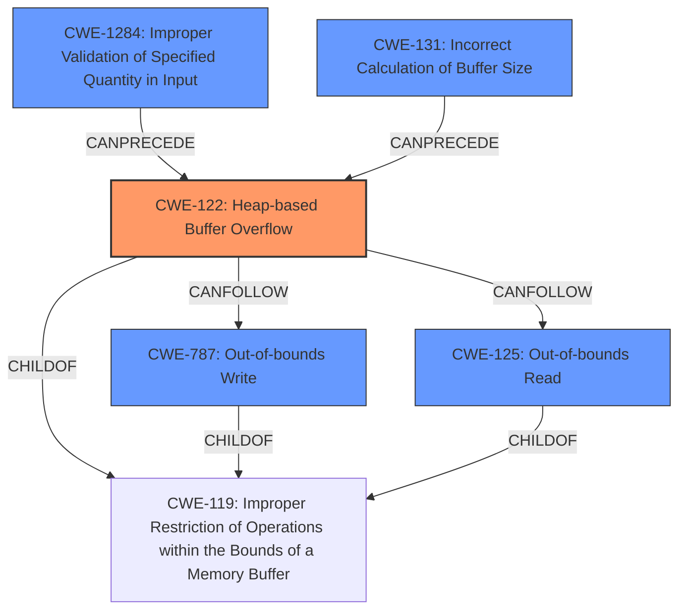

# Final Resolution for CVE-2021-28277

# Summary
| CWE ID | CWE Name | Confidence | CWE Abstraction Level | CWE Vulnerability Mapping Label | CWE-Vulnerability Mapping Notes |
|---|---|---|---|---|---|
| CWE-122 | Heap-based Buffer Overflow | 0.95 | Variant | Allowed | Primary CWE. Direct evidence from vulnerability description and CVE reference. |
| CWE-787 | Out-of-bounds Write | 0.70 | Base | Allowed | Secondary Candidate. Inherent in buffer overflows, as data is written beyond buffer boundaries. |
| CWE-125 | Out-of-bounds Read | 0.60 | Base | Allowed | Secondary Candidate. Possible if the code reads past the buffer boundary while processing data or metadata.|
| CWE-1284 | Improper Validation of Specified Quantity in Input | 0.30 | Base | Allowed | Possible contributing factor. The length of the extraneous padding or unknown sections might not be properly validated. |
| CWE-131 | Incorrect Calculation of Buffer Size | 0.30 | Base | Allowed | Possible contributing factor. The buffer size allocated for removing the unknown sections might be incorrectly calculated |

## Evidence and Confidence

*   **Confidence Score:** 0.90
*   **Evidence Strength:** HIGH

## Relationship Analysis
The primary CWE is CWE-122, a variant of the more general CWE-119. CWE-787 (Out-of-bounds Write) is a child of CWE-119 and can precede CWE-122. Similarly, CWE-125 (Out-of-bounds Read) is a child of CWE-119 and can be related to CWE-122. The potential root causes, CWE-1284 (Improper Validation of Specified Quantity in Input) and CWE-131 (Incorrect Calculation of Buffer Size), can precede CWE-122 by leading to an incorrect buffer size. These parent-child and chain relationships were influential in identifying potential root causes and related weaknesses.

## Vulnerability Chain
The vulnerability chain starts with a potential **ROOTCAUSE** in the form of `CWE-1284: Improper Validation of Specified Quantity in Input` or `CWE-131: Incorrect Calculation of Buffer Size`. This leads to `CWE-122: Heap-based Buffer Overflow` when the `RemoveUnknownSections` function processes a crafted JPEG file with extraneous padding. The overflow results in writing beyond the allocated buffer (`CWE-787`) and potentially reading beyond the buffer (`CWE-125`) while trying to determine the next section. The final impact is a denial of service (DoS), as the program crashes.

## Summary of Analysis
The initial analysis correctly identified `CWE-122: Heap-based Buffer Overflow` as the primary **WEAKNESS** based on the vulnerability description and CVE reference. The critique highlighted the importance of considering potential root causes and elaborating on the relationships between CWEs. The additional candidates `CWE-1284` and `CWE-131` were added with lower confidence as possible contributing factors to the overflow. The decision to include `CWE-787` and `CWE-125` as secondary candidates is based on the understanding that buffer overflows typically involve writing beyond the buffer and potentially reading beyond the buffer. The abstraction levels are appropriate, with `CWE-122` being a Variant (specific to heap overflows) and the others being Base level CWEs. The retriever results were considered, and the analysis explains why other candidates were not selected.

The selection of `CWE-122` as the primary CWE is justified because the vulnerability is explicitly described as a heap-based buffer overflow. The inclusion of `CWE-787` and `CWE-125` is based on the typical consequences of a buffer overflow. The additional potential **ROOTCAUSE** factors `CWE-1284` and `CWE-131` are included to reflect that the overflow likely originates from an input validation issue or incorrect size calculation.

The evidence for `CWE-122` is strong: "A Heap-based Buffer Overflow vulnerabilty exists in jhead 3.04 and 3.05 is affected by Buffer Overflow via the RemoveUnknownSections function in jpgfile.c.". This directly supports the classification of CWE-122.