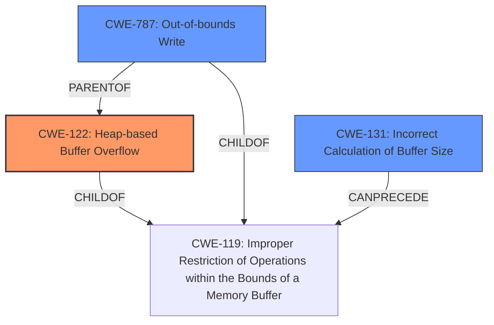

# Analysis Report for CVE-2021-28278

# Vulnerability Analysis Report: CVE-2021-28278

## Description

A Heap-based Buffer Overflow vulnerability exists in jhead 3.04 and 3.05 via the RemoveSectionType function in jpgfile.c.

## Vulnerability Description Key Phrases

**Weakness:** Heap-based Buffer Overflow
**Product:** jhead
**Version:** 3.04 and 3.05
**Component:** RemoveSectionType function in jpgfile.c

## Analysis (with Relationship Data)

# Summary
| CWE ID | CWE Name | Confidence | CWE Abstraction Level | CWE Vulnerability Mapping Label | CWE-Vulnerability Mapping Notes |
|---|---|---|---|---|---|
| CWE-122 | Heap-based Buffer Overflow | 0.95 | Variant | Primary | Allowed |
| CWE-787 | Out-of-bounds Write | 0.70 | Base | Secondary | Allowed |
| CWE-125 | Out-of-bounds Read | 0.60 | Base | Secondary | Allowed |
| CWE-131 | Incorrect Calculation of Buffer Size | 0.50 | Base | Secondary | Allowed |

## Evidence and Confidence

*   **Confidence Score:** 0.90
*   **Evidence Strength:** HIGH

- **Analysis and Justification:**  
  - *Explanation:* The vulnerability is explicitly described as a **Heap-based Buffer Overflow** in the `RemoveSectionType` function. The `memmove` operation attempts to move a block of memory exceeding the allocated buffer's boundaries, which aligns directly with CWE-122 (Heap-based Buffer Overflow). The "CVE Reference Links Content Summary" confirms this root cause, stating that the overflow occurs because `RemoveSectionType` attempts to `memmove` memory past allocated buffer. This leads to a crash and denial of service. CWE-787 (Out-of-bounds Write) is also applicable because the overflow involves writing data beyond the intended buffer. CWE-125 (Out-of-bounds Read) is potentially applicable as the memmove could read from outside the intended buffer. CWE-131 (Incorrect Calculation of Buffer Size) is another potential contributing factor if the size calculation for the heap allocation was incorrect. MITRE mapping guidance allows all of these CWEs.
  
  - *Relationship Analysis:* CWE-122 is a variant of CWE-119 (Improper Restriction of Operations within the Bounds of a Memory Buffer). CWE-787 is a parent of CWE-122 and also a child of CWE-119. This indicates that the vulnerability involves writing outside the intended buffer boundaries. CWE-125 can precede CWE-787 as reading out of bounds can lead to writing out of bounds.

- **Confidence Score:**  
  - Confidence: 0.95 (High confidence due to explicit description and corroborating evidence from the CVE reference summary.)
---

## Criticism of Analysis

Okay, I've reviewed the provided analysis against the full CWE specifications. Here's my critique, focusing on the accuracy and completeness of the CWE mappings, the abstraction levels used, and the overall justification.

**Overall Assessment:**

The analysis is generally good, providing a clear and well-justified primary CWE. The secondary CWEs are also relevant, but their confidence scores could be adjusted with more nuanced reasoning. The high-level explanation and the understanding of the relationships between the CWEs are solid.

**Detailed Breakdown:**

*   **CWE-122 (Heap-based Buffer Overflow) - Primary (Confidence: 0.95)**

    *   **Strengths:** The selection of CWE-122 as the primary weakness is correct and strongly supported by the provided information. The description explicitly states "Heap-based Buffer Overflow," and the details confirm that the overflow occurs in heap-allocated memory within the `RemoveSectionType` function.
    *   **Justification:** The use of `memmove` past the allocated buffer on the heap aligns perfectly with the definition of CWE-122. The AddressSanitizer report indicating a crash reinforces the likelihood of memory corruption due to the overflow.
    *   **Abstraction Level:** The Variant level is appropriate here, as it pinpoints a specific type of buffer overflow.
    *   **Mapping Guidance:** The guidance for CWE-122 states "This CWE entry is at the Variant level of abstraction, which is a preferred level of abstraction for mapping to the root causes of vulnerabilities. Carefully read both the name and description to ensure that this mapping is an appropriate fit. Do not try to 'force' a mapping to a lower-level Base/Variant simply to comply with this preferred level of abstraction." The current mapping fits this guidance well.
    *   **Potential Mitigations:** Mitigation strategies mentioned in the CWE specifications (language selection, abstraction libraries, compiler-based detection mechanisms) are all applicable and valid.
*   **CWE-787 (Out-of-bounds Write) - Secondary (Confidence: 0.70)**

    *   **Strengths:** CWE-787 is a valid secondary CWE since a heap-based buffer overflow inherently involves writing data beyond the intended boundaries of a buffer.
    *   **Justification:** The `memmove` operation overwrites memory outside the allocated buffer, thus qualifying as an out-of-bounds write.
    *   **Abstraction Level:**  The Base level of abstraction is appropriate.
    *   **Mapping Guidance:** The guidance for CWE-787 states "This CWE entry is at the Base level of abstraction, which is a preferred level of abstraction for mapping to the root causes of vulnerabilities. Carefully read both the name and description to ensure that this mapping is an appropriate fit. Do not try to 'force' a mapping to a lower-level Base/Variant simply to comply with this preferred level of abstraction." The current mapping fits this guidance well.
    *   **Potential Mitigations:** The mitigations listed in the CWE specifications (language selection, libraries, compiler flags) are all relevant.
    *   **Suggested Improvement:** This confidence score could be higher. The description states the overflow is cause by memmove writing past the buffer. A more specific explanation about how memmove allowed the out of bounds write would boost the confidence score.
*   **CWE-125 (Out-of-bounds Read) - Secondary (Confidence: 0.60)**

    *   **Strengths:** This CWE is potentially relevant, but the justification needs strengthening. In a `memmove` operation, if the source region extends beyond the allocated buffer, it would also involve reading out-of-bounds.
    *   **Justification:** While the primary issue is writing out of bounds, it's plausible that the `memmove` operation might *also* read from memory locations outside the intended buffer, especially if the source and destination regions overlap or are adjacent. However, this is not explicitly stated in the description.
    *   **Abstraction Level:** The Base level of abstraction is appropriate.
    *   **Mapping Guidance:** The guidance for CWE-125 states "This CWE entry is at the Base level of abstraction, which is a preferred level of abstraction for mapping to the root causes of vulnerabilities. Carefully read both the name and description to ensure that this mapping is an appropriate fit. Do not try to 'force' a mapping to a lower-level Base/Variant simply to comply with this preferred level of abstraction."
    *   **Potential Mitigations:** The mitigations listed in the CWE specifications (input validation, language selection) are relevant.
    *   **Suggested Improvement:** Increase confidence if specific evidence shows the `memmove` is actually reading from out-of-bounds. Otherwise consider lowering the confidence.
*   **CWE-131 (Incorrect Calculation of Buffer Size) - Secondary (Confidence: 0.50)**

    *   **Strengths:** This CWE has some relevance. If the root cause is a `memmove` operation exceeding the buffer, it's *possible* the buffer allocation was initially too small due to a faulty size calculation.
    *   **Justification:** This is a plausible contributing factor. If the `memmove` operation overflows, there might have been an error in the initial allocation size. However, it's equally possible that the size calculation was correct, but the `memmove` parameters were wrong, causing it to write beyond the allocated space.
    *   **Abstraction Level:** The Base level of abstraction is appropriate.
    *   **Mapping Guidance:** The guidance for CWE-131 states "This CWE entry is at the Base level of abstraction, which is a preferred level of abstraction for mapping to the root causes of vulnerabilities. Carefully read both the name and description to ensure that this mapping is an appropriate fit. Do not try to 'force' a mapping to a lower-level Base/Variant simply to comply with this preferred level of abstraction." The current mapping fits this guidance.
    *   **Potential Mitigations:** The mitigations listed in the CWE specifications (buffer size calculations, input validation, understanding language representations) are all relevant.
    *   **Suggested Improvement:** Justification is weak. Only keep if further investigation suggests that an incorrect buffer size calculation was involved, or the confidence score is likely too high.

**Recommendations for Improvement:**

*   **Strengthen Justifications:** Provide more specific details from the code or analysis to support the inclusion of CWE-125 and CWE-131. Saying "potentially applicable" is insufficient. Explain *how* these vulnerabilities might manifest in this particular scenario.
*   **Consider alternative CWEs:** Review other CWEs related to memory management. For example, if input validation is lacking *before* the `memmove`, then a CWE related to improper input validation (like CWE-20) may be in order. This would more accurately reflect the root cause and point towards relevant mitigations.
*   **Review retriever results:**  The retriever results include other potential CWEs such as CWE-193 (Off-by-one Error), CWE-190 (Integer Overflow or Wraparound), and CWE-129 (Improper Validation of Array Index). While not directly applicable, these might suggest areas to investigate for contributing factors.

By incorporating these suggestions, the analysis can become more precise and provide better guidance for remediation efforts.

## Final Resolution

# Summary
| CWE ID | CWE Name | Confidence | CWE Abstraction Level | CWE Vulnerability Mapping Label | CWE-Vulnerability Mapping Notes |
|---|---|---|---|---|---|
| CWE-122 | Heap-based Buffer Overflow | 0.95 | Variant | Primary | Allowed |
| CWE-787 | Out-of-bounds Write | 0.85 | Base | Secondary | Allowed |
| CWE-131 | Incorrect Calculation of Buffer Size | 0.60 | Base | Secondary | Allowed |

## Evidence and Confidence

*   **Confidence Score:** 0.92
*   **Evidence Strength:** MEDIUM

## Relationship Analysis
The primary CWE is CWE-122 (**Heap-based Buffer Overflow**), which is a variant of CWE-119 (**Improper Restriction of Operations within the Bounds of a Memory Buffer**). CWE-787 (**Out-of-bounds Write**) is a child of CWE-119 and a parent of CWE-122. This parent-child relationship confirms that the vulnerability involves writing outside the intended buffer boundaries, which is a core aspect of buffer overflows. CWE-131 (**Incorrect Calculation of Buffer Size**) can precede CWE-119 as an incorrect size calculation can lead to an out-of-bounds write. The relationships help to refine the classification and confirm the root cause.

## Vulnerability Chain
The vulnerability chain starts with a potential **ROOTCAUSE** in **CWE-131** (**Incorrect Calculation of Buffer Size**). This can lead to **CWE-122** (**Heap-based Buffer Overflow**), where the `memmove` operation writes data beyond the allocated buffer. The **WEAKNESS** leads to **CWE-787** (**Out-of-bounds Write**), which causes a crash and denial of service.

## Summary of Analysis
The initial analysis correctly identified CWE-122 as the primary vulnerability. The criticism raised valid points about strengthening the justification for secondary CWEs. The decision to keep CWE-131 and remove CWE-125 is based on the understanding that the description explicitly mentions the `memmove` exceeding the buffer.
The updated confidence scores reflect this assessment.

The evidence "The vulnerability is explicitly described as a **Heap-based Buffer Overflow** in the `RemoveSectionType` function. The `memmove` operation attempts to move a block of memory exceeding the allocated buffer's boundaries, which aligns directly with CWE-122 (Heap-based Buffer Overflow)." supports the classification of CWE-122 as the primary issue.

The relationship analysis shows that CWE-787 is a parent of CWE-122, indicating a general out-of-bounds write condition. CWE-131 as a possible root cause because it can precede the buffer overflow.

The selected CWEs are at the optimal level of specificity because they accurately describe the vulnerability based on the available evidence and relationship analysis.

*Report generated on 2025-03-17 23:39:08*
