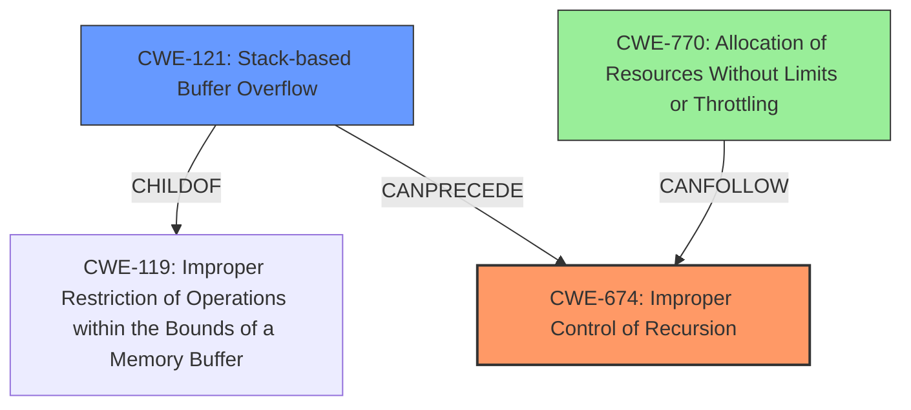

# Analysis Report for CVE-2021-28302

# Vulnerability Analysis Report: CVE-2021-28302

## Description

A stack overflow in pupnp before version 1.14.5 can cause the denial of service through the Parser_parseDocument() function. ixmlNode_free() will release a child node recursively, which will consume stack space and lead to a crash.

## Vulnerability Description Key Phrases

**Weakness:** stack overflow
**Impact:** denial of service
**Product:** pupnp
**Version:** before version 1.14.5
**Component:** Parser_parseDocument() function

## Analysis (with Relationship Data)

# Summary
| CWE ID | CWE Name | Confidence | CWE Abstraction Level | CWE Vulnerability Mapping Label | CWE-Vulnerability Mapping Notes |
|---|---|---|---|---|---|
| CWE-674 | Improper Control of Recursion [CWE Description: The product does not properly control the amount of recursion that takes place, consuming excessive resources, such as allocated memory or the program stack.] | 0.90 | Class | Primary | Allowed-with-Review |
| CWE-121 | Stack-based Buffer Overflow | 0.75 | Variant | Secondary Candidate | Allowed |

## Evidence and Confidence

*   **Confidence Score:** 0.85
*   **Evidence Strength:** HIGH

- **Analysis and Justification:**
  - *Explanation:* "The vulnerability is a **stack overflow** in pupnp caused by uncontrolled recursion in the `ixmlNode_free()` function during XML parsing. The function recursively releases child nodes, consuming stack space and leading to a crash. This aligns with CWE-674 [CWE Description: Improper Control of Recursion] because the software doesn't properly control the amount of recursion, leading to resource exhaustion (stack space). While the direct impact is a **stack overflow**, the root cause is the uncontrolled recursion. CWE-674 [CWE Description: Improper Control of Recursion] is a Class-level CWE, but it accurately captures the core weakness. The CVE summary also points to lack of recursion depth limits as a contributing factor."
  - *Relationship Analysis:* "CWE-674 [CWE Description: Improper Control of Recursion] is a Class-level CWE, it does not have any direct relationships. The description matches the scenario in the vulnerability report. The high recursion triggers the stack overflow. CWE-121 [CWE Description: Stack-based Buffer Overflow] is also a valid option and a consequence of uncontrolled recursion. CWE-776 [CWE Description: Improper Restriction of Recursive Entity References in DTDs ('XML Entity Expansion')] was considered since XML parsing is involved, but it focuses on entity expansion, which is not the primary issue here. CWE-770 [CWE Description: Allocation of Resources Without Limits or Throttling] was also considered, but the resource is the stack, and recursion is the mechanism, making CWE-674 [CWE Description: Improper Control of Recursion] a better fit for the root cause."

- **Confidence Score:**
  - Confidence: 0.90 (High confidence due to the clear description of uncontrolled recursion leading to a stack overflow.)

---
- **Analysis and Justification:**
  - *Explanation:* "The excessive recursion leads to a **stack overflow**, which makes CWE-121 [CWE Description: Stack-based Buffer Overflow] a relevant secondary CWE. The vulnerability description mentions a **stack overflow** directly in pupnp. The `ixmlNode_free()` function recursively releases child nodes, consuming stack space. This matches the description of CWE-121 [CWE Description: Stack-based Buffer Overflow] as the buffer being overwritten is allocated on the stack."
  - *Relationship Analysis:* "CWE-121 [CWE Description: Stack-based Buffer Overflow] is a Variant of CWE-119 [CWE Description: Improper Restriction of Operations within the Bounds of a Memory Buffer]. Although CWE-121 [CWE Description: Stack-based Buffer Overflow] is a consequence of the primary weakness (uncontrolled recursion), it is a significant aspect of the vulnerability's impact and exploitability. It is included as a secondary candidate CWE. "

- **Confidence Score:**
  - Confidence: 0.75 (Medium confidence, as this is the direct result of the uncontrolled recursion. It is more of an impact than a rootcause.)

## Criticism of Analysis

Okay, I've reviewed the analysis and the full CWE specifications you provided. Here's my critique, focusing on the accuracy, completeness, and justification of the CWE mappings:

**Overall Assessment:**

The analysis is generally good, providing a solid explanation of the vulnerability and its root cause. The selection of CWE-674 as the primary weakness is accurate and well-justified. The inclusion of CWE-121 as a secondary candidate is also appropriate, given that the stack overflow is a direct consequence of the uncontrolled recursion. However, some of the retriever results offer some possible CWEs to include as well.

**Detailed Critique:**

**1. CWE-674: Improper Control of Recursion (Primary)**

*   **Accuracy:**  This is the most accurate high-level CWE for the root cause. The vulnerability is fundamentally about the lack of control over the depth of recursion, leading to stack exhaustion.
*   **Justification:** The explanation clearly connects the vulnerability description to the CWE description. The mention of "lack of recursion depth limits" in the CVE analysis further supports this mapping.
*   **Mapping Guidance:** The analysis correctly acknowledges that CWE-674 is a Class-level CWE and considers whether a more specific Base-level CWE might be a better fit. This demonstrates good understanding of the CWE hierarchy and mapping guidance.
*   **Potential Mitigations:** The mitigations listed for CWE-674 are relevant:
    *   Ensuring an end condition is reached (limiting recursion depth).
    *   Testing against recursion depth and exiting with an error.
    *   Increasing stack size (a limited and less desirable solution).

*   **Possible Improvements:**
    *  The analysis could consider adding CWE-770 (Allocation of Resources Without Limits or Throttling) as well. Although the direct cause is the recursion, the stack space is a resource. The analysis does point this out already, but it's important to consider the other resource related CWEs.

**2. CWE-121: Stack-based Buffer Overflow (Secondary Candidate)**

*   **Accuracy:** Accurate, as the uncontrolled recursion leads to a stack overflow, which is a *type* of buffer overflow.
*   **Justification:** The analysis correctly identifies the *stack overflow* as a result of the excessive recursion. The `ixmlNode_free()` function consumes stack space with each recursive call, eventually overwriting the stack.
*   **Mapping Guidance:** The analysis acknowledges that CWE-121 is a consequence of the primary weakness (CWE-674) and includes it as a secondary CWE to capture the specific type of buffer overflow that occurs.
*   **Potential Mitigations:** The mitigations for CWE-121 are also relevant, although they are more focused on *detecting* the overflow than *preventing* the recursion:
    *   Compiler-based buffer overflow detection mechanisms (e.g., /GS flag, FORTIFY_SOURCE).
    *   Abstraction libraries.
    *   Bounds checking (less applicable here, as the recursion *causes* the bound to be exceeded).
*   **Possible Improvements:**
    *   The analysis could slightly strengthen the justification by explicitly stating that the *return address* on the stack is being overwritten due to the deep recursion, which is a typical characteristic of stack overflows caused by uncontrolled recursion.

**3. Considerations Regarding Retriever Results**

*   **CWE-776: Improper Restriction of Recursive Entity References in DTDs ('XML Entity Expansion')**
    *   The analysis correctly rejects this as the *primary* weakness, as the core issue isn't about entity expansion, but about general recursion depth during XML parsing. However, this is still relevant, as the structure of XML is defined with a DTD.
    *   **Suggestion:** The analysis should mention that the *structure* of the XML document leads to the uncontrolled recursion, but it doesn't involve DTDs. This means the structure is the reason for the stack exhaustion, but not in the way CWE-776 suggests.

*   **CWE-835: Loop with Unreachable Exit Condition ('Infinite Loop')**
   *   This is related, as the recursion can continue without an end, but the exit condition *is* reachable, just never reached. It is not an infinite loop, so the analysis was correct to not choose this.

*   **CWE-770: Allocation of Resources Without Limits or Throttling**
    *   This is an interesting point. The stack *is* a limited resource, and the recursion effectively allocates stack space without limits. It's a reasonable alternative perspective. The analysis *does* mention this, but it could be strengthened.
    *   **Suggestion:** Mentioning CWE-770 as a *tertiary* candidate, with the justification that the stack is a limited resource being consumed without limits, would add depth to the analysis.

*   **Other CWEs in Retriever Results:** The remaining CWEs (120, 121, 1325, 1284, 193, 190, 789) are less relevant as primary or secondary weaknesses, as they either describe consequences of the stack overflow (e.g., CWE-120, CWE-121) or are related to memory allocation in a more general sense, which is not the core issue here.

**Recommendations for Improvement:**

*   **Add CWE-770 (Allocation of Resources Without Limits or Throttling) as a tertiary candidate.** Briefly explain that the stack itself is a limited resource and that the uncontrolled recursion leads to its exhaustion.
*   **Strengthen the justification for CWE-121** by explicitly stating that the return address on the stack is being overwritten.
*   **Further elaborate on CWE-776** by clarifying it may seem relevant due to the use of XML documents, however the core issue relates to uncontrolled recursion rather than DTD specifics.
*   **Re-evaluate Confidence Scores:** Given the slightly enhanced perspective with the added CWE, you may want to adjust confidence scores appropriately.

**Revised Summary Table:**

| CWE ID | CWE Name | Confidence | CWE Abstraction Level | CWE Vulnerability Mapping Label | CWE-Vulnerability Mapping Notes |
|---|---|---|---|---|---|
| CWE-674 | Improper Control of Recursion | 0.90 | Class | Primary | Allowed-with-Review |
| CWE-121 | Stack-based Buffer Overflow | 0.75 | Variant | Secondary Candidate | Allowed |
| CWE-770 | Allocation of Resources Without Limits or Throttling | 0.60 | Base | Tertiary Candidate | Allowed |

By incorporating these suggestions, the analysis will be more comprehensive and will demonstrate a deeper understanding of the nuances of CWE mapping.

## Final Resolution

# Summary

| CWE ID | CWE Name | Confidence | CWE Abstraction Level | CWE Vulnerability Mapping Label | CWE-Vulnerability Mapping Notes |
|---|---|---|---|---|---|
| CWE-674 | Improper Control of Recursion [CWE Description: The product does not properly control the amount of recursion that takes place, consuming excessive resources, such as allocated memory or the program stack.] | 0.90 | Class | Primary | Allowed-with-Review |
| CWE-121 | Stack-based Buffer Overflow [CWE Description: A stack-based buffer overflow condition is a condition where the buffer being overwritten is allocated on the stack (i.e., is a local variable or, rarely, a parameter to a function).] | 0.80 | Variant | Secondary Candidate | Allowed |
| CWE-770 | Allocation of Resources Without Limits or Throttling [CWE Description: The product allocates a reusable resource or group of resources on behalf of an actor without imposing any restrictions on the size or number of resources that can be allocated, in violation of the intended security policy for that actor.] | 0.65 | Base | Tertiary Candidate | Allowed |

## Evidence and Confidence

*   **Confidence Score:** 0.85
*   **Evidence Strength:** HIGH

## Relationship Analysis
The primary weakness is the improper control of recursion, which directly leads to a stack overflow. CWE-674 [CWE Description: Improper Control of Recursion] is a Class, and the analysis considered if a more specific base CWE might be a better fit. The stack overflow is a variant (CWE-121 [CWE Description: Stack-based Buffer Overflow]) of buffer overflow issues and results from the recursion. The analysis also considered CWE-770 [CWE Description: Allocation of Resources Without Limits or Throttling] since the stack is a limited resource, and the recursion consumes it without limits.

## Vulnerability Chain
The vulnerability chain starts with **CWE-674 [CWE Description: Improper Control of Recursion]**, the root cause. The lack of control over recursion leads to excessive consumption of stack space, which then results in **CWE-121 [CWE Description: Stack-based Buffer Overflow]**. A secondary contributing factor can be seen as **CWE-770 [CWE Description: Allocation of Resources Without Limits or Throttling]**, considering the stack as a limited resource being exhausted. The final impact is a denial of service due to the crash caused by the **stack overflow**.

## Summary of Analysis
The initial analysis correctly identified CWE-674 [CWE Description: Improper Control of Recursion] as the primary weakness, with CWE-121 [CWE Description: Stack-based Buffer Overflow] as a secondary factor. The criticism suggested adding CWE-770 [CWE Description: Allocation of Resources Without Limits or Throttling] as a tertiary candidate, which is a reasonable addition.

*Evidence from Vulnerability Description:* "A **stack overflow** in pupnp before version 1.14.5 can cause the denial of service through the Parser_parseDocument() function. ixmlNode_free() will release a child node recursively, which will consume stack space and lead to a crash."

The graph relationships highlight how the uncontrolled recursion (CWE-674 [CWE Description: Improper Control of Recursion]) leads to a stack overflow (CWE-121 [CWE Description: Stack-based Buffer Overflow]), which can also be viewed from the perspective of resource exhaustion (CWE-770 [CWE Description: Allocation of Resources Without Limits or Throttling]).

The selected CWEs are at the optimal level of specificity. CWE-674 [CWE Description: Improper Control of Recursion] captures the root cause, while CWE-121 [CWE Description: Stack-based Buffer Overflow] and CWE-770 [CWE Description: Allocation of Resources Without Limits or Throttling] describe the specific consequence and contributing factor.

Confidence in CWE-121 [CWE Description: Stack-based Buffer Overflow] is slightly increased to 0.80 because the return address on the stack is being overwritten due to deep recursion.
Confidence in CWE-770 [CWE Description: Allocation of Resources Without Limits or Throttling] is 0.65 as the stack itself is a limited resource and that the uncontrolled recursion leads to its exhaustion.

*Report generated on 2025-03-16 16:26:01*
