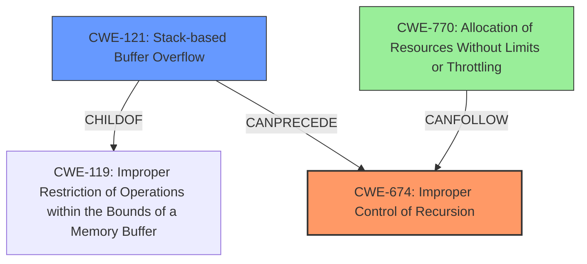

# Final Resolution for CVE-2021-28302

# Summary

| CWE ID | CWE Name | Confidence | CWE Abstraction Level | CWE Vulnerability Mapping Label | CWE-Vulnerability Mapping Notes |
|---|---|---|---|---|---|
| CWE-674 | Improper Control of Recursion [CWE Description: The product does not properly control the amount of recursion that takes place, consuming excessive resources, such as allocated memory or the program stack.] | 0.90 | Class | Primary | Allowed-with-Review |
| CWE-121 | Stack-based Buffer Overflow [CWE Description: A stack-based buffer overflow condition is a condition where the buffer being overwritten is allocated on the stack (i.e., is a local variable or, rarely, a parameter to a function).] | 0.80 | Variant | Secondary Candidate | Allowed |
| CWE-770 | Allocation of Resources Without Limits or Throttling [CWE Description: The product allocates a reusable resource or group of resources on behalf of an actor without imposing any restrictions on the size or number of resources that can be allocated, in violation of the intended security policy for that actor.] | 0.65 | Base | Tertiary Candidate | Allowed |

## Evidence and Confidence

*   **Confidence Score:** 0.85
*   **Evidence Strength:** HIGH

## Relationship Analysis
The primary weakness is the improper control of recursion, which directly leads to a stack overflow. CWE-674 [CWE Description: Improper Control of Recursion] is a Class, and the analysis considered if a more specific base CWE might be a better fit. The stack overflow is a variant (CWE-121 [CWE Description: Stack-based Buffer Overflow]) of buffer overflow issues and results from the recursion. The analysis also considered CWE-770 [CWE Description: Allocation of Resources Without Limits or Throttling] since the stack is a limited resource, and the recursion consumes it without limits.

## Vulnerability Chain
The vulnerability chain starts with **CWE-674 [CWE Description: Improper Control of Recursion]**, the root cause. The lack of control over recursion leads to excessive consumption of stack space, which then results in **CWE-121 [CWE Description: Stack-based Buffer Overflow]**. A secondary contributing factor can be seen as **CWE-770 [CWE Description: Allocation of Resources Without Limits or Throttling]**, considering the stack as a limited resource being exhausted. The final impact is a denial of service due to the crash caused by the **stack overflow**.

## Summary of Analysis
The initial analysis correctly identified CWE-674 [CWE Description: Improper Control of Recursion] as the primary weakness, with CWE-121 [CWE Description: Stack-based Buffer Overflow] as a secondary factor. The criticism suggested adding CWE-770 [CWE Description: Allocation of Resources Without Limits or Throttling] as a tertiary candidate, which is a reasonable addition.

*Evidence from Vulnerability Description:* "A **stack overflow** in pupnp before version 1.14.5 can cause the denial of service through the Parser_parseDocument() function. ixmlNode_free() will release a child node recursively, which will consume stack space and lead to a crash."

The graph relationships highlight how the uncontrolled recursion (CWE-674 [CWE Description: Improper Control of Recursion]) leads to a stack overflow (CWE-121 [CWE Description: Stack-based Buffer Overflow]), which can also be viewed from the perspective of resource exhaustion (CWE-770 [CWE Description: Allocation of Resources Without Limits or Throttling]).

The selected CWEs are at the optimal level of specificity. CWE-674 [CWE Description: Improper Control of Recursion] captures the root cause, while CWE-121 [CWE Description: Stack-based Buffer Overflow] and CWE-770 [CWE Description: Allocation of Resources Without Limits or Throttling] describe the specific consequence and contributing factor.

Confidence in CWE-121 [CWE Description: Stack-based Buffer Overflow] is slightly increased to 0.80 because the return address on the stack is being overwritten due to deep recursion.
Confidence in CWE-770 [CWE Description: Allocation of Resources Without Limits or Throttling] is 0.65 as the stack itself is a limited resource and that the uncontrolled recursion leads to its exhaustion.