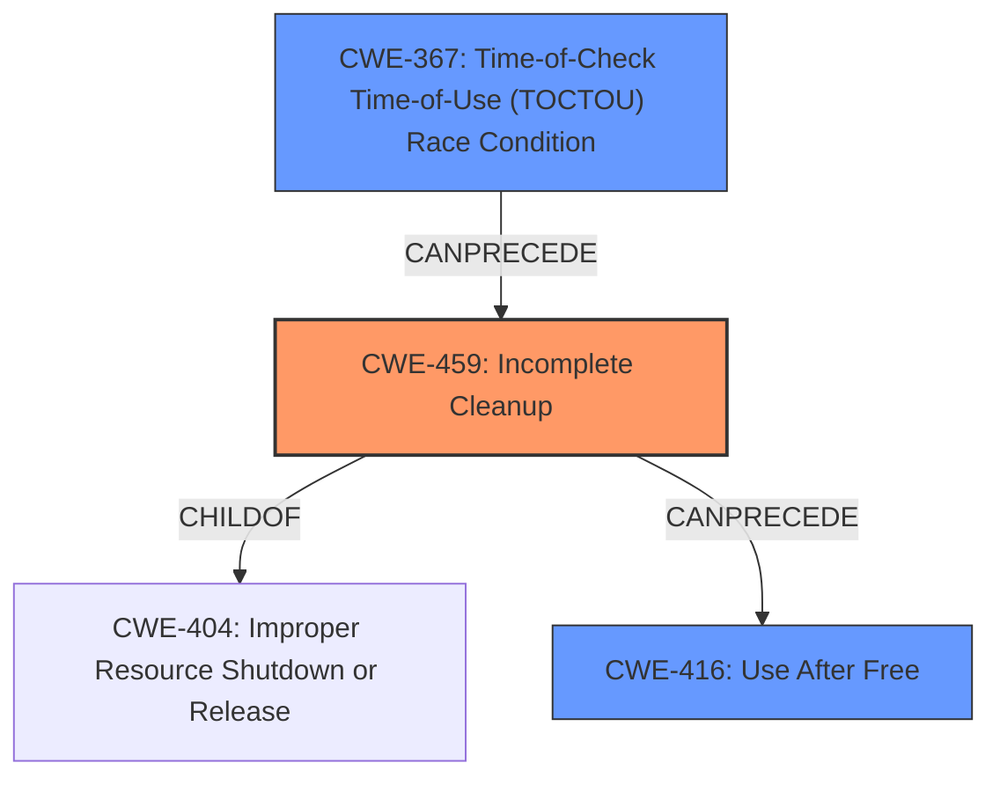

# Analysis Report for CVE-2021-28697

# Vulnerability Analysis Report: CVE-2021-28697

## Description

grant table v2 status pages may remain accessible after de-allocation Guest get permitted access to certain Xen-owned pages of memory. The majority of such pages remain allocated / associated with a guest for its entire lifetime. Grant table v2 status pages, however, get de-allocated when a guest switched (back) from v2 to v1. The freeing of such pages requires that the hypervisor know where in the guest these pages were mapped. The hypervisor tracks only one use within guest space, but racing requests from the guest to insert mappings of these pages may result in any of them to become mapped in multiple locations. Upon switching back from v2 to v1, the guest would then retain access to a page that was freed and perhaps re-used for other purposes.

## Vulnerability Description Key Phrases

**Rootcause:** freed pages still retain access
**Weakness:** time-of-check time-of-use race condition
**Vector:** multiple mappings from guest
**Attacker:** guest
**Version:** Xen
**Component:** grant table v2 status pages

## Analysis (with Relationship Data)

# Summary
| CWE ID | CWE Name | Confidence | CWE Abstraction Level | CWE Vulnerability Mapping Label | CWE-Vulnerability Mapping Notes |
|---|---|---|---|---|---|
| CWE-459 | Incomplete Cleanup | 0.85 | Base | Allowed | Primary CWE |
| CWE-367 | Time-of-Check Time-of-Use (TOCTOU) Race Condition | 0.75 | Base | Allowed | Secondary Candidate |

## Evidence and Confidence

*   **Confidence Score:** 0.80
*   **Evidence Strength:** HIGH

- **Analysis and Justification:**
  - *Explanation:* The vulnerability description clearly states that "**freed pages still retain access**" after being deallocated. The "CVE Reference Links Content Summary" explains that the hypervisor does not properly track all mappings of grant table v2 status pages within guest memory. Consequently, when a guest switches from grant table v2 to v1, these pages are deallocated, but the guest may still retain access due to a race condition that creates multiple mappings. This scenario perfectly aligns with **CWE-459 (Incomplete Cleanup)**, which describes a situation where the product does not properly "clean up" and remove temporary or supporting resources after they have been used. In this case, the resource is the grant table v2 status pages. The MITRE mapping guidance for CWE-459 states that its Usage is "Allowed," indicating that this is an acceptable mapping.
  - *Relationship Analysis:* CWE-459 is a child of CWE-404 (Improper Resource Shutdown or Release), but CWE-459 is more specific because the issue is about not cleaning up temporary resources.

- **Confidence Score:**
  - Confidence: 0.85 (High confidence based on the vulnerability description and CVE reference materials.)

---

- **Analysis and Justification:**
  - *Explanation:* The vulnerability description also includes "**weakness: time-of-check time-of-use race condition**". The description notes "racing requests from the guest to insert mappings of these pages may result in any of them to become mapped in multiple locations". This highlights a **CWE-367 (Time-of-Check Time-of-Use (TOCTOU) Race Condition)** where the state of a resource (the grant table v2 status page) is checked before use (deallocation), but the state changes (multiple mappings) between the check and the use. This can lead to the product performing invalid actions (deallocating a page that's still in use). While the primary issue revolves around incomplete cleanup, the race condition contributes to the vulnerability's exploitability. The usage for CWE-367 is "Allowed".
  - *Relationship Analysis:* CWE-367 describes a race condition. The race condition exists when the guest attempts to map the same grant table v2 status page to multiple locations.

- **Confidence Score:**
  - Confidence: 0.75 (Sufficient evidence from technical description and CVE reference materials.)

## Criticism of Analysis

Okay, I've reviewed your CWE analysis with the full specifications. Here's my critique, focusing on accuracy, completeness, and justification:

**Overall Assessment:**

The analysis is generally good, with a solid justification for the primary CWE. The inclusion of CWE-367 as a secondary issue is also valid and well-explained. The confidence scores are appropriate.

**Detailed Review:**

*   **CWE-459: Incomplete Cleanup (Primary CWE)**

    *   **Confidence:** 0.85 - This is well-justified and aligns with the evidence.
    *   **Justification:** The explanation is clear and concise. The connection between the vulnerability description, CVE summary, and CWE-459 definition is well-established.  The mention of "not cleaning up temporary resources" directly reflects the CWE's description.
    *   **Relationship Analysis:** Excellent. The comparison to CWE-404 is helpful in clarifying why CWE-459 is a more precise fit.
    *   **CWE Examples from Database**: Appropriate usage.
    *   **CWE Specifications Coverage:** The analysis covers the description, relationships, and mapping guidance effectively. Potential mitigations for CWE-459 are applicable.

*   **CWE-367: Time-of-Check Time-of-Use (TOCTOU) Race Condition (Secondary CWE)**

    *   **Confidence:** 0.75 - Appropriate. While the race condition is a *contributing factor*, it's not the core *cause* of the vulnerability.
    *   **Justification:**  The analysis clearly identifies the TOCTOU aspect – the check for the mapping's status before deallocation, and the potential for the mapping to change in the interim. The phrase "racing requests from the guest to insert mappings" is key evidence.
    *   **Relationship Analysis:** The connection to the guest attempting multiple mappings is accurate.
    *   **CWE Examples from Database**: Appropriate usage.
    *   **CWE Specifications Coverage:** The analysis uses the description, relationships, and mapping guidance effectively. Potential mitigations for CWE-367 are applicable. However, it should be noted that Mitigation 1, "do not perform a check before the use," is not appropriate in this situation because a check has to be made to deallocate the correct memory. Mitigation 3, "limit the interleaving of operations on files from multiple processes," is a more applicable mitigation.

**Suggested Improvements:**

1.  **CWE-367 Alternative Consideration**: While CWE-367 is a good fit, consider if CWE-362 (Concurrent Execution using Shared Resource with Improper Synchronization) is more appropriate. CWE-367 is a specific *type* of race condition, whereas CWE-362 is the broader class. The core of the problem isn't just the TOCTOU, but the lack of proper synchronization when the guest tries to create multiple mappings. However, CWE-367 is still an appropriate fit for the analysis because it captures a particular type of Race Condition.

2.  **Use-After-Free Consideration**: While it's implied by "freed pages still retain access", consider adding a mention of CWE-416: Use After Free. This is a direct consequence of the incomplete cleanup and the race condition. This CWE could further increase confidence in this analysis.

3. **Additional Notes Considerations**: Some Additional Notes that could be helpful are as follows:
   * The attacker can exploit the vulnerability, leading to privilege escalation, denial of service, or information leaks. The impact of exploitation makes this issue have a significant impact to the availability and integrity of the system.
   * The mitigations related to CWE-459 are not sufficient if the resource is not tracked or is improperly tracked.

**Response to Retriever Results:**

You provided the top 10 retriever results along with your analysis. Here's a short critique of the top retriever results:
*   **CWE-459**: The retriever result aligns with your analysis.
*   **CWE-425**: This result is incorrect. There is no "Direct Request" in this scenario.
*   **CWE-125**: This result is incorrect. There is no indication of an out-of-bounds read in the summary.
*   **CWE-1342**: The retriever may have mapped to the information exposure vector that is present in the summary.
*   **CWE-1284**: This result is likely incorrect. There is no mention of "Improper Validation of Specified Quantity in Input"
*   **CWE-404**: This result is generally correct, but CWE-459 is a more specific result.
*   **CWE-226**: The retriever may have mapped to the sensitive information exposure vector that is present in the summary.
*   **CWE-362**: The retriever result aligns with the alternative recommendation of adding CWE-362.
*   **CWE-306**: This result is incorrect. There is no "Missing Authentication" in this summary.
*   **CWE-401**: This result is incorrect. There is no "Missing Release of Memory" in this summary.

**Revised Summary**

| CWE ID | CWE Name | Confidence | CWE Abstraction Level | CWE Vulnerability Mapping Label | CWE-Vulnerability Mapping Notes |
|---|---|---|---|---|---|
| CWE-459 | Incomplete Cleanup | 0.85 | Base | Allowed | Primary CWE |
| CWE-367 | Time-of-Check Time-of-Use (TOCTOU) Race Condition | 0.75 | Base | Allowed | Secondary Candidate |
| CWE-416 | Use After Free | 0.65 | Base | Allowed | Consequence |

By adding the reference to CWE-416, this analysis provides more technical specificity to the high-level cause (incomplete cleanup) and the contributing factor (TOCTOU).

In summary, the analysis is well-reasoned and accurate. Addressing the suggested improvements would enhance the completeness and precision of the analysis.

## Final Resolution

# Summary
| CWE ID | CWE Name | Confidence | CWE Abstraction Level | CWE Vulnerability Mapping Label | CWE-Vulnerability Mapping Notes |
|---|---|---|---|---|---|
| CWE-459 | Incomplete Cleanup | 0.85 | Base | Allowed | Primary CWE |
| CWE-367 | Time-of-Check Time-of-Use (TOCTOU) Race Condition | 0.75 | Base | Allowed | Secondary Candidate |
| CWE-416 | Use After Free | 0.65 | Variant | Allowed | Consequence |

## Evidence and Confidence

*   **Confidence Score:** 0.80
*   **Evidence Strength:** HIGH

## Relationship Analysis
The primary **WEAKNESS** is **CWE-459 (Incomplete Cleanup)**, which is at the Base level. While CWE-404 (Improper Resource Shutdown or Release) is a parent, CWE-459 is more specific to cleanup after use. **CWE-367 (Time-of-Check Time-of-Use (TOCTOU) Race Condition)** is a contributing factor. Finally, **CWE-416 (Use After Free)** describes the consequence of the incomplete cleanup and race condition.

## Vulnerability Chain
The **ROOTCAUSE** is the hypervisor not properly tracking all mappings of grant table v2 status pages within guest memory, leading to **CWE-459 (Incomplete Cleanup)** when a guest switches from v2 to v1. The guest's attempts to map the same page to multiple locations introduce **CWE-367 (Time-of-Check Time-of-Use (TOCTOU) Race Condition)** during deallocation. The end result is **CWE-416 (Use After Free)**, where the guest retains access to freed memory.

## Summary of Analysis
The initial analysis and criticism provide strong support for the chosen CWEs. The vulnerability description clearly states that "**freed pages still retain access**" after being deallocated. This is direct evidence for **CWE-459 (Incomplete Cleanup)**. The description also notes "**weakness: time-of-check time-of-use race condition**," which supports **CWE-367 (Time-of-Check Time-of-Use (TOCTOU) Race Condition)**.

The graph relationships clarify that **CWE-459 (Incomplete Cleanup)** is the most appropriate primary CWE because it's a more specific instance of resource management issues than its parent, **CWE-404 (Improper Resource Shutdown or Release)**. The addition of **CWE-416 (Use After Free)** as a secondary CWE provides a more complete picture of the vulnerability's impact.

The selected CWEs are at the optimal level of specificity. **CWE-459 (Incomplete Cleanup)** is a Base-level CWE that directly addresses the **ROOTCAUSE** of the vulnerability. **CWE-367 (Time-of-Check Time-of-Use (TOCTOU) Race Condition)** explains the race condition that is present, and **CWE-416 (Use After Free)**, a Variant, explains the result of the vulnerability.

*Report generated on 2025-03-17 02:31:26*
