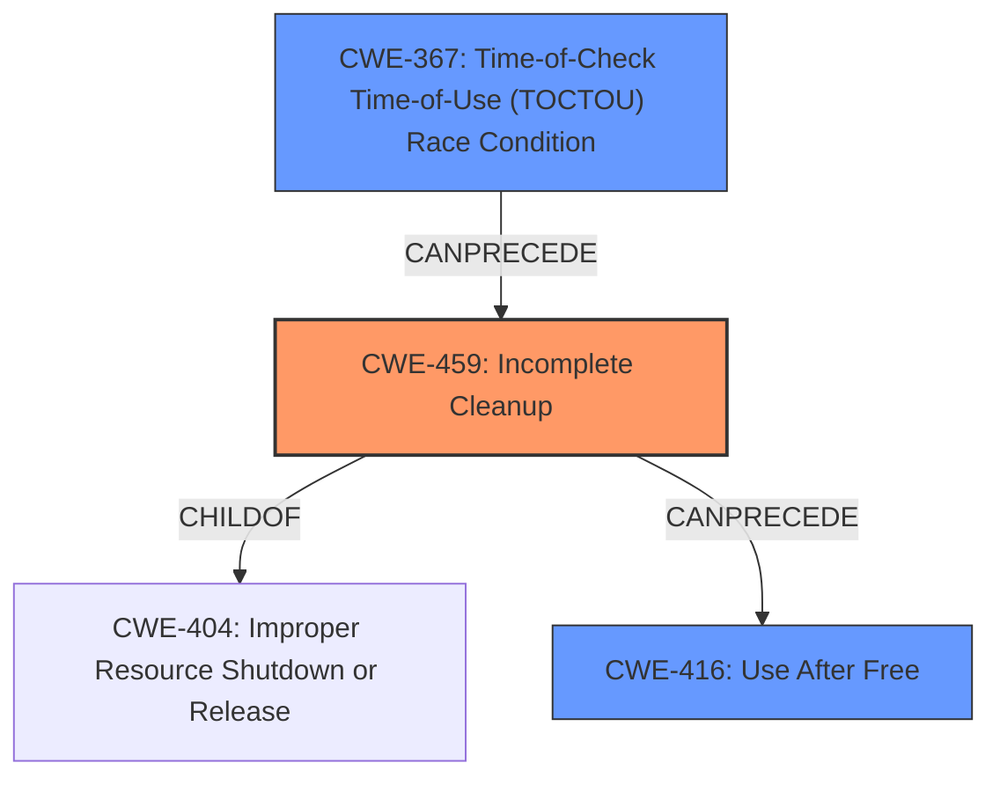

# Final Resolution for CVE-2021-28697

# Summary
| CWE ID | CWE Name | Confidence | CWE Abstraction Level | CWE Vulnerability Mapping Label | CWE-Vulnerability Mapping Notes |
|---|---|---|---|---|---|
| CWE-459 | Incomplete Cleanup | 0.85 | Base | Allowed | Primary CWE |
| CWE-367 | Time-of-Check Time-of-Use (TOCTOU) Race Condition | 0.75 | Base | Allowed | Secondary Candidate |
| CWE-416 | Use After Free | 0.65 | Variant | Allowed | Consequence |

## Evidence and Confidence

*   **Confidence Score:** 0.80
*   **Evidence Strength:** HIGH

## Relationship Analysis
The primary **WEAKNESS** is **CWE-459 (Incomplete Cleanup)**, which is at the Base level. While CWE-404 (Improper Resource Shutdown or Release) is a parent, CWE-459 is more specific to cleanup after use. **CWE-367 (Time-of-Check Time-of-Use (TOCTOU) Race Condition)** is a contributing factor. Finally, **CWE-416 (Use After Free)** describes the consequence of the incomplete cleanup and race condition.

## Vulnerability Chain
The **ROOTCAUSE** is the hypervisor not properly tracking all mappings of grant table v2 status pages within guest memory, leading to **CWE-459 (Incomplete Cleanup)** when a guest switches from v2 to v1. The guest's attempts to map the same page to multiple locations introduce **CWE-367 (Time-of-Check Time-of-Use (TOCTOU) Race Condition)** during deallocation. The end result is **CWE-416 (Use After Free)**, where the guest retains access to freed memory.

## Summary of Analysis
The initial analysis and criticism provide strong support for the chosen CWEs. The vulnerability description clearly states that "**freed pages still retain access**" after being deallocated. This is direct evidence for **CWE-459 (Incomplete Cleanup)**. The description also notes "**weakness: time-of-check time-of-use race condition**," which supports **CWE-367 (Time-of-Check Time-of-Use (TOCTOU) Race Condition)**.

The graph relationships clarify that **CWE-459 (Incomplete Cleanup)** is the most appropriate primary CWE because it's a more specific instance of resource management issues than its parent, **CWE-404 (Improper Resource Shutdown or Release)**. The addition of **CWE-416 (Use After Free)** as a secondary CWE provides a more complete picture of the vulnerability's impact.

The selected CWEs are at the optimal level of specificity. **CWE-459 (Incomplete Cleanup)** is a Base-level CWE that directly addresses the **ROOTCAUSE** of the vulnerability. **CWE-367 (Time-of-Check Time-of-Use (TOCTOU) Race Condition)** explains the race condition that is present, and **CWE-416 (Use After Free)**, a Variant, explains the result of the vulnerability.