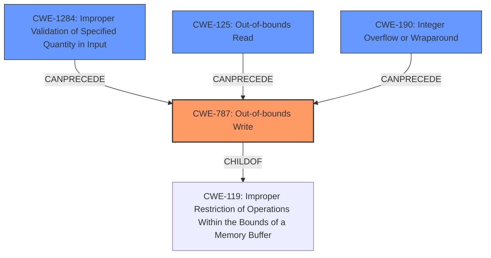

# Final Resolution for CVE-2021-28875

# Summary
| CWE ID | CWE Name | Confidence | CWE Abstraction Level | CWE Vulnerability Mapping Label | CWE-Vulnerability Mapping Notes |
|---|---|---|---|---|---|
| CWE-787 | Out-of-bounds Write | 0.95 | Base | Allowed | The product writes data past the end of the intended buffer due to a missing bounds check on the length returned by the `read` method. |
| CWE-1284 | Improper Validation of Specified Quantity in Input | 0.85 | Base | Allowed | The quantity (length) is not checked to be within the bounds. |
| CWE-125 | Out-of-bounds Read | 0.75 | Base | Allowed | The product reads data past the end of the intended buffer, as the return value is greater than the size of the provided buffer to the read function. While not the primary action, this serves as the catalyst. |
| CWE-190 | Integer Overflow or Wraparound | 0.60 | Base | Allowed | The unbounded increment of `g.len` could potentially lead to an integer overflow if the return value of `read` is sufficiently large. |

  - The Primary CWE should be first and noted as the Primary CWEs
  - The secondary candidate CWEs should be next and noted as secondary candidates.
  - The confidence is a confidence score 0 to 1 to rate your confidence in your assessment for that CWE.
  - The CWE Abstraction Level as one of these values: Base, Variant, Pillar, Class, Compound
  - The Mapping Notes Usage as one of these values: Allowed, Allowed-with-Review, Prohibited, Discouraged

## Evidence and Confidence

*   **Confidence Score:** 0.90
*   **Evidence Strength:** HIGH

## Relationship Analysis
The decision-making process was significantly influenced by the relationships between CWEs.

  - Parent-child hierarchical relationships: CWE-787 is a child of CWE-119 (Improper Restriction of Operations within the Bounds of a Memory Buffer), highlighting the fundamental issue of exceeding memory boundaries.
  - Chain relationships: The vulnerability chain involves a sequence of weaknesses, starting with an untrusted read value, followed by improper input validation, and culminating in an out-of-bounds write.
  - Peer relationships: Alternatives like CWE-770 were considered but deemed less specific than CWE-1284 for capturing the input validation failure.
  - Abstraction levels: The selection favored Base-level CWEs (787, 1284, 125, 190) to provide detailed insight into the vulnerability's root causes.

## Vulnerability Chain
The vulnerability chain starts with an untrusted `read` value, leading to a failure in validating the quantity specified in the input (CWE-1284). This, in turn, results in an out-of-bounds write (CWE-787), potentially preceded by an out-of-bounds read (CWE-125) as the catalyst, and possibly exacerbated by an integer overflow (CWE-190) under specific conditions.

  - **Root Cause:** Improper validation of the size/length returned by the `read` function
  - **Weakness 1:** CWE-1284 (Improper Validation of Specified Quantity in Input)
  - **Weakness 2:** CWE-125 (Out-of-bounds Read) - catalyst to the overflow
  - **Weakness 3:** CWE-787 (Out-of-bounds Write)
  - **Potential Weakness 4:** CWE-190 (Integer Overflow or Wraparound)
  - **Impact:** Memory corruption, potential code execution

## Summary of Analysis
The initial analysis correctly identified **CWE-787 (Out-of-bounds Write)** as the primary issue. The criticism helped refine the selection of secondary CWEs and strengthen the justification for each.

The graph relationships highlighted the chain of events leading to the vulnerability. The decision to include **CWE-1284 (Improper Validation of Specified Quantity in Input)** was based on its direct relevance to the vulnerability, as the root cause lies in the failure to validate the size returned by the `read` function. **CWE-125 (Out-of-bounds Read)** was retained as a contributing factor, as the `read` method returning a value greater than the buffer's size can be interpreted as reading beyond the intended bounds. **CWE-190 (Integer Overflow or Wraparound)** was kept with a lower confidence score, as it is a potential contributing factor but not a guaranteed component of the exploit.

The selected CWEs are at the optimal level of specificity, providing a detailed understanding of the vulnerability's root causes and contributing factors. The analysis considered the MITRE mapping guidance, relationship analysis, and mitigation insights to arrive at a well-justified classification.