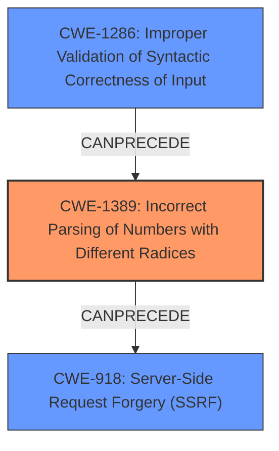

# Final Resolution for CVE-2021-28918

# Summary
| CWE ID    | CWE Name                                                                    | Confidence | CWE Abstraction Level | CWE Vulnerability Mapping Label | CWE-Vulnerability Mapping Notes                                                                             |
| :--------- | :-------------------------------------------------------------------------- | :--------- | :-------------------- | :------------------------------ | :---------------------------------------------------------------------------------------------------------- |
| CWE-1389 | Incorrect Parsing of Numbers with Different Radices  (**ROOTCAUSE**) | 0.90       | Base                  | Allowed                       | Acceptable-Use               |
| CWE-1286 | Improper Validation of Syntactic Correctness of Input (**WEAKNESS**)                                                                  | 0.70       | Base                  | Allowed                       | Acceptable-Use, contributing factor to incorrect parsing of numbers with different radices.              |
| CWE-918 | Server-Side Request Forgery (SSRF) (**IMPACT**) | 0.60       | Base                  | Allowed                       | Acceptable-Use, Potential Impact               |

## Evidence and Confidence

*   **Confidence Score:** 0.85
*   **Evidence Strength:** HIGH

## Relationship Analysis
The analysis focused on identifying the **ROOTCAUSE** of the vulnerability and its potential impact.
  - Parent-child hierarchical relationships: Not directly relevant in this case, as the selected CWEs do not have strong hierarchical links that influence the classification.
  - Chain relationships showing progression of vulnerability: The chain progresses from **improper input validation** (CWE-1286) leading to incorrect parsing (CWE-1389), which then results in SSRF (CWE-918).
  - Peer relationships that offered alternative classifications: No significant peer relationships influenced the decision. The focus remained on identifying the specific **ROOTCAUSE**.
  - How abstraction levels influenced your selection: The analysis favored Base-level CWEs for their specificity, aligning with MITRE's mapping guidance.

## Vulnerability Chain
The vulnerability chain starts with the **improper input validation** (CWE-1286), which allows octal strings to be processed. This leads to **incorrect parsing of numbers with different radices** (CWE-1389), causing the `netmask` package to misinterpret IP addresses. The misinterpretation allows attackers to bypass IP filters, resulting in Server-Side Request Forgery (CWE-918), enabling them to reach critical VPN or LAN hosts.
  - Map the sequence from initial flaw to final impact: Input Validation -> Incorrect Parsing -> SSRF
  - Identify which CWEs represent root causes vs. impacts: CWE-1389 is the **ROOTCAUSE**, CWE-1286 is a contributing **WEAKNESS**, and CWE-918 is the potential **IMPACT**.
  - Note any missing links in the chain based on relationship data: The chain is complete, showing how the initial flaw leads to the final impact.

## Summary of Analysis
The analysis built upon the initial assessment and criticism, focusing on the most specific **ROOTCAUSE** and potential impact.
  - Highlight how much your assessment is based on the provided evidence only, and show or quote that evidence: The assessment is based on the vulnerability description: "Improper input validation of octal strings in netmask npm package v1.0.6 and below allows unauthenticated remote attackers to perform indeterminate SSRF, RFI, and LFI attacks on many of the dependent packages." This directly supports the selection of CWE-1389 as the primary **ROOTCAUSE**.
  - Explain how the graph relationships influenced your final selection: The chain relationship, where CWE-1286 leads to CWE-1389 and then to CWE-918, solidified the selection of these CWEs.
  - Provide clear justification for your decision: CWE-1389 accurately represents the **ROOTCAUSE** of the vulnerability (incorrect parsing of numbers), while CWE-1286 is a contributing factor (improper input validation), and CWE-918 is the potential impact (SSRF).
  - Explain why your selected CWEs are at the optimal level of specificity: The selected CWEs are at the Base level of abstraction, providing sufficient specificity to accurately describe the vulnerability and its potential impact.