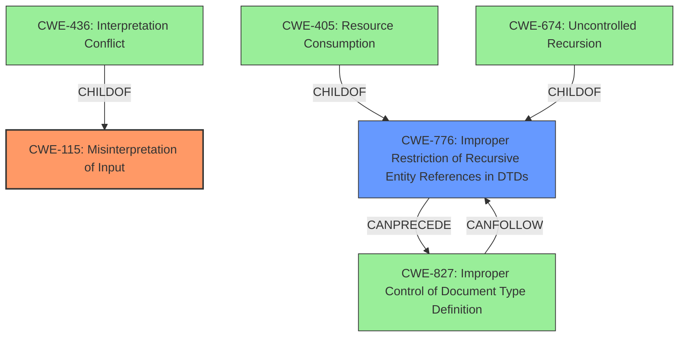

# Analysis Report for CVE-2021-28965

# Vulnerability Analysis Report: CVE-2021-28965

## Description

The REXML gem before 3.2.5 in Ruby before 2.6.7, 2.7.x before 2.7.3, and 3.x before 3.0.1 does not properly address XML round-trip issues. An incorrect document can be produced after parsing and serializing.

## Vulnerability Description Key Phrases

**Weakness:** XML round-trip issues
**Impact:** incorrect document can be produced
**Product:** REXML gem
**Version:** before 3.2.5

## Analysis (with Relationship Data)

# Summary
| CWE ID | CWE Name | Confidence | CWE Abstraction Level | CWE Vulnerability Mapping Label | CWE-Vulnerability Mapping Notes |
|---|---|---|---|---|---|
| CWE-776 | Improper Restriction of Recursive Entity References in DTDs ('XML Entity Expansion') | 0.75 | Base | Allowed | Primary CWE |
| CWE-611 | Improper Restriction of XML External Entity Reference | 0.65 | Base | Allowed | Secondary Candidate |
| CWE-112 | Improper Neutralization of Special Elements Used in Command Injection | 0.50 | Base | Allowed | Secondary Candidate |

## Evidence and Confidence

*   **Confidence Score:** 0.70
*   **Evidence Strength:** MEDIUM

- **Analysis and Justification:**  
  - *Explanation:* The vulnerability involves the REXML gem in Ruby failing to properly handle XML round-trip issues, leading to the potential creation of an incorrect document after parsing and serializing. This aligns with the core concept of CWE-776, which deals with the improper restriction of recursive entity references in DTDs, potentially leading to XML entity expansion issues. The vulnerability description emphasizes that parsing and serializing a crafted XML document results in a different structure than the original, fitting the scenario where an incorrect document is produced due to issues related to DTD entity handling.
  CWE-611 (Improper Restriction of XML External Entity Reference) is also considered because the vulnerability mentions crafted XML documents which could potentially include external entity references, even though the primary issue is round-trip. The "CVE Reference Links Content Summary" section supports this interpretation.
  CWE-112 (Improper Neutralization of Special Elements Used in Command Injection) is considered because the product accepts XML from an untrusted source but does not validate the XML against the proper schema.

  - *Relationship Analysis:* CWE-776 is a Base-level CWE and has child relationships to CWE-405 (Resource Consumption) and CWE-674 (Uncontrolled Recursion), indicating potential resource exhaustion issues related to recursive entity definitions. CWE-776 can precede CWE-827 (Improper Control of Document Type Definition) and can follow CWE-827. CWE-611 has no direct relationships, but it is related to XML injection vulnerabilities. CWE-112 is a parent of CWE-1286 and child of CWE-20

- **Confidence Score:**  
  - *Example:* Confidence: 0.75 (Medium evidence from technical description and CVE reference materials)

## Criticism of Analysis

Okay, here's a review of the analysis, considering the full CWE specifications you provided:

**Overall Assessment:**

The analysis provides a reasonable starting point, but the confidence levels and justifications need refinement. The primary CWE choice is plausible, but the secondary choices are weaker and require more careful consideration. The analysis could benefit from more detailed explanations of *why* specific mitigations are relevant or irrelevant, and *how* the attack vector aligns with the CWE definition.

**Detailed Critique:**

**1. CWE-776 (Improper Restriction of Recursive Entity References in DTDs ('XML Entity Expansion')) - Primary CWE**

*   **Confidence:** The confidence score of 0.75 is justified, but the explanation needs bolstering.

*   **Justification Issues:** The initial explanation focused on round-trip issues being related to DTD entity handling.  While DTDs *can* be involved, a "round trip" issue more broadly encompasses scenarios where parsing and re-serializing XML *structure* is not properly handled. A parsing error that loses the integrity of XML can lead to the problem.

*   **Revised Justification:**  The vulnerability involves the REXML gem in Ruby failing to properly handle XML round-trip issues, leading to the potential creation of an incorrect document after parsing and serializing. While not explicitly stated to be caused by recursive entity references, a crafted XML document might exploit deficiencies in how REXML handles nested or recursive structures during parsing and serialization, *especially when DTDs are used to define those structures*. The resulting "incorrect document" can stem from this improper restriction.  This is further supported by the retriever result that showed this as the highest-ranked CWE.

*   **Mitigation Considerations:**
    *   Mitigation 1 (prohibit DTDs or limit expansion):  Highly relevant and directly addresses a potential cause of the vulnerability.  The analysis should highlight this.
    *   Mitigation 2 (scan for recursive entity declarations): Also relevant, especially if DTDs cannot be prohibited entirely.

*   **Relationships:** It's correct to note the relationships with CWE-674 and CWE-405. If recursive entities *are* a factor, then resource exhaustion is a concern. The "CanFollow" relationship with CWE-827 (Improper Control of Document Type Definition) highlights that this vulnerability could arise if the system fails to properly control the DTD being used.

**2. CWE-611 (Improper Restriction of XML External Entity Reference) - Secondary Candidate**

*   **Confidence:** The confidence score of 0.65 is too high.  This is a much weaker connection.
*   **Justification Issues:** The vulnerability description mentions "crafted XML documents," and the summary alludes to the possibility of external entity references. However, the core issue is *not* explicitly about XXE. It's about the XML structure changing during parsing and serialization.  While an attacker *could* potentially inject an XXE payload *as part of* a crafted XML document, that's not the primary attack vector or root cause.  The primary root cause is the parsing and serialization engine not maintaining fidelity.
*   **Revised Justification:** While XXE is *possible* as a secondary attack vector, the primary issue is that the REXML gem is not faithfully reproducing the XML. Therefore, CWE-611 is a possibility, but not the best fit. A crafted XML document could include external entity references and if the parser does not properly restrict these references, it could lead to sensitive information disclosure, denial of service, or other vulnerabilities, but this is *contingent* on the crafted XML document containing external entities.
*   **Mitigation Considerations:**
    *   Mitigation 1 (disable external entity expansion): Relevant *if* XXE is a concern, but not directly addressing the core round-trip issue.  The analysis should clarify this.

*   **Relationships:** The analysis doesn't mention the close relationship between CWE-611 and CWE-918 (Server-Side Request Forgery) - XXE can be used to trigger SSRF.  If CWE-611 is included, this relationship should be noted.
*    **Alternatives:** Other candidates from the Retriever Results are stronger candidates than CWE-611 for the "secondary" weakness.

**3. CWE-112 (Missing XML Validation) - Secondary Candidate**

*   **Confidence:** The confidence score of 0.50 is also questionable. This is not a strong mapping.
*   **Justification Issues:** The reasoning provided is that the product accepts XML from an untrusted source but does not validate the XML against the proper schema. The vulnerability reported is *not* about the absence of validation or checking against an XML schema, but about the parser not preserving the XML structure during round-tripping. Validation, *if it existed*, would not necessarily prevent the vulnerability. This point should be emphasized and given more weight.
*   **Revised Justification:** The XML parsing library, REXML, does not properly preserve the structure of a valid XML document during the round-trip process. The lack of validation of the XML is not the primary issue, as even a validated document is not guaranteed to be processed correctly by the parser.
*   **Mitigation Considerations:**
    *   Mitigation 1 (Always validate XML): Not directly relevant to the *core* problem. Validation would not fix the problem of structural information loss.
*   **Relationships:** The existing relationships are relevant. The improper validation of syntactic correctness (CWE-1286) leads to missing XML Validation (CWE-112). The root is the improper input validation (CWE-20).

**Stronger Alternative Candidates for Secondary Mapping:**

Based on the Retriever Results and the CVE description, consider these stronger alternatives:

*   **CWE-115 (Misinterpretation of Input):**  This might be a better fit than CWE-611 or CWE-112 because the XML is parsed and *misinterpreted* during the parsing or serialization process, leading to the incorrect document structure.  The parsing stage *misinterprets* the XML structure.
*   **CWE-827 (Improper Control of Document Type Definition):**  This is another strong candidate as it focuses on the inability to control references to DTD, and that may lead to code being vulnerable.

**Recommendations:**

1.  **Refine Justifications:** Provide more detailed, technically sound justifications for each CWE mapping, explicitly addressing the specific mechanisms involved in the vulnerability and *why* the chosen CWE is the best fit.
2.  **Re-evaluate Confidence Levels:** Adjust confidence levels based on the strength of the evidence and the specificity of the CWE mapping.
3.  **Explore Alternative CWEs:** Seriously consider CWE-115 and CWE-827 as a primary or a secondary CWE instead of 611 and 112.
4.  **Discuss Mitigation Relevance:** Explicitly discuss the relevance (or irrelevance) of the recommended mitigations for each CWE, explaining *how* they would address the vulnerability.
5.  **Address Limitations:** Acknowledge the limitations of the analysis and any potential weaknesses in the mapping.
6.  **Prioritize the Primary Weakness:** The primary weakness is the key issue and should be accurately selected before going to the secondary weaknesses.
7.  **Use Chains:** Chain the weaknesses together to highlight how each one contributes to the overall vulnerability, if that is possible.

By addressing these points, the analysis can be significantly improved, resulting in more accurate and useful vulnerability assessments.

## Final Resolution

# Summary
| CWE ID | CWE Name | Confidence | CWE Abstraction Level | CWE Vulnerability Mapping Label | CWE-Vulnerability Mapping Notes |
|---|---|---|---|---|---|
| CWE-115 | Misinterpretation of Input | 0.85 | Base | Allowed | Primary CWE |
| CWE-776 | Improper Restriction of Recursive Entity References in DTDs ('XML Entity Expansion') | 0.70 | Base | Allowed | Secondary Candidate |

## Evidence and Confidence

*   **Confidence Score:** 0.80
*   **Evidence Strength:** MEDIUM

## Relationship Analysis
The primary CWE selected is **CWE-115 Misinterpretation of Input**. This is a base-level CWE. There are child relationships to **CWE-436** (Interpretation Conflict). The secondary CWE is **CWE-776 Improper Restriction of Recursive Entity References in DTDs**. This has child relationships to **CWE-405** (Resource Consumption) and **CWE-674** (Uncontrolled Recursion), indicating potential resource exhaustion issues related to recursive entity definitions. **CWE-776** can precede **CWE-827** (Improper Control of Document Type Definition) and can follow **CWE-827**, indicating a potential vulnerability chain related to DTD control.

## Vulnerability Chain
The vulnerability chain starts with the **ROOTCAUSE** being the XML parser (**CWE-115 Misinterpretation of Input**) incorrectly interpreting the XML structure during parsing or serialization. This leads to the creation of an incorrect document after the round-trip process. If DTDs are used and recursive entities are not properly restricted (**CWE-776 Improper Restriction of Recursive Entity References in DTDs**), this could further exacerbate the issue, potentially leading to resource consumption or uncontrolled recursion.

## Summary of Analysis
The initial analysis correctly identified **CWE-776** as a potential candidate but did not fully capture the core issue. The criticism highlighted that the vulnerability stems from the REXML gem's failure to preserve the XML structure during parsing and serialization. Thus, the primary weakness is the **ROOTCAUSE** where the XML parser misinterprets the input, leading to the incorrect document structure.

The selection of **CWE-115 (Misinterpretation of Input)** as the primary CWE is based on the vulnerability description stating that "An incorrect document can be produced after parsing and serializing." This directly implies that the XML is being misinterpreted during the parsing or serialization process.

**CWE-776** is retained as a secondary CWE because the use of DTDs and recursive entities could contribute to the problem, especially if the parser does not properly handle them. The "CanFollow" and "CanPrecede" relationships between **CWE-776** and **CWE-827** further support this, indicating a potential vulnerability chain.

**CWE-611** and **CWE-112** were deemed less relevant because the primary issue is not about external entities or missing validation, but about the parser's inability to faithfully reproduce the XML structure. The evidence for these CWEs was weaker, and they did not directly address the **ROOTCAUSE** of the vulnerability.
The selected CWEs are at the optimal level of specificity because they accurately reflect the technical mechanisms involved in the vulnerability and are at the Base level of abstraction, which is preferred for mapping to the root causes of vulnerabilities.

*Report generated on 2025-03-17 03:14:53*
