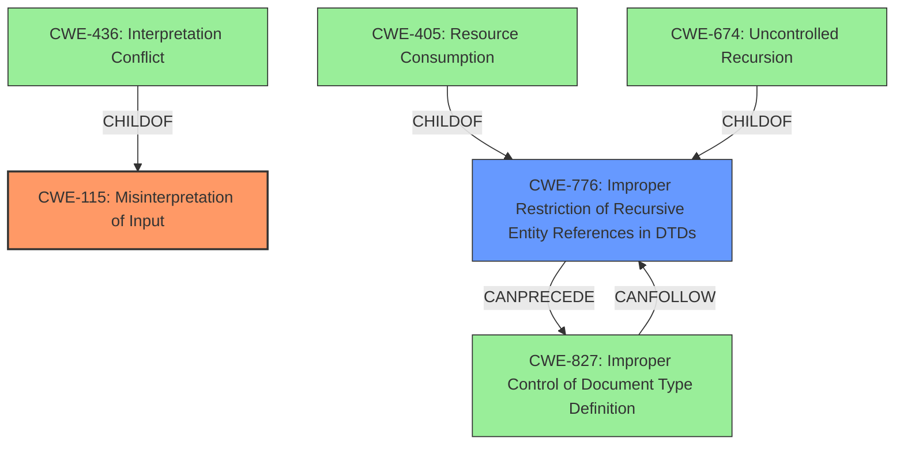

# Final Resolution for CVE-2021-28965

# Summary
| CWE ID | CWE Name | Confidence | CWE Abstraction Level | CWE Vulnerability Mapping Label | CWE-Vulnerability Mapping Notes |
|---|---|---|---|---|---|
| CWE-115 | Misinterpretation of Input | 0.85 | Base | Allowed | Primary CWE |
| CWE-776 | Improper Restriction of Recursive Entity References in DTDs ('XML Entity Expansion') | 0.70 | Base | Allowed | Secondary Candidate |

## Evidence and Confidence

*   **Confidence Score:** 0.80
*   **Evidence Strength:** MEDIUM

## Relationship Analysis
The primary CWE selected is **CWE-115 Misinterpretation of Input**. This is a base-level CWE. There are child relationships to **CWE-436** (Interpretation Conflict). The secondary CWE is **CWE-776 Improper Restriction of Recursive Entity References in DTDs**. This has child relationships to **CWE-405** (Resource Consumption) and **CWE-674** (Uncontrolled Recursion), indicating potential resource exhaustion issues related to recursive entity definitions. **CWE-776** can precede **CWE-827** (Improper Control of Document Type Definition) and can follow **CWE-827**, indicating a potential vulnerability chain related to DTD control.

## Vulnerability Chain
The vulnerability chain starts with the **ROOTCAUSE** being the XML parser (**CWE-115 Misinterpretation of Input**) incorrectly interpreting the XML structure during parsing or serialization. This leads to the creation of an incorrect document after the round-trip process. If DTDs are used and recursive entities are not properly restricted (**CWE-776 Improper Restriction of Recursive Entity References in DTDs**), this could further exacerbate the issue, potentially leading to resource consumption or uncontrolled recursion.

## Summary of Analysis
The initial analysis correctly identified **CWE-776** as a potential candidate but did not fully capture the core issue. The criticism highlighted that the vulnerability stems from the REXML gem's failure to preserve the XML structure during parsing and serialization. Thus, the primary weakness is the **ROOTCAUSE** where the XML parser misinterprets the input, leading to the incorrect document structure.

The selection of **CWE-115 (Misinterpretation of Input)** as the primary CWE is based on the vulnerability description stating that "An incorrect document can be produced after parsing and serializing." This directly implies that the XML is being misinterpreted during the parsing or serialization process.

**CWE-776** is retained as a secondary CWE because the use of DTDs and recursive entities could contribute to the problem, especially if the parser does not properly handle them. The "CanFollow" and "CanPrecede" relationships between **CWE-776** and **CWE-827** further support this, indicating a potential vulnerability chain.

**CWE-611** and **CWE-112** were deemed less relevant because the primary issue is not about external entities or missing validation, but about the parser's inability to faithfully reproduce the XML structure. The evidence for these CWEs was weaker, and they did not directly address the **ROOTCAUSE** of the vulnerability.
The selected CWEs are at the optimal level of specificity because they accurately reflect the technical mechanisms involved in the vulnerability and are at the Base level of abstraction, which is preferred for mapping to the root causes of vulnerabilities.