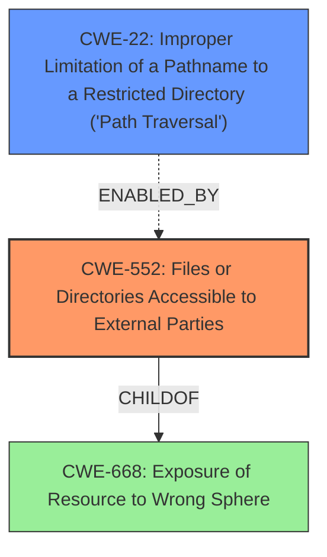

# Analysis Report for CVE-2021-29024

# Vulnerability Analysis Report: CVE-2021-29024

## Description

In InvoicePlane 1.5.11 a misconfigured web server allows unauthenticated directory listing and file download. Allowing an attacker to directory traversal and download files suppose to be private without authentication.

## Vulnerability Description Key Phrases

**Rootcause:** misconfigured web server
**Impact:** unauthenticated directory listing and file download
**Vector:** directory traversal
**Attacker:** attacker
**Product:** InvoicePlane
**Version:** 1.5.11

## Analysis (with Relationship Data)

# Summary
| CWE ID | CWE Name | Confidence | CWE Abstraction Level | CWE Vulnerability Mapping Label | CWE-Vulnerability Mapping Notes |
|---|---|---|---|---|---|
| CWE-552 | Files or Directories Accessible to External Parties | 0.95 | Base | Primary | Allowed |
| CWE-22 | Improper Limitation of a Pathname to a Restricted Directory ('Path Traversal') | 0.75 | Base | Secondary Candidate | Allowed |

## Evidence and Confidence

*   **Confidence Score:** 0.90
*   **Evidence Strength:** HIGH

- **Analysis and Justification:**  
  - *Explanation:* The primary **weakness** is that the **misconfigured web server** allows files and directories to be accessible to external parties without authentication. This aligns directly with CWE-552 (Files or Directories Accessible to External Parties). The vulnerability description explicitly states that an attacker can perform unauthenticated directory listing and file download. The CVE reference summary confirms this, highlighting that the core issue is a misconfigured web server not preventing directory listing. MITRE mapping guidance for CWE-552 indicates this is ALLOWED. Although there's mention of directory traversal as an attack vector, the root cause is the accessibility of files without authorization due to misconfiguration.

  - *Relationship Analysis:* While CWE-22 (Improper Limitation of a Pathname to a Restricted Directory ('Path Traversal')) is related and identified by the retriever, it is a consequence of the primary weakness (CWE-552) rather than the root cause. The **directory traversal** mentioned is an attack vector enabled by the **misconfiguration** and the ability to access files without authentication.

- **Confidence Score:**
  - *Example:* Confidence: 0.95 (High evidence from vulnerability description, CVE reference materials, and retriever results)

---

## Criticism of Analysis

Okay, here's a detailed review of the provided analysis, incorporating the full CWE specifications:

**Overall Assessment:**

The analysis is generally good and identifies the primary CWE correctly. The justification is well-articulated and uses relevant information from the vulnerability description and CVE summary. The secondary candidate is reasonable but correctly identified as not the primary cause.

**Detailed Critique:**

**1. CWE-552: Files or Directories Accessible to External Parties (Primary)**

*   **Correctness:** This is the most accurate CWE mapping. The vulnerability's root cause is the web server's failure to restrict access to sensitive files and directories. The description aligns perfectly: "The product makes files or directories accessible to unauthorized actors, even though they should not be."
*   **Confidence Level:** 0.95 is a justifiable high confidence score.
*   **Justification:** The provided evidence is strong. The vulnerability description clearly states "unauthenticated directory listing and file download." The CVE reference summary reiterates the misconfigured web server not preventing directory listing.  This direct access without authorization maps directly to CWE-552.
*   **Mapping Guidance:** The analysis correctly notes that the mapping guidance for CWE-552 indicates that this is ALLOWED and at the Base level of abstraction, which is ideal.
*   **Mitigations:**
    *   The analysis should implicitly recognize that the **Mitigation 1**, is the most relevant for this case:
        *   **Phase:** Implementation, System Configuration, Operation
        *   **Description:** When storing data in the cloud (e.g., S3 buckets, Azure blobs, Google Cloud Storage, etc.), use the provider's controls to disable public access.
        *   **Applicability:** This highlights the importance of proper server configuration (which is where this lies), and would have preveented the issue.
*   **CWE Examples:** The inclusion of CVE-2005-1835 and CVE-2021-29024 under the top 25 examples in the analysis is good to include, as it provides a context.

**2. CWE-22: Improper Limitation of a Pathname to a Restricted Directory ('Path Traversal') (Secondary Candidate)**

*   **Correctness:** While directory traversal is *an attack vector* in this scenario, it's not the fundamental *weakness*. The traversal is *enabled* by the misconfigured server's allowing access to directories and files that should be restricted.
*   **Confidence Level:** 0.75 is a reasonable score, reflecting that it's a related but not primary issue.
*   **Justification:** The analysis correctly identifies that CWE-22 is a *consequence* of the primary weakness. The attacker uses directory traversal techniques (like "../") to exploit the lack of access controls, but the ability to traverse directories isn't the root problem.  The root problem is that the server is not restricting access to the root directory in the first place. The analysis clearly identifies that this is the result of a misconfiguration.
*   **Mapping Guidance:** The analysis correctly notes that the mapping guidance for CWE-22 indicates that this is ALLOWED and at the Base level of abstraction, which is ideal.
*   **Mitigations:**
    *   **Relevance:** While the mitigations for CWE-22 (input validation, canonicalization) are important to prevent directory traversal attacks, they are not the primary solution for *this specific vulnerability*. The *primary* fix is to configure the web server to restrict access to sensitive directories (i.e., prevent directory listing, require authentication).
    *   **Example:** Mitigation 3 for CWE-22 uses canonicalization:
        *   Inputs should be decoded and canonicalized to the application's current internal representation before being validated (CWE-180). Make sure that the application does not decode the same input twice (CWE-174). Such errors could be used to bypass allowlist validation schemes by introducing dangerous inputs after they have been checked.
        *   Use a built-in path canonicalization function (such as realpath() in C) that produces the canonical version of the pathname, which effectively removes ".." sequences and symbolic links (CWE-23, CWE-59). This includes:
        *   realpath() in C
        *   getCanonicalPath() in Java
        *   GetFullPath() in ASP.NET
        *   realpath() or abs_path() in Perl
        *   realpath() in PHP
        * While this would help to prevent path traversal exploits, it would not stop the directory listing if the web server is misconfigured.
*   **CWE Examples:** The inclusion of CVE-2024-37032 and CVE-2024-4315 under the observed examples in the analysis is good to include, as it provides a context.

**Improvements and Suggestions:**

1.  **Highlight Mitigation Relevance:**  While the analysis mentions mitigations in the CWE descriptions, it would be stronger to explicitly state which mitigation from CWE-552 is most relevant to the given vulnerability and why. For example, "The most relevant mitigation for this vulnerability is configuring the web server to disable directory listing and require authentication for access to sensitive directories."
2.  **Other CWEs to Consider (but ultimately reject):**
    *   **CWE-425: Direct Request ('Forced Browsing'):** This might seem relevant, but it focuses on *bypassing authorization* to access resources. In this case, there's *no* authorization in place due to the misconfiguration. The problem isn't bypassing it, it's the *absence* of authorization.
    *   **CWE-548: Exposure of Information Through Directory Listing:** This is a *variant* of CWE-497 (Exposure of Sensitive Information). While the vulnerability does result in directory listing, the listing itself isn't the root cause. It's a *symptom* of the underlying misconfiguration that allows unauthenticated access (CWE-552).
3.  **Clarity on the "Fix":** While the analysis mentions adding `index.html` files as a fix, it should be clarified that this is a *workaround*, not a true fix. It *prevents* directory listing in the absence of proper server configuration, but the underlying problem (lack of access controls) remains. A better fix would be to properly configure the web server.
4.  **Relationship to other CWEs:** The analysis could benefit from explicitly mentioning that CWE-552 is a child of CWE-285 (Improper Authorization), indicating that the root cause is a failure to properly implement authorization checks. While mentioning the hierarchy isn't always necessary, it can help to provide a more complete picture of the vulnerability.
5.  **CVSS Score Context:** While the CVSS score is mentioned, it might be useful to briefly mention the specific CVSS metrics that contribute to the high score (e.g., network attack vector, low attack complexity, no privileges required, high impact to confidentiality and integrity).

**Revised Summary Table:**

| CWE ID | CWE Name | Confidence | CWE Abstraction Level | CWE Vulnerability Mapping Label | CWE-Vulnerability Mapping Notes |
|---|---|---|---|---|---|
| CWE-552 | Files or Directories Accessible to External Parties | 0.95 | Base | Primary | Allowed |
| CWE-22 | Improper Limitation of a Pathname to a Restricted Directory ('Path Traversal') | 0.75 | Base | Secondary Candidate | Allowed |

**Conclusion:**

The analysis is sound and provides a good assessment of the vulnerability. The suggestions above are primarily aimed at providing more context and explicitly linking the vulnerability to relevant mitigation strategies. The key strength of the analysis is its correct identification of CWE-552 as the primary cause and its clear explanation of why other related CWEs are not the fundamental issue.

## Final Resolution

# Summary
| CWE ID | CWE Name | Confidence | CWE Abstraction Level | CWE Vulnerability Mapping Label | CWE-Vulnerability Mapping Notes |
|---|---|---|---|---|---|
| CWE-552 | Files or Directories Accessible to External Parties | 0.95 | Base | Primary | Allowed |
| CWE-22 | Improper Limitation of a Pathname to a Restricted Directory ('Path Traversal') | 0.75 | Base | Secondary Candidate | Allowed |

## Evidence and Confidence

*   **Confidence Score:** 0.95
*   **Evidence Strength:** HIGH

## Relationship Analysis
The primary CWE is CWE-552, which is a base-level weakness focusing on the exposure of files and directories. CWE-22 is considered as a secondary candidate, which can arise due to a lack of proper path restriction, however, it is not the root cause. The relationship lies in that a misconfigured server (CWE-552) allows for directory traversal (CWE-22) as an attack vector. CWE-552 is a child of CWE-668 (Exposure of Resource to Wrong Sphere), indicating a broader category of exposing resources inappropriately.

## Vulnerability Chain
The vulnerability chain starts with a **misconfigured web server** (the **ROOTCAUSE**), which leads to **CWE-552 (Files or Directories Accessible to External Parties)**. This, in turn, allows an attacker to perform **directory traversal**, potentially exploiting **CWE-22 (Improper Limitation of a Pathname to a Restricted Directory ('Path Traversal'))** to access sensitive files. The final impact is the unauthorized download of private files.

## Summary of Analysis
The initial analysis correctly identifies **CWE-552 (Files or Directories Accessible to External Parties)** as the primary **weakness**. The vulnerability description states that a "misconfigured web server allows unauthenticated directory listing and file download," which directly supports this classification. The retriever scores also indicate a high similarity to CWE-552.

The criticism correctly points out that **CWE-22 (Improper Limitation of a Pathname to a Restricted Directory ('Path Traversal'))** is a secondary factor, acting as an attack vector enabled by the primary **weakness**. The graph relationships confirm that CWE-552 is a more fundamental issue, with CWE-22 being a potential consequence.

The selection of CWE-552 is at the optimal level of specificity because it directly addresses the root cause of the vulnerability: the **misconfiguration** that allows unauthorized access to files and directories.

*Report generated on 2025-03-16 22:38:25*
