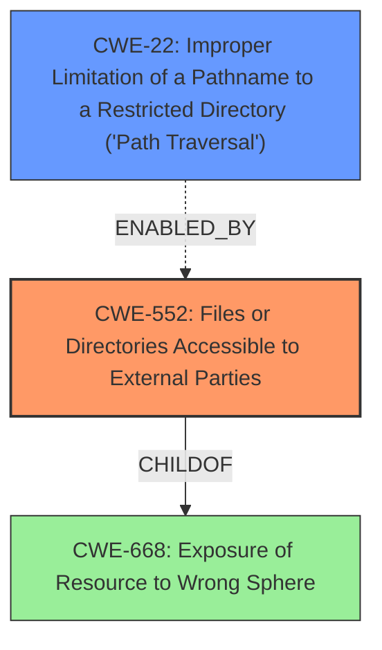

# Final Resolution for CVE-2021-29024

# Summary
| CWE ID | CWE Name | Confidence | CWE Abstraction Level | CWE Vulnerability Mapping Label | CWE-Vulnerability Mapping Notes |
|---|---|---|---|---|---|
| CWE-552 | Files or Directories Accessible to External Parties | 0.95 | Base | Primary | Allowed |
| CWE-22 | Improper Limitation of a Pathname to a Restricted Directory ('Path Traversal') | 0.75 | Base | Secondary Candidate | Allowed |

## Evidence and Confidence

*   **Confidence Score:** 0.95
*   **Evidence Strength:** HIGH

## Relationship Analysis
The primary CWE is CWE-552, which is a base-level weakness focusing on the exposure of files and directories. CWE-22 is considered as a secondary candidate, which can arise due to a lack of proper path restriction, however, it is not the root cause. The relationship lies in that a misconfigured server (CWE-552) allows for directory traversal (CWE-22) as an attack vector. CWE-552 is a child of CWE-668 (Exposure of Resource to Wrong Sphere), indicating a broader category of exposing resources inappropriately.

## Vulnerability Chain
The vulnerability chain starts with a **misconfigured web server** (the **ROOTCAUSE**), which leads to **CWE-552 (Files or Directories Accessible to External Parties)**. This, in turn, allows an attacker to perform **directory traversal**, potentially exploiting **CWE-22 (Improper Limitation of a Pathname to a Restricted Directory ('Path Traversal'))** to access sensitive files. The final impact is the unauthorized download of private files.

## Summary of Analysis
The initial analysis correctly identifies **CWE-552 (Files or Directories Accessible to External Parties)** as the primary **weakness**. The vulnerability description states that a "misconfigured web server allows unauthenticated directory listing and file download," which directly supports this classification. The retriever scores also indicate a high similarity to CWE-552.

The criticism correctly points out that **CWE-22 (Improper Limitation of a Pathname to a Restricted Directory ('Path Traversal'))** is a secondary factor, acting as an attack vector enabled by the primary **weakness**. The graph relationships confirm that CWE-552 is a more fundamental issue, with CWE-22 being a potential consequence.

The selection of CWE-552 is at the optimal level of specificity because it directly addresses the root cause of the vulnerability: the **misconfiguration** that allows unauthorized access to files and directories.