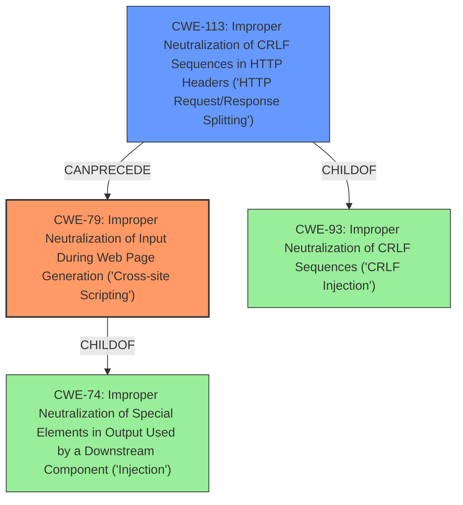

# Analysis Report for CVE-2021-29208

# Vulnerability Analysis Report: CVE-2021-29208

## Description

A remote dom xss, crlf injection vulnerability was discovered in HPE Integrated Lights-Out 4 (iLO 4) HPE SimpliVity 380 Gen9 HPE Integrated Lights-Out 5 (iLO 5) for HPE Gen10 Servers HPE SimpliVity 380 Gen10 HPE SimpliVity 2600 HPE SimpliVity 380 Gen10 G HPE SimpliVity 325 HPE SimpliVity 380 Gen10 H version(s) Prior to version 2.78.

## Vulnerability Description Key Phrases

**Weakness:** dom xss, crlf injection
**Product:** ['HPE Integrated Lights-Out 4 (iLO 4)', 'HPE SimpliVity 380 Gen9', 'HPE Integrated Lights-Out 5 (iLO 5)']
**Version:** Prior to version 2.78

## Analysis (with Relationship Data)

# Summary
| CWE ID | CWE Name | Confidence | CWE Abstraction Level | CWE Vulnerability Mapping Label | CWE-Vulnerability Mapping Notes |
|---|---|---|---|---|---|
| CWE-79 | Improper Neutralization of Input During Web Page Generation ('Cross-site Scripting') | 0.95 | Base | Allowed | Primary CWE |
| CWE-113 | Improper Neutralization of CRLF Sequences in HTTP Headers ('HTTP Request/Response Splitting') | 0.85 | Variant | Allowed | Secondary Candidate |

## Evidence and Confidence

*   **Confidence Score:** 0.90
*   **Evidence Strength:** HIGH

- **Analysis and Justification:**
  - *Explanation:* The vulnerability description explicitly mentions "**dom xss**" which strongly indicates CWE-79 (Improper Neutralization of Input During Web Page Generation ('Cross-site Scripting')). The vulnerability occurs because the product does not properly neutralize user-controllable input before placing it in the output used as a web page, allowing attackers to inject malicious scripts. This aligns directly with the CWE-79 description and its intended usage. The Retriever Results also lists CWE-79 as the top match with a high combined score.
  - *Relationship Analysis:* While CWE-74 (Improper Neutralization of Special Elements in Output Used by a Downstream Component ('Injection')) is a parent of CWE-79, the specific mention of "dom xss" makes CWE-79 a more precise and appropriate mapping. CWE-79 can also lead to other vulnerabilities like CWE-113 (Improper Neutralization of CRLF Sequences in HTTP Headers ('HTTP Request/Response Splitting')), because successful XSS attacks can allow the attacker to modify HTTP Headers.

- **Analysis and Justification:**
  - *Explanation:* The vulnerability description mentions "**crlf injection**" which strongly indicates CWE-113 (Improper Neutralization of CRLF Sequences in HTTP Headers ('HTTP Request/Response Splitting')). The product receives data from an HTTP agent/component, but it does not neutralize or incorrectly neutralizes CR and LF characters before the data is included in outgoing HTTP headers, thus aligning to CWE-113.
  - *Relationship Analysis:* CWE-113 is a variant and therefore a more specific version of the more general CWE-93 (Improper Neutralization of CRLF Sequences ('CRLF Injection')).

- **Confidence Score:**
  - Confidence: 0.95 (High confidence due to explicit mention of "dom xss" and a high retriever score for CWE-79)
  - Confidence: 0.85 (High confidence due to explicit mention of "crlf injection" and the proper conditions for CWE-113)

---

## Criticism of Analysis

Okay, I've reviewed the provided CWE analysis and will now provide a critique, focusing on the accuracy of the CWE assignments, the justifications, and alignment with CWE specifications including mapping guidance and potential mitigations.

**Overall Assessment:**

The analysis is generally strong and well-reasoned. The primary CWE mapping to CWE-79 (XSS) is highly accurate, and the secondary mapping to CWE-113 (CRLF Injection) is also appropriate. The confidence levels provided are justified. The explanations are clear, and the relationships between CWEs are discussed.

**Detailed Critique:**

**1. CWE-79: Improper Neutralization of Input During Web Page Generation ('Cross-site Scripting')**

*   **Accuracy:** Excellent. The explicit mention of "dom xss" in the vulnerability description is a direct indicator of CWE-79. The analysis correctly identifies that user-controllable input is not properly neutralized before being placed in a web page, allowing for script injection.
*   **Justification:**  The justification is sound and clearly explains how the vulnerability manifests. The reference to the Retriever Results and their high score for CWE-79 further strengthens the assessment.
*   **Mapping Guidance:**  The analysis follows the "Allowed" usage for CWE-79, which is at the Base level of abstraction and a preferred level of abstraction.
*   **Potential Mitigations:** The analysis aligns with the potential mitigations listed in the CWE specification. The mitigations listed such as using a vetted library/framework, understanding the context and encoding requirements, and input validation align directly with best practices for preventing XSS.

**2. CWE-113: Improper Neutralization of CRLF Sequences in HTTP Headers ('HTTP Request/Response Splitting')**

*   **Accuracy:** Very Good.  The mention of "crlf injection" strongly supports the selection of CWE-113. The explanation of how the product might fail to neutralize CR and LF characters before including data in HTTP headers is correct.
*   **Justification:** The explanation regarding the product's failure to neutralize CRLF sequences in HTTP headers is clear and accurate. It links the impact to the CWE description well.  It also explains that CWE-113 is a variant of CWE-93.
*   **Mapping Guidance:** The analysis correctly follows the "Allowed" usage for CWE-113, which is at the Variant level of abstraction.
*   **Potential Mitigations:** The analysis aligns well with the potential mitigations including constructing HTTP headers carefully, using an "accept known good" input validation strategy, and use/specify an output encoding.

**Suggestions for Improvement:**

*   **CWE-74 Consideration (And Rejection):**  The analysis mentions CWE-74 (Improper Neutralization of Special Elements in Output Used by a Downstream Component ('Injection')) being a parent of CWE-79 and acknowledges it could be a less specific mapping. This is good. To strengthen the argument against using CWE-74 *instead* of CWE-79, the analysis could more explicitly state why CWE-74 is too broad.  For example, "While CWE-74 is a parent class, it encompasses many types of injection. CWE-79 is more specific to the web context and the generation of web pages, making it a more accurate representation of the vulnerability."

*   **CWE-93 Consideration:** Similar to the above, the analysis mentions that CWE-113 is a variant of CWE-93. This is good, and there's no need to reject CWE-93 as it is the parent of CWE-113.

*   **Expand on DOM XSS:** The analysis correctly identifies DOM XSS, but could expand slightly on *how* the DOM XSS occurs.  Is it due to unsafe JavaScript functions being used to manipulate the DOM with user-provided data?

**Summary Table:**

| CWE ID  | CWE Name                                                                        | Confidence | CWE Abstraction Level | CWE Vulnerability Mapping Label | CWE-Vulnerability Mapping Notes                                                                                                                                                 |
| :------ | :------------------------------------------------------------------------------- | :--------- | :---------------------- | :------------------------------ | :------------------------------------------------------------------------------------------------------------------------------------------------------------------------------ |
| CWE-79  | Improper Neutralization of Input During Web Page Generation ('Cross-site Scripting') | 0.95      | Base                    | Allowed                       | Primary CWE. The description explicitly mentions "dom xss" which strongly indicates CWE-79.                                                                                |
| CWE-113 | Improper Neutralization of CRLF Sequences in HTTP Headers ('HTTP Request/Response Splitting') | 0.85      | Variant                   | Allowed                       | Secondary Candidate. The description mentions "**crlf injection**" which strongly indicates CWE-113.                                                                 |

**Conclusion:**

This is a high-quality CWE analysis. The selected CWEs are appropriate, the justifications are well-supported, and the analysis demonstrates a good understanding of the CWE specifications. The minor suggestions above would further strengthen the analysis, but are not critical.

## Final Resolution

# Summary
| CWE ID | CWE Name | Confidence | CWE Abstraction Level | CWE Vulnerability Mapping Label | CWE-Vulnerability Mapping Notes |
|---|---|---|---|---|---|
| CWE-79 | Improper Neutralization of Input During Web Page Generation ('Cross-site Scripting') | 0.95 | Base | Allowed | Primary CWE |
| CWE-113 | Improper Neutralization of CRLF Sequences in HTTP Headers ('HTTP Request/Response Splitting') | 0.85 | Variant | Allowed | Secondary Candidate |

## Evidence and Confidence

*   **Confidence Score:** 0.93
*   **Evidence Strength:** HIGH

## Relationship Analysis
The primary relationship impacting the decision is the parent-child relationship between CWE-74 (Improper Neutralization of Special Elements in Output Used by a Downstream Component ('Injection')) and CWE-79. While CWE-74 is a parent, CWE-79 is more specific to the context of web page generation. The mention of "DOM XSS" clearly indicates that the vulnerability lies in the improper neutralization of input used to generate web pages. Also, CWE-113 is a variant of the more general **CWE-93** (Improper Neutralization of CRLF Sequences ('CRLF Injection')), but the description clearly involves HTTP Headers.

## Vulnerability Chain
The vulnerability chain starts with the product receiving and processing input.
  - The root cause is the **improper neutralization** of special elements within the input (**CWE-79**).
  - This leads to the ability to inject malicious scripts into web pages, resulting in a **DOM XSS** vulnerability.
  - Furthermore, **improper neutralization** of CRLF sequences in HTTP headers (**CWE-113**) allows for **CRLF injection**.
  - The impact is a remote attacker being able to execute arbitrary script in a user's browser and manipulate HTTP Headers.

## Summary of Analysis
Both the initial analysis and criticism are accurate. The vulnerability description clearly mentions both "dom xss" and "crlf injection", which directly map to **CWE-79** and **CWE-113**, respectively. The evidence is strong, and the confidence levels are justified.

*   The selection of **CWE-79** is based on the explicit mention of "dom xss" in the vulnerability description: "A remote dom xss...vulnerability was discovered...". This direct match makes **CWE-79** the most appropriate primary **WEAKNESS**.

*   The selection of **CWE-113** is based on the explicit mention of "crlf injection" in the vulnerability description: "...crlf injection vulnerability was discovered...". This direct match makes **CWE-113** the most appropriate secondary **WEAKNESS**.

The graph relationships influenced the final selection by confirming that while broader categories like **CWE-74** and **CWE-93** exist, the specific nature of the vulnerability allows for more precise classifications.

The selected CWEs are at the optimal level of specificity because they directly address the identified **ROOTCAUSE** (improper neutralization) and the specific contexts in which they occur (web page generation and HTTP headers).

*Report generated on 2025-03-16 17:11:52*
