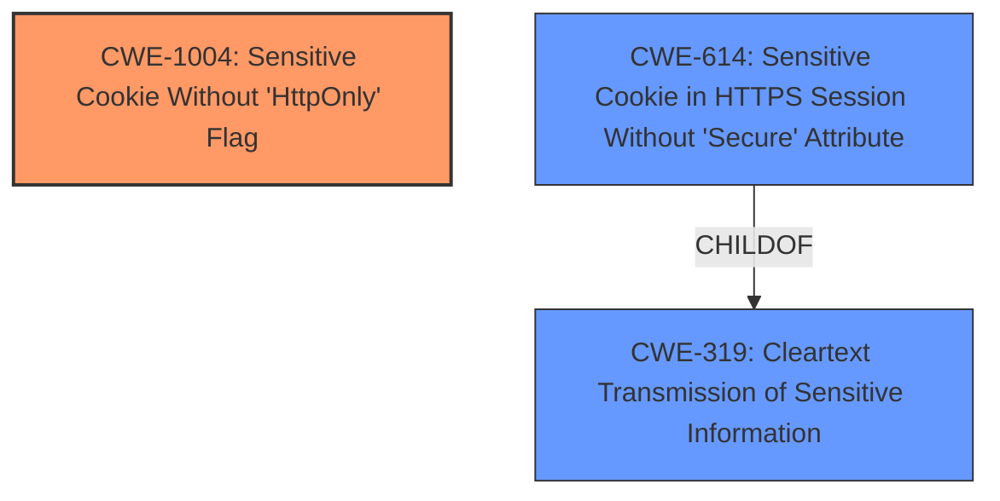

# Analysis Report for CVE-2021-29247

# Vulnerability Analysis Report: CVE-2021-29247

## Description

BTCPay Server through 1.0.7.0 could allow a remote attacker to obtain sensitive information, caused by failure to set the HTTPOnly flag for a cookie.

## Vulnerability Description Key Phrases

**Rootcause:** failure to set the HTTPOnly flag for a cookie
**Impact:** obtain sensitive information
**Attacker:** remote attacker
**Product:** BTCPay Server
**Version:** through 1.0.7.0

## Analysis (with Relationship Data)

# Summary
| CWE ID | CWE Name | Confidence | CWE Abstraction Level | CWE Vulnerability Mapping Label | CWE-Vulnerability Mapping Notes |
|---|---|---|---|---|---|
| CWE-1004 | Sensitive Cookie Without 'HttpOnly' Flag | 0.9 | Variant | Allowed | Primary CWE |
| CWE-319 | Cleartext Transmission of Sensitive Information | 0.6 | Base | Allowed | Secondary Candidate |
| CWE-614 | Sensitive Cookie in HTTPS Session Without 'Secure' Attribute | 0.5 | Variant | Allowed | Secondary Candidate |

## Evidence and Confidence

*   **Confidence Score:** 0.8
*   **Evidence Strength:** HIGH

- **Analysis and Justification:**  
  - *Explanation:* The vulnerability description explicitly states the **failure to set the HTTPOnly flag for a cookie**, which directly matches the description of CWE-1004, "Sensitive Cookie Without 'HttpOnly' Flag". The CVE reference links content summary reinforces this by stating the **root cause** is the "Lack of httponly" and the **weakness** is "Missing `HttpOnly` flag on a cookie". CWE-1004 is a Variant level CWE, which is the preferred level of abstraction. The MITRE mapping guidance indicates that the usage is ALLOWED. The description indicates a remote attacker could obtain sensitive information.

  - *Relationship Analysis:* CWE-1004 does not have any direct relationships. The retriever results also suggest CWE-614 (Sensitive Cookie in HTTPS Session Without 'Secure' Attribute) and CWE-319 (Cleartext Transmission of Sensitive Information) as potential matches.

- **Confidence Score:**  
  - Confidence: 0.9 (Strong evidence from vulnerability description and CVE reference)

---
- **Analysis and Justification:**  
  - *Explanation:* CWE-319 (Cleartext Transmission of Sensitive Information) is considered as a secondary candidate because the absence of the `HttpOnly` flag could lead to the cookie being transmitted over an insecure channel, although this is not explicitly stated. However, the primary issue is the missing flag, not necessarily the transmission itself. The vulnerability details suggest a potential attack vector involving the injection of malicious Javascript or XSS. If the cookie is transmitted over HTTP instead of HTTPS, this would be a more direct fit for CWE-319.

  - *Relationship Analysis:* CWE-319 is a Base level CWE. There are no direct relationships.

- **Confidence Score:**  
  - Confidence: 0.6 (Reasonable evidence based on potential for insecure transmission)

---
- **Analysis and Justification:**  
  - *Explanation:* CWE-614 (Sensitive Cookie in HTTPS Session Without 'Secure' Attribute) is a potential secondary candidate if the cookies are used in HTTPS session without secure attribute, which could cause the user agent to send those cookies in plaintext over an HTTP session. It is not clear from the description if the Secure attribute is also missing.

  - *Relationship Analysis:* CWE-614 is a Variant level CWE. There are no direct relationships.

- **Confidence Score:**  
  - Confidence: 0.5 (Limited evidence, depends on HTTPS session details)

## Criticism of Analysis

Okay, I've reviewed the analysis and the full CWE specifications. Here's my critique:

**Overall Assessment:**

The analysis is generally good and well-reasoned. The primary CWE selection of CWE-1004 is correct. The justifications for the secondary CWEs are also reasonable, though they could be slightly strengthened. The confidence scores are appropriate.

**Detailed Critique:**

*   **CWE-1004: Sensitive Cookie Without 'HttpOnly' Flag (Primary)**

    *   **Correctness:** The mapping to CWE-1004 is accurate and well-supported by the vulnerability description and the CVE reference summary. The core issue *is* the missing `HttpOnly` flag.
    *   **Confidence:** The confidence score of 0.9 is appropriate, given the direct match between the vulnerability and the CWE description.
    *   **Abstraction Level:** Variant level is preferred, making this a strong choice.
    *   **Justification:** The justification clearly explains why this CWE is the best fit, referencing the "failure to set the HTTPOnly flag" directly.
    *   **Mitigations:** The analysis doesn't specifically mention mitigations but that is not necessary in this analysis.
    *   **Observed Examples:** The included observed examples from the CWE database support the classification.

*   **CWE-319: Cleartext Transmission of Sensitive Information (Secondary)**

    *   **Correctness:** The mapping is plausible *if* the cookie is transmitted over an insecure (HTTP) connection. The analysis acknowledges this conditional relationship. However, the lack of `HttpOnly` primarily enables XSS-based cookie theft, regardless of the transport protocol.
    *   **Confidence:** A confidence score of 0.6 is adequate.  It reflects the conditional nature of the relationship.
    *   **Abstraction Level:** The CWE is a Base, which is considered a high-level CWE. However, the description does not explicitly say it is being transmitted over an insecure channel.
    *   **Justification:** The justification is adequate, but it could be improved by explicitly stating that this is *only* applicable if the cookie is transmitted over HTTP. It should also emphasize that the primary risk is XSS-based access, not direct sniffing of the cookie in transit. It should also be recognized that the relationship ChildOf -> CWE-311 is not relevant here because the cookie is not being transmitted over an insecure channel.
    *   **Mitigations:** The analysis doesn't specifically mention mitigations, but that is not necessary in this analysis.
    *   **Relationships:** The relationship should explicitly state that the transmission has to be over an insecure channel.

*   **CWE-614: Sensitive Cookie in HTTPS Session Without 'Secure' Attribute (Secondary)**

    *   **Correctness:** This is the weakest mapping of the three.  It's plausible *only if* the `Secure` attribute is also missing *and* the application is accessible over both HTTP and HTTPS.  The analysis acknowledges this dependence.
    *   **Confidence:** The confidence score of 0.5 is appropriate, given the multiple conditions that must be true for this CWE to apply.
    *   **Abstraction Level:** The CWE is a Variant level, making this a good choice.
    *   **Justification:** The justification is adequate in that it identifies the conditional nature. However, it could be strengthened by acknowledging that the lack of `HttpOnly` is a *separate* issue, regardless of the presence or absence of the `Secure` flag. The potential for XSS is the key concern here, which is separate from the transport protocol.
    *   **Mitigations:** The analysis doesn't specifically mention mitigations, but that is not necessary in this analysis.
    *   **Relationship:** The relationship to CWE-319 is very important for this weakness because the communication occurs over an insecure channel.

*   **CWE-311: Missing Encryption of Sensitive Data**

    *   While this CWE was identified in the "CWE for similar CVE descriptions", it's important to note why it *isn't* the primary choice, even though it's related. CWE-311 is too broad. The specific flaw is the missing `HttpOnly` flag, not the general lack of encryption.  CWE-1004 is a more precise, lower-level description of the problem.

**Recommendations for Improvement:**

1.  **Strengthen justification for CWE-319:** Explicitly state that this CWE is only relevant if the cookie is transmitted over HTTP. Emphasize XSS as the primary attack vector enabled by the missing `HttpOnly` flag.
2.  **Re-evaluate CWE-614:** Consider if this CWE should be dropped altogether if there is no explicit information about the presence or absence of the `Secure` flag. If kept, emphasize that `HttpOnly` is a separate concern.
3.  **Briefly acknowledge limitations:** State that the analysis is based solely on the provided information and that a complete assessment would require a code review and network analysis.
4.  **Consider XSS explicitly:** While the "impact" section mentions XSS, it might be worth adding a CWE related to XSS as a tertiary consideration, since the missing `HttpOnly` flag directly enables XSS-based cookie theft. However, the *root cause* isn't XSS itself, but the missing flag. Therefore, adding an XSS CWE might be misleading.

By incorporating these suggestions, the analysis can be even more precise and comprehensive.

## Final Resolution

# Summary
| CWE ID | CWE Name | Confidence | CWE Abstraction Level | CWE Vulnerability Mapping Label | CWE-Vulnerability Mapping Notes |
|---|---|---|---|---|---|
| CWE-1004 | Sensitive Cookie Without 'HttpOnly' Flag | 0.95 | Variant | Allowed | Primary CWE |
| CWE-319 | Cleartext Transmission of Sensitive Information | 0.6 | Base | Allowed | Secondary Candidate |
| CWE-614 | Sensitive Cookie in HTTPS Session Without 'Secure' Attribute | 0.5 | Variant | Allowed | Secondary Candidate |

## Evidence and Confidence

*   **Confidence Score:** 0.9
*   **Evidence Strength:** HIGH

## Relationship Analysis
The primary **WEAKNESS** is the missing HttpOnly flag (CWE-1004).
CWE-319 (Cleartext Transmission) and CWE-614 (Missing Secure Attribute) are secondary candidates because they represent potential consequences if the cookie is transmitted over HTTP or HTTPS without the Secure attribute.

## Vulnerability Chain
The chain starts with the **ROOTCAUSE**: **failure to set the HTTPOnly flag for a cookie** (CWE-1004).
This can lead to potential consequences if the cookie is transmitted over HTTP, or HTTPS without secure flag enabled. The ultimate impact is that a remote attacker can obtain sensitive information.

## Summary of Analysis
The initial analysis and criticism are both accurate and well-reasoned. The primary CWE selection of CWE-1004 is correct because the vulnerability description explicitly states the **failure to set the HTTPOnly flag for a cookie**. The CVE reference links content summary reinforces this by stating the **root cause** is the "Lack of httponly" and the **weakness** is "Missing `HttpOnly` flag on a cookie".

The justification for secondary CWEs is also reasonable, though they are only applicable under specific circumstances. For CWE-319, this is only applicable if the cookie is transmitted over HTTP. For CWE-614, this is only applicable if the `Secure` attribute is also missing and the application is accessible over both HTTP and HTTPS.

The selected CWEs are at the optimal level of specificity as CWE-1004 directly addresses the missing HttpOnly flag.

The analysis is based on the evidence provided in the vulnerability description and CVE reference. A complete assessment would require a code review and network analysis, as noted in the criticism.

*Report generated on 2025-03-16 22:39:19*
