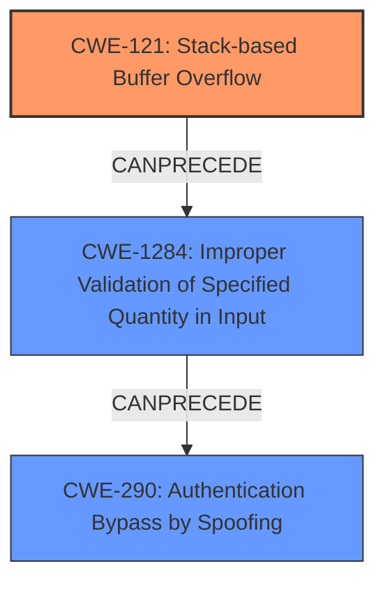

# Final Resolution for CVE-2021-29280

# Summary
| CWE ID | CWE Name | Confidence | CWE Abstraction Level | CWE Vulnerability Mapping Label | CWE-Vulnerability Mapping Notes |
|---|---|---|---|---|---|
| CWE-121 | Stack-based Buffer Overflow | 0.85 | Variant | Allowed | Primary CWE; triggered by malformed ARP packet data. |
| CWE-1284 | Improper Validation of Specified Quantity in Input | 0.75 | Base | Allowed | Secondary: Lack of input validation of network packet data length |
| CWE-290 | Authentication Bypass by Spoofing | 0.65 | Base | Allowed | Secondary Candidate; ARP poisoning attack vector. |

## Evidence and Confidence

*   **Confidence Score:** 0.80
*   **Evidence Strength:** MEDIUM

## Relationship Analysis
The analysis considered the following CWE relationships:
  - Parent-child hierarchical relationships: CWE-121 is a variant of CWE-119.
  - Chain relationships showing progression of vulnerability: ARP Spoofing (CWE-290) leading to lack of input validation (CWE-1284) and then triggering a Stack-based Buffer Overflow (CWE-121).
  - Peer relationships: Considered CWE-122 (Heap-based Buffer Overflow) as an alternative to CWE-121.
  - Abstraction levels: Preferred Variant (CWE-121) and Base (CWE-290, CWE-1284) levels for specificity.

## Vulnerability Chain
The vulnerability chain involves the following sequence:
  - Root Cause: ARP poisoning allows spoofed packets (CWE-290).
  - Weakness: Lack of input validation on the length of ARP packet data (CWE-1284).
  - Impact: This leads to a **stack-based buffer overflow** (CWE-121) when processing the malformed ARP packet.

## Summary of Analysis
The initial analysis and criticism provided a solid foundation. The key improvement is framing the vulnerability as a chain of weaknesses rather than isolated issues. The decision to include CWE-1284, "Improper Validation of Specified Quantity in Input," strengthens the analysis by pinpointing the lack of validation on ARP packet length as a critical contributing factor.

The evidence from the vulnerability description, particularly the mention of "ARP poisoning attack can cause **buffer overflow**," supports the selection of CWE-121 as the primary weakness. The addition of CWE-1284 addresses the criticism of needing to specify *how* the ARP poisoning leads to the overflow. The ARP packet is not validated for length, so it overwrites the buffer.

The graph relationships highlight the progression of the vulnerability. The ARP spoofing (CWE-290) enables the injection of malformed packets, the lack of input validation (CWE-1284) fails to detect the oversized packet, and the **buffer overflow** (CWE-121) occurs when processing the packet.

The selected CWEs are at the optimal level of specificity. CWE-121 is a Variant, providing a specific type of **buffer overflow**. CWE-1284 is a Base, identifying the root cause of the missing length validation. CWE-290 is a Base, identifying the attack vector.

The removal of CWE-400 is justified, as it is more of a consequence than a direct cause.