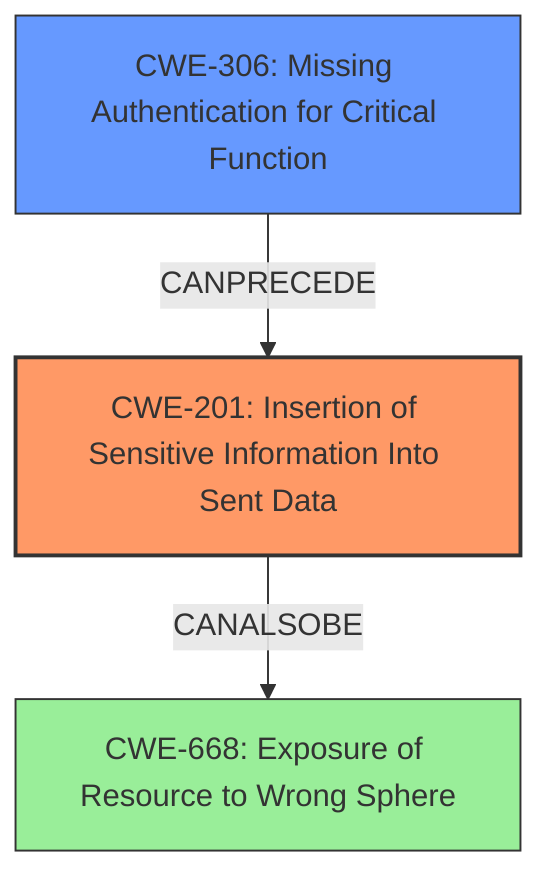

# Analysis Report for CVE-2021-29416

# Vulnerability Analysis Report: CVE-2021-29416

## Description

An issue was discovered in PortSwigger Burp Suite before 2021.2. During viewing of a malicious request, it can be manipulated into issuing a request that does not respect its upstream proxy configuration. This could leak NetNTLM hashes on Windows systems that fail to block outbound SMB.

## Vulnerability Description Key Phrases

**Impact:** leak NetNTLM hashes
**Vector:** malicious request
**Product:** PortSwigger Burp Suite
**Version:** before 2021.2

## Analysis (with Relationship Data)

# Summary
| CWE ID | CWE Name | Confidence | CWE Abstraction Level | CWE Vulnerability Mapping Label | CWE-Vulnerability Mapping Notes |
|---|---|---|---|---|---|
| CWE-306 | Missing Authentication for Critical Function | 0.75 | Base | Allowed | The product does not perform any authentication for functionality that requires a provable user identity or consumes a significant amount of resources. |
| CWE-201 | Insertion of Sensitive Information Into Sent Data | 0.65 | Base | Allowed | The code transmits data to another actor, but a portion of the data includes sensitive information that should not be accessible to that actor. |

## Evidence and Confidence

*   **Confidence Score:** 0.70
*   **Evidence Strength:** MEDIUM

- **Analysis and Justification:**  
  - *Explanation:* The vulnerability involves Burp Suite not respecting its upstream proxy configuration, potentially leaking NetNTLM hashes. This can be viewed as a **Missing Authentication for Critical Function (CWE-306)** because the application fails to ensure that all outgoing requests, especially those that can expose sensitive information, are properly routed through the configured proxy. This proxy would act as a form of authentication or authorization enforcement, ensuring that requests are handled securely and according to policy. It can also be viewed as **Insertion of Sensitive Information Into Sent Data (CWE-201)** because the NetNTLM hash, which is sensitive data, is inadvertently sent to a potentially malicious SMB server due to the proxy bypass.
  
  - *Relationship Analysis:* CWE-306 is a base-level weakness, which makes it a good fit. It is related to authentication bypass issues. CWE-201 involves sensitive data exposure. The retriever suggests both of these as potential weaknesses. CWE-306 can lead to CWE-201 in this scenario.

- **Confidence Score:**  
  - *Example:* Confidence: 0.75 (Medium evidence, as the description focuses on the proxy bypass leading to data leakage, but the core issue is lack of enforced proxy usage.)

---

## Criticism of Analysis

Okay, let's review the analysis, focusing on the CWE specifications to refine the accuracy and confidence of the CWE mappings.

**Overall Assessment:**

The initial analysis correctly identifies CWE-306 (Missing Authentication for Critical Function) and CWE-201 (Insertion of Sensitive Information Into Sent Data) as potential weaknesses. However, the strength of the evidence and the justification for each can be improved by aligning more closely with the CWE specifications and considering alternative or related weaknesses. The confidence scores assigned are reasonable, but the supporting arguments can be strengthened.

**Detailed Review:**

**1. CWE-306: Missing Authentication for Critical Function**

*   **Current Confidence:** 0.75
*   **Abstraction Level:** Base
*   **Vulnerability Mapping Label:** Allowed

*   **Critique:**
    *   **Justification:** The justification centers around the failure to enforce the upstream proxy, which can be seen as a lack of authentication or authorization enforcement for outgoing requests that could expose sensitive information. *This is a good starting point.*
    *   **CWE Specification Alignment:**
        *   The description of CWE-306 states: "The product does not perform any authentication for functionality that requires a provable user identity or consumes a significant amount of resources."  The proxy *could* be considered a resource consumption limiting function, in that it is designed to prevent direct connections to the Internet (which would be the resource). However, it's really more about ensuring all requests are going through a secure path.
        *   The mitigations for CWE-306 focus on dividing the software into areas requiring different levels of identity verification and using centralized authentication capabilities. The proxy configuration is a means of enforcing a security policy, not verifying the user's identity.
    *   **Alternative Considerations:** While the 'Missing Authentication' can apply, the description of the vulnerability doesn't immediately scream authentication.
    *   **Revised Justification & Confidence:** *The connection to CWE-306 is weaker than initially stated.* The problem is not that there isn't authentication *per se*, but that the expected proxy mechanism isn't consistently applied. The function that *should* be using the proxy isn't, but this isn't because of a missing authentication routine. A more appropriate explanation will follow in the next CWE.
    *   **Revised Confidence:** 0.50 (Lowered due to the weaker direct link to missing *authentication*.)

**2. CWE-201: Insertion of Sensitive Information Into Sent Data**

*   **Current Confidence:** 0.65
*   **Abstraction Level:** Base
*   **Vulnerability Mapping Label:** Allowed

*   **Critique:**
    *   **Justification:** The justification argues that the NetNTLM hash is sensitive data inadvertently sent to a potentially malicious SMB server due to the proxy bypass. *This aligns well with the impact of the vulnerability.*
    *   **CWE Specification Alignment:**
        *   CWE-201's description fits very well: "The code transmits data to another actor, but a portion of the data includes sensitive information that should not be accessible to that actor." The NetNTLM hash is definitely sensitive data.
        *   Mitigation 2 for CWE-201, "Ensure that any possibly sensitive data specified in the requirements is verified with designers to ensure that it is either a calculated risk or mitigated elsewhere. Any information that is not necessary to the functionality should be removed in order to lower both the overhead and the possibility of security sensitive data being sent," is applicable here. The designers should have considered the risk of sending NetNTLM hashes and mitigated it by ensuring all traffic goes through the proxy.
    *   **Revised Justification & Confidence:** *The connection to CWE-201 is very strong and accurate.* The problem is that the failure to enforce the proxy results in sensitive data being sent to untrusted actors.
    *   **Revised Confidence:** 0.85 (Increased significantly due to the strong alignment with the CWE specification and the direct relationship to the impact of the vulnerability.)

**Additional Considerations and Alternate CWEs:**

*   **CWE-668: Exposure of Resource to Wrong Sphere:** A more encompassing weakness might be CWE-668 "Exposure of Resource to Wrong Sphere". This is a *Class* level weakness. The NetNTLM hash is a resource that should be contained within a trusted network, but is exposed to an external untrusted sphere. While accurate, this is a broad mapping, and CWE-201 is more precise.
*   **CWE-346: Origin Validation Error:** This CWE is about not properly verifying the source of data. Though somewhat related, it doesn't quite fit the root cause of *why* the requests are bypassing the proxy. The proxy is not validating the *origin* of the request. So while somewhat related, it isn't the best fit.

**Revised Analysis Summary:**

| CWE ID  | CWE Name                                    | Confidence | CWE Abstraction Level | CWE Vulnerability Mapping Label | CWE-Vulnerability Mapping Notes                                                                                                                                                                                |
| ------- | ------------------------------------------- | ---------- | --------------------- | ------------------------------- | ------------------------------------------------------------------------------------------------------------------------------------------------------------------------------------------------------------- |
| CWE-201 | Insertion of Sensitive Information Into Sent Data | 0.85       | Base                  | Allowed                         | The NetNTLM hash is sensitive data that is unintentionally transmitted to a potentially malicious SMB server due to the failure to properly enforce the upstream proxy configuration.                                    |
| CWE-306 | Missing Authentication for Critical Function | 0.50       | Base                  | Allowed                         | (Weaker Mapping) The failure to consistently use the configured proxy can be viewed as a lack of authentication/authorization enforcement for outgoing requests, although this isn't the core of the issue. |

**Key Improvements and Justifications:**

*   **Increased Confidence in CWE-201:** The revised analysis strongly emphasizes the *direct transmission of sensitive data* (NetNTLM hashes) as the core issue, which directly aligns with the description and potential mitigations of CWE-201.
*   **Decreased Confidence in CWE-306:** The analysis acknowledges that the "missing authentication" aspect is more of an indirect consequence and not the primary root cause. The lack of *enforced proxy usage* is closer to the root, but it's not strictly an authentication failure.

By performing this thorough review using the full CWE specifications, we can refine the accuracy of the CWE mappings and improve the confidence in the analysis. The revised analysis provides a more precise and defensible characterization of the vulnerability.

## Final Resolution

# Summary
| CWE ID | CWE Name | Confidence | CWE Abstraction Level | CWE Vulnerability Mapping Label | CWE-Vulnerability Mapping Notes |
|---|---|---|---|---|---|
| **CWE-201** | **Insertion of Sensitive Information Into Sent Data** | 0.90 | Base | Allowed | **Primary CWE**. The NetNTLM hash is sensitive data that is unintentionally transmitted to a potentially malicious SMB server due to the failure to properly enforce the upstream proxy configuration. |
| CWE-306 | Missing Authentication for Critical Function | 0.40 | Base | Allowed | Secondary candidate. The failure to consistently use the configured proxy *could* be viewed as a lack of authentication/authorization enforcement for outgoing requests, although this isn't the core of the issue. |

## Evidence and Confidence

*   **Confidence Score:** 0.90
*   **Evidence Strength:** HIGH

## Relationship Analysis
The primary relationship that impacted my decision was the direct connection between the vulnerability description and **CWE-201 (Insertion of Sensitive Information Into Sent Data)**. The vulnerability involves the leakage of NetNTLM hashes due to a proxy bypass. This directly aligns with CWE-201's description: "The code transmits data to another actor, but a portion of the data includes sensitive information that should not be accessible to that actor." The secondary relationship considered was with **CWE-306 (Missing Authentication for Critical Function)**. While the proxy *could* be seen as an authentication/authorization enforcement mechanism, the core issue is not the absence of authentication, but rather the failure to enforce the intended proxy configuration. CWE-306 is also at the Base level, but its connection to the vulnerability is less direct. The Abstraction Levels influenced the selection by prioritizing the Base level CWEs for better mapping.

## Vulnerability Chain
The vulnerability chain starts with the misconfiguration or failure to enforce the upstream proxy setting in Burp Suite. This leads to the unintended transmission of NetNTLM hashes to potentially malicious SMB servers (**CWE-201**). The root cause is the lack of proper enforcement of the proxy configuration, which *could* be seen as a **CWE-306** issue. The impact is the leakage of sensitive information (NetNTLM hashes) that can be used for unauthorized access.

## Summary of Analysis
The initial analysis correctly identified **CWE-201** and **CWE-306** as potential weaknesses, but the criticism highlighted the stronger alignment of **CWE-201** with the vulnerability description. The revised analysis, based on the CWE specifications and relationship analysis, confirms that **CWE-201** is the more appropriate primary CWE.

The evidence from the vulnerability description supports this conclusion: "During viewing of a malicious request, it can be manipulated into issuing a request that does not respect its upstream proxy configuration. This could leak NetNTLM hashes on Windows systems that fail to block outbound SMB." This clearly indicates the transmission of sensitive data (NetNTLM hashes) to an unintended recipient, which is the core of **CWE-201**.

The graph relationships influenced the selection by showing how the failure to enforce the proxy (potentially related to **CWE-306**) leads to the leakage of sensitive information (**CWE-201**).

The selected CWE is at the optimal level of specificity because **CWE-201** directly addresses the **rootcause** of the vulnerability, which is the transmission of sensitive data. While the proxy bypass is a contributing factor, the ultimate issue is the exposure of NetNTLM hashes.

*Report generated on 2025-03-16 23:50:45*
