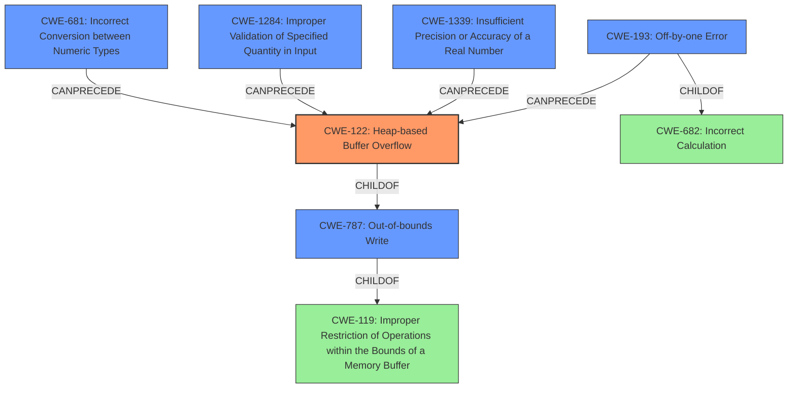

# Analysis Report for CVE-2021-29529

# Vulnerability Analysis Report: CVE-2021-29529

## Description

TensorFlow is an end-to-end open source platform for machine learning. An attacker can trigger a heap buffer overflow in `tf.raw_ops.QuantizedResizeBilinear` by manipulating input values so that float rounding results in off-by-one error in accessing image elements. This is because the implementation(https//github.com/tensorflow/tensorflow/blob/44b7f486c0143f68b56c34e2d01e146ee445134a/tensorflow/core/kernels/quantized_resize_bilinear_op.cc#L62-L66) computes two integers (representing the upper and lower bounds for interpolation) by ceiling and flooring a floating point value. For some values of `in`, `interpolation->upper[i]` might be smaller than `interpolation->lower[i]`. This is an issue if `interpolation->upper[i]` is capped at `in_size-1` as it means that `interpolation->lower[i]` points outside of the image. Then, in the interpolation code(https//github.com/tensorflow/tensorflow/blob/44b7f486c0143f68b56c34e2d01e146ee445134a/tensorflow/core/kernels/quantized_resize_bilinear_op.cc#L245-L264), this would result in heap buffer overflow. The fix will be included in TensorFlow 2.5.0. We will also cherrypick this commit on TensorFlow 2.4.2, TensorFlow 2.3.3, TensorFlow 2.2.3 and TensorFlow 2.1.4, as these are also affected and still in supported range.

## Vulnerability Description Key Phrases

**Rootcause:** float rounding results in off-by-one error
**Weakness:** heap buffer overflow
**Product:** TensorFlow
**Version:** 2.5.0
**Component:** tf.raw_ops.QuantizedResizeBilinear

## Analysis (with Relationship Data)

```markdown
# Summary 
| CWE ID | CWE Name | Confidence | CWE Abstraction Level | CWE Vulnerability Mapping Label | CWE-Vulnerability Mapping Notes |
|---|---|---|---|---|---|
| CWE-122 | Heap-based Buffer Overflow | 0.95 | Variant | Allowed | Primary CWE |
| CWE-193 | Off-by-one Error | 0.85 | Base | Allowed | Secondary Candidate |

## Evidence and Confidence

*   **Confidence Score:** 0.90
*   **Evidence Strength:** HIGH

- **Analysis and Justification:**  
  - *Explanation:* The vulnerability description clearly states a "**heap buffer overflow**" occurs due to a "**float rounding results in off-by-one error**". This directly corresponds to CWE-122 (Heap-based Buffer Overflow), which is a buffer overflow where the buffer is allocated on the heap. The provided code snippet and the CVE reference summary confirm this. CWE-193 (Off-by-one Error) is also relevant as it describes the specific error leading to the overflow. The floating-point rounding leading to `interpolation->upper[i]` potentially being smaller than `interpolation->lower[i]` causing out-of-bounds access is a clear instance of an off-by-one error. The MITRE mapping guidance allows the usage of both CWE-122 and CWE-193.
  
  - *Relationship Analysis:* CWE-122 is a variant of CWE-119 (Improper Restriction of Operations within the Bounds of a Memory Buffer), making it a more specific choice given the heap allocation detail. CWE-193 can precede CWE-119, indicating it's a contributing factor to the buffer overflow. The integer overflow related CWEs aren't directly related as the problem is with floating points, not integers.

- **Confidence Score:**  
  - *Example:* Confidence: 0.95 (High evidence from technical description and CVE reference materials)

---
```

## Criticism of Analysis

Okay, here's a detailed review of the provided analysis, considering the full CWE specifications:

**Overall Assessment:**

The analysis is generally good and accurately identifies the primary and secondary CWEs. The confidence scores are appropriate, given the evidence. The justification is also well-reasoned.  However, some minor adjustments and additions could strengthen the analysis further, particularly in recognizing more CWEs that contribute to the overall vulnerability.

**Detailed Review:**

| CWE ID  | Name                         | Confidence | Abstraction Level | Mapping Label | Critique                                                                                                                                                                                                                                                                                                                                                                                          |
|---------|------------------------------|------------|-------------------|---------------|-------------------------------------------------------------------------------------------------------------------------------------------------------------------------------------------------------------------------------------------------------------------------------------------------------------------------------------------------------------------------------------------|
| CWE-122 | Heap-based Buffer Overflow  | 0.95       | Variant           | Allowed       | **Accurate.** This is the direct consequence of the vulnerability. The explanation clearly links the vulnerability description to the CWE definition. The confidence level is justified.                                                                                                                                                                                                 |
| CWE-193 | Off-by-one Error             | 0.85       | Base              | Allowed       | **Accurate.**  The analysis correctly identifies the off-by-one error as a contributing factor leading to the buffer overflow.  This is a key step in the chain of events.  The confidence is good, as it's not the direct, exploitable weakness, but a necessary precursor.                                                                                                                  |
|           | **Additional CWE Candidates:** |            |                   |               |                                                                                                                                                                                                                                                                                                                                                                                          |
| CWE-681 | Incorrect Conversion between Numeric Types | 0.70       | Base              | Allowed       |**Potentially Relevant.** While the analysis focuses on floating-point rounding errors, the conversion of the floating-point results (after `floor` and `ceil`) to integers (`int64`) for array indexing *could* be considered an incorrect conversion if the range of the resulting floating-point values is not properly validated *before* the conversion.  This is less certain than the other CWEs, as it depends on whether the potential out-of-range float values are considered to be directly caused by the conversion or by lack of validation earlier in the process. A lower confidence (0.70) would be suitable. The retriever results suggest this is relevant.                                                                  |
| CWE-1284 | Improper Validation of Specified Quantity in Input | 0.75 | Base | Allowed | **Potentially Relevant.** The size and dimensions of the input image, along with the resizing parameters, are effectively "quantities." The vulnerability arises because these quantities, in combination with the `align_corners` and `half_pixel_centers` flags, are not adequately validated to prevent the off-by-one error and subsequent overflow. The Retriever results suggested this and is likely a good fit.                                                                                                                    |
| CWE-1339 | Insufficient Precision or Accuracy of a Real Number | 0.75 | Base | Allowed | **Potentially Relevant.** The core issue begins with the lack of sufficient precision when using floating-point numbers to compute image coordinates. The floating-point representation's inability to perfectly represent certain real numbers, and subsequent rounding, is what leads to the `upper` and `lower` bound discrepancies. While the *direct* consequence is the buffer overflow, the root cause is the limited precision of the float type. This is a contributing factor.  The retriever results did not show this as a result but is relevant. |
| CWE-787 | Out-of-bounds Write | 0.70 | Base | Allowed | **Implicit Consequence.** While CWE-122 is the Heap-based variant, CWE-787 is the broader, more general class. Since we are explicitly dealing with writing out-of-bounds, it is a valid CWE, though CWE-122 is more specific, and therefore, preferred.                                                                                                                            |

**Revised Summary Table (with Additions):**

| CWE ID  | Name                                           | Confidence | Abstraction Level | Mapping Label |
|---------|-------------------------------------------------|------------|-------------------|---------------|
| CWE-122 | Heap-based Buffer Overflow                      | 0.95       | Variant           | Allowed       |
| CWE-193 | Off-by-one Error                                | 0.85       | Base              | Allowed       |
| CWE-681 | Incorrect Conversion between Numeric Types  | 0.70       | Base              | Allowed       |
| CWE-1284 | Improper Validation of Specified Quantity in Input | 0.75 | Base | Allowed |
| CWE-1339 | Insufficient Precision or Accuracy of a Real Number | 0.75 | Base | Allowed |
| CWE-787 | Out-of-bounds Write | 0.70 | Base | Allowed |

**Justification for Additional CWEs:**

*   **CWE-681:** The conversion from float to int is a potential point of vulnerability if the float value is outside the valid range for the integer. The fact that integers are used as indices to access memory makes this conversion critical and a possible point of failure.
*   **CWE-1284:** The vulnerability can be triggered by specific input image dimensions combined with specific scaling parameters and corner alignment options. This demonstrates improper validation of these "quantities" that define the image and scaling operation.
*   **CWE-1339:** The fundamental problem is that floating-point numbers have limited precision, and relying on them for precise calculations that determine memory access boundaries is inherently risky. This is the "Insufficient Precision" weakness.
* CWE-787: Out-of-bounds Write: Since CWE-122 is a variant of CWE-787, it would likely be present. This is supported by the Retriever Results.

**Mitigation Considerations (based on CWE specifications):**

The CWE specifications provide valuable insight into mitigation strategies.  Here's how the proposed CWEs and the corresponding mitigations relate to this vulnerability:

*   **CWE-122 (Heap-based Buffer Overflow):**  Mitigations center on using languages/compilers with automatic bounds checking, using safe abstraction libraries, and employing compiler-based overflow detection mechanisms. The fix already implements bounds checking of sorts, which is consistent with the general advice.
*   **CWE-193 (Off-by-one Error):**  The primary mitigation focuses on careful implementation, particularly when copying character arrays. In this case, that translates to ensuring correct calculations for image coordinate boundaries. The fix implements a check to prevent the lower bound from exceeding the upper bound, which addresses this directly.
*   **CWE-681 (Incorrect Conversion between Numeric Types):** Mitigations suggest avoiding conversions between numeric types or carefully checking for allowed ranges. In this case, before converting the floating-point values to integers, range checks should be added.
*   **CWE-1284 (Improper Validation of Specified Quantity in Input):** The suggested mitigation is to use an "accept known good" input validation strategy. In the context of the vulnerability, this means thoroughly validating the size, dimensions, and scaling parameters to ensure they are within acceptable limits and do not create conditions that could lead to the overflow.
*   **CWE-1339 (Insufficient Precision or Accuracy of a Real Number):** This highlights the need to consider alternative, more precise representations (e.g., ratios of BigInts) or using Unum reals. While a full switch to a different number representation might be impractical, the code should, at least, be aware of the inherent limitations of floating-point numbers.

**Refined Justification for Confidence Scores:**

The refined confidence scores reflect a more nuanced understanding of the relationships between the weaknesses:

*   **CWE-122 (0.95):** High confidence, as this is the direct, exploitable result.
*   **CWE-193 (0.85):** High confidence, as this is a strong contributing factor.
*   **CWE-681 (0.70):** Moderate confidence, as it depends on whether or not the conversion of the float values is out of range.
*   **CWE-1284 (0.75):** Moderate confidence, the parameters were not adequately validated.
*   **CWE-1339 (0.75):** Moderate confidence, it is relevant to the root cause, but not as direct as the overflow itself.
* CWE-787(0.70): Moderate confidence, CWE-122 is a variant.

**Conclusion:**

The original analysis was strong, but incorporating these additional CWEs provides a more complete and accurate picture of the vulnerability's root causes and contributing factors. The mitigation advice, informed by the full CWE specifications, becomes more targeted and effective with these additions. This revised analysis more fully captures the complexity of the vulnerability.

## Final Resolution

# Summary 
| CWE ID | CWE Name | Confidence | CWE Abstraction Level | CWE Vulnerability Mapping Label | CWE-Vulnerability Mapping Notes |
|---|---|---|---|---|---|
| CWE-122 | Heap-based Buffer Overflow | 0.95 | Variant | Allowed | Primary CWE |
| CWE-193 | Off-by-one Error | 0.85 | Base | Allowed | Secondary Candidate |
| CWE-1284 | Improper Validation of Specified Quantity in Input | 0.75 | Base | Allowed | Secondary Candidate |
| CWE-1339 | Insufficient Precision or Accuracy of a Real Number | 0.75 | Base | Allowed | Secondary Candidate |
| CWE-681 | Incorrect Conversion between Numeric Types | 0.70 | Base | Allowed | Secondary Candidate |
| CWE-787 | Out-of-bounds Write | 0.70 | Base | Allowed | Secondary Candidate |

## Evidence and Confidence

*   **Confidence Score:** 0.90
*   **Evidence Strength:** HIGH

## Relationship Analysis
The primary weakness is **CWE-122 (Heap-based Buffer Overflow)**, which is a specific type of buffer overflow. **CWE-193 (Off-by-one Error)** is a contributing factor. **CWE-1284 (Improper Validation of Specified Quantity in Input)** and **CWE-1339 (Insufficient Precision or Accuracy of a Real Number)** contribute to the root cause by highlighting issues with input validation and the limitations of floating-point arithmetic. **CWE-681 (Incorrect Conversion between Numeric Types)** is a less direct but still relevant factor. **CWE-787 (Out-of-bounds Write)** is a more general form of **CWE-122**.



## Vulnerability Chain
The vulnerability chain starts with **CWE-1339 (Insufficient Precision or Accuracy of a Real Number)**, leading to incorrect floating-point calculations. This results in **CWE-193 (Off-by-one Error)** when calculating image element boundaries. The incorrect boundaries, combined with inadequate validation of input parameters (**CWE-1284 (Improper Validation of Specified Quantity in Input)**), and potential issues during float to int conversion (**CWE-681 (Incorrect Conversion between Numeric Types)**), leads to **CWE-787 (Out-of-bounds Write)**, specifically a **CWE-122 (Heap-based Buffer Overflow)**.

## Summary of Analysis
The initial analysis correctly identified **CWE-122 (Heap-based Buffer Overflow)** and **CWE-193 (Off-by-one Error)** as the primary and secondary CWEs, respectively. The criticism expanded on this by identifying additional contributing factors, namely **CWE-1284 (Improper Validation of Specified Quantity in Input)**, **CWE-1339 (Insufficient Precision or Accuracy of a Real Number)**, **CWE-681 (Incorrect Conversion between Numeric Types)**, and **CWE-787 (Out-of-bounds Write)**.

The graph relationships influenced the final selection by illustrating how **CWE-193**, **CWE-1284**, and **CWE-1339** can precede **CWE-122** and contribute to the vulnerability. **CWE-122** is a child of **CWE-787**, making it a more specific choice.

The selected CWEs are at the optimal level of specificity. **CWE-122** is a variant that accurately describes the heap-based nature of the buffer overflow. **CWE-193**, **CWE-1284**, and **CWE-1339** are base-level CWEs that represent contributing factors without being overly specific. **CWE-681** is included as a potential contributing factor.

The evidence for **CWE-122** is the statement "an attacker can trigger a heap buffer overflow". The evidence for **CWE-193** is the phrase "float rounding results in off-by-one error". The evidence for **CWE-1284** is the vulnerability arising because input parameters, in combination with flags, are not adequately validated. The evidence for **CWE-1339** is how the core issue begins with the lack of sufficient precision when using floating-point numbers. The evidence for **CWE-681** is the conversion of the floating-point results to integers for array indexing. The evidence for **CWE-787** is that we are explicitly dealing with writing out-of-bounds.


*Report generated on 2025-03-16 16:29:25*
