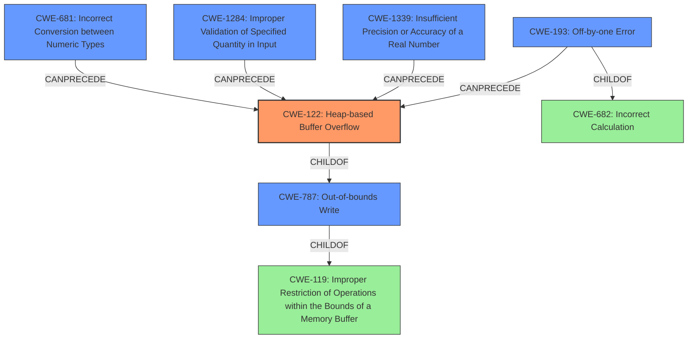

# Final Resolution for CVE-2021-29529

# Summary 
| CWE ID | CWE Name | Confidence | CWE Abstraction Level | CWE Vulnerability Mapping Label | CWE-Vulnerability Mapping Notes |
|---|---|---|---|---|---|
| CWE-122 | Heap-based Buffer Overflow | 0.95 | Variant | Allowed | Primary CWE |
| CWE-193 | Off-by-one Error | 0.85 | Base | Allowed | Secondary Candidate |
| CWE-1284 | Improper Validation of Specified Quantity in Input | 0.75 | Base | Allowed | Secondary Candidate |
| CWE-1339 | Insufficient Precision or Accuracy of a Real Number | 0.75 | Base | Allowed | Secondary Candidate |
| CWE-681 | Incorrect Conversion between Numeric Types | 0.70 | Base | Allowed | Secondary Candidate |
| CWE-787 | Out-of-bounds Write | 0.70 | Base | Allowed | Secondary Candidate |

## Evidence and Confidence

*   **Confidence Score:** 0.90
*   **Evidence Strength:** HIGH

## Relationship Analysis
The primary weakness is **CWE-122 (Heap-based Buffer Overflow)**, which is a specific type of buffer overflow. **CWE-193 (Off-by-one Error)** is a contributing factor. **CWE-1284 (Improper Validation of Specified Quantity in Input)** and **CWE-1339 (Insufficient Precision or Accuracy of a Real Number)** contribute to the root cause by highlighting issues with input validation and the limitations of floating-point arithmetic. **CWE-681 (Incorrect Conversion between Numeric Types)** is a less direct but still relevant factor. **CWE-787 (Out-of-bounds Write)** is a more general form of **CWE-122**.

## Vulnerability Chain
The vulnerability chain starts with **CWE-1339 (Insufficient Precision or Accuracy of a Real Number)**, leading to incorrect floating-point calculations. This results in **CWE-193 (Off-by-one Error)** when calculating image element boundaries. The incorrect boundaries, combined with inadequate validation of input parameters (**CWE-1284 (Improper Validation of Specified Quantity in Input)**), and potential issues during float to int conversion (**CWE-681 (Incorrect Conversion between Numeric Types)**), leads to **CWE-787 (Out-of-bounds Write)**, specifically a **CWE-122 (Heap-based Buffer Overflow)**.

## Summary of Analysis
The initial analysis correctly identified **CWE-122 (Heap-based Buffer Overflow)** and **CWE-193 (Off-by-one Error)** as the primary and secondary CWEs, respectively. The criticism expanded on this by identifying additional contributing factors, namely **CWE-1284 (Improper Validation of Specified Quantity in Input)**, **CWE-1339 (Insufficient Precision or Accuracy of a Real Number)**, **CWE-681 (Incorrect Conversion between Numeric Types)**, and **CWE-787 (Out-of-bounds Write)**.

The graph relationships influenced the final selection by illustrating how **CWE-193**, **CWE-1284**, and **CWE-1339** can precede **CWE-122** and contribute to the vulnerability. **CWE-122** is a child of **CWE-787**, making it a more specific choice.

The selected CWEs are at the optimal level of specificity. **CWE-122** is a variant that accurately describes the heap-based nature of the buffer overflow. **CWE-193**, **CWE-1284**, and **CWE-1339** are base-level CWEs that represent contributing factors without being overly specific. **CWE-681** is included as a potential contributing factor.

The evidence for **CWE-122** is the statement "an attacker can trigger a heap buffer overflow". The evidence for **CWE-193** is the phrase "float rounding results in off-by-one error". The evidence for **CWE-1284** is the vulnerability arising because input parameters, in combination with flags, are not adequately validated. The evidence for **CWE-1339** is how the core issue begins with the lack of sufficient precision when using floating-point numbers. The evidence for **CWE-681** is the conversion of the floating-point results to integers for array indexing. The evidence for **CWE-787** is that we are explicitly dealing with writing out-of-bounds.