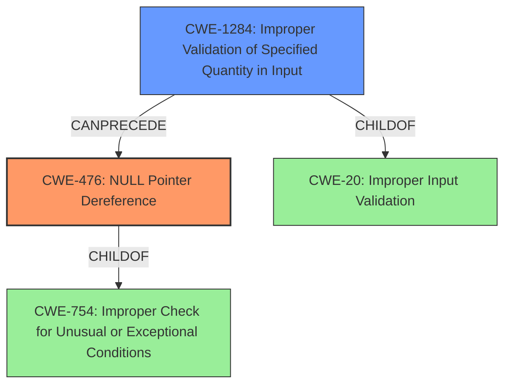

# Final Resolution for CVE-2021-29568

# Summary
| CWE ID | CWE Name | Confidence | CWE Abstraction Level | CWE Vulnerability Mapping Label | CWE-Vulnerability Mapping Notes |
|---|---|---|---|---|---|
| CWE-476 | **NULL Pointer Dereference** | 0.95 | Base | Primary | Allowed |
| CWE-1284 | **Improper Validation of Specified Quantity in Input** | 0.6 | Base | Secondary | Allowed |

## Evidence and Confidence

*   **Confidence Score:** 0.85
*   **Evidence Strength:** HIGH

## Relationship Analysis
The primary weakness is **CWE-476: NULL Pointer Dereference**, which occurs because the code dereferences a pointer that is expected to be valid but is NULL. This happens due to a missing input validation. **CWE-1284: Improper Validation of Specified Quantity in Input**, is selected as the secondary weakness since the shape is not validated and the shape is expected to specify a quantity.

## Vulnerability Chain
The vulnerability chain starts with the **ROOTCAUSE** of missing input validation (**CWE-1284: Improper Validation of Specified Quantity in Input**). This leads to the **WEAKNESS** of dereferencing a null pointer (**CWE-476: NULL Pointer Dereference**), which results in a crash (undefined behavior).

## Summary of Analysis
The initial analysis correctly identified **CWE-476: NULL Pointer Dereference** as the primary **WEAKNESS**. The criticism suggested replacing **CWE-20: Improper Input Validation** with **CWE-1284: Improper Validation of Specified Quantity in Input** as the secondary **WEAKNESS**, which is more precise since the shape is a tensor that defines the dimensions and size.

The vulnerability description states: "This is because the implementation does not validate input arguments before accessing the first element of `shape`. If `shape` argument is empty, then `shape_tensor.flat()` is an empty array." This provides direct evidence for both **CWE-476 (NULL Pointer Dereference)** and **CWE-1284 (Improper Validation of Specified Quantity in Input)**.

The relationship analysis shows that **CWE-476** is a child of **CWE-754**, and **CWE-1284** is a child of **CWE-20**. **CWE-1284** can precede **CWE-476**.

The selected CWEs are at the optimal level of specificity because they directly address the root cause (**improper input validation of shape**) and the resulting error (**null pointer dereference**).