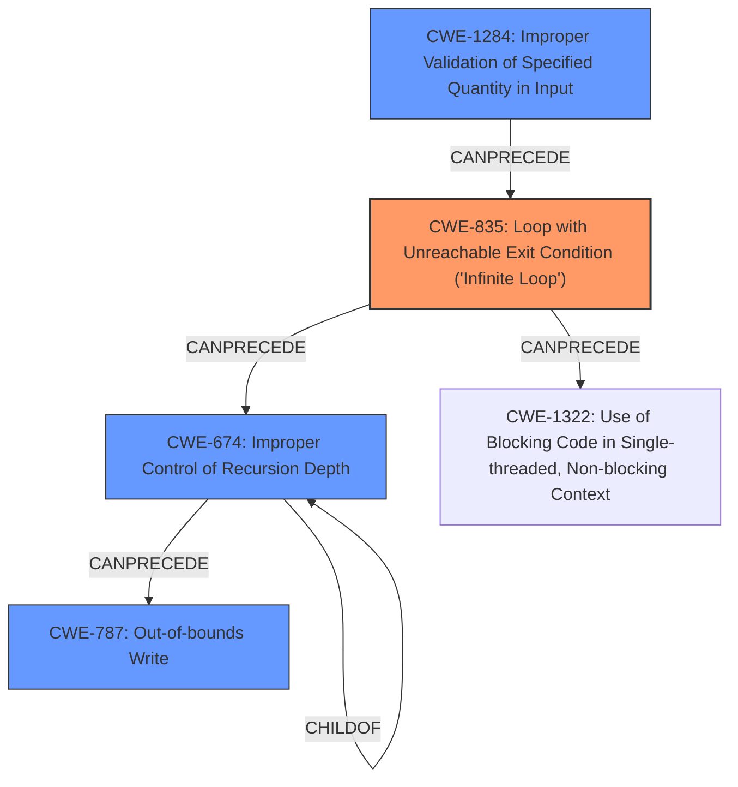

# Final Resolution for CVE-2021-29591

# Summary
| CWE ID | CWE Name | Confidence | CWE Abstraction Level | CWE Vulnerability Mapping Label | CWE-Vulnerability Mapping Notes |
|---|---|---|---|---|---|
| **CWE-835** | Loop with Unreachable Exit Condition ('Infinite Loop') | 0.90 | Base | Allowed | Primary CWE |
| **CWE-674** | Improper Control of Recursion Depth | 0.75 | Class | Allowed-with-Review | Secondary Candidate |
| **CWE-1284** | Improper Validation of Specified Quantity in Input | 0.80 | Base | Allowed | Secondary Candidate |
| **CWE-787** | Out-of-bounds Write | 0.65 | Base | Allowed | Secondary Candidate |

## Evidence and Confidence

*   **Confidence Score:** 0.85
*   **Evidence Strength:** HIGH

## Relationship Analysis
The following CWE relationships impacted my decision:
  - **CWE-835** (Infinite Loop) is the primary issue described in the vulnerability.
  - **CWE-674** (Improper Control of Recursion Depth) is a consequence of the **infinite loop**, resulting in stack overflow. While it is a Class level CWE, a more specific base CWE isn't apparent from the provided information.
  - **CWE-1284** (Improper Validation of Specified Quantity in Input) represents the **root cause**, as the lack of input validation on the graph structure allows the **infinite loop** to be created.
  - **CWE-787** (Out-of-bounds Write) is a potential consequence of stack overflow.

## Vulnerability Chain
The vulnerability chain starts with the lack of input validation (**CWE-1284**), allowing a crafted TFlite graph with **loops between nodes**. This leads to an **infinite loop** (**CWE-835**), which can then cause excessive recursive calls and stack overflow (**CWE-674**). The stack overflow can lead to an out-of-bounds write (**CWE-787**).

## Summary of Analysis
The initial analysis was well-reasoned. The criticism highlighted the need for a CWE representing the **lack of input validation**, which is the **root cause** of the vulnerability. It also identified that **CWE-125** (Out-of-bounds Read) was a weaker candidate and suggested **CWE-787** (Out-of-bounds Write) as a possible alternative, as stack overflow can lead to out-of-bounds writes. The vulnerability description mentions, "TFlite graphs must not have **loops between nodes**. However, this condition was not checked and an attacker could craft models that would result in **infinite loop** during evaluation." This, combined with the potential for stack overflow, justifies the selection of **CWE-835**, **CWE-674**, **CWE-1284**, and **CWE-787**. The graph relationships confirm this chain, with **CWE-1284** leading to **CWE-835**, which then leads to **CWE-674** and potentially **CWE-787**. These CWEs are at the optimal level of specificity based on the available evidence.