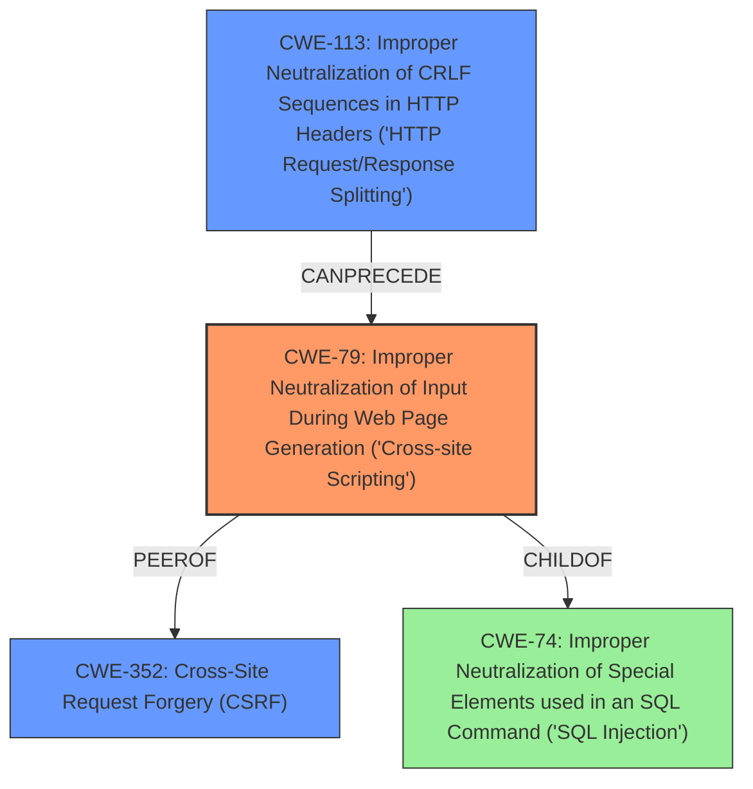

# Final Resolution for CVE-2021-29676

# Summary
| CWE ID | CWE Name | Confidence | CWE Abstraction Level | CWE Vulnerability Mapping Label | CWE-Vulnerability Mapping Notes |
|---|---|---|---|---|---|
| CWE-79 | Improper Neutralization of Input During Web Page Generation ('Cross-site Scripting') | 0.85 | Base | Allowed | Primary CWE. Link injection leads to potential XSS via a crafted URL. Likely Reflected XSS. |
| CWE-352 | Cross-Site Request Forgery (CSRF) | 0.70 | Compound | Allowed | Secondary Candidate. XSS (CWE-79) could be leveraged to steal CSRF tokens/session cookies. |
| CWE-113 | Improper Neutralization of CRLF Sequences in HTTP Headers ('HTTP Request/Response Splitting') | 0.60 | Variant | Allowed | Secondary Candidate. XSS (CWE-79) could be leveraged to perform CRLF injection leading to cache poisoning or session hijacking. |

## Evidence and Confidence

*   **Confidence Score:** 0.80
*   **Evidence Strength:** MEDIUM

## Relationship Analysis
The primary CWE is CWE-79 (Cross-site Scripting), which is a base-level CWE. It has parent-child relationships with CWE-74 and peer relationships with CWE-352. The vulnerability description suggests that the attacker could use XSS to conduct attacks, which include session hijacking and potentially cache poisoning, thereby supporting the inclusion of CWE-352 and CWE-113 as secondary candidates. The abstraction levels (Base for CWE-79, Compound for CWE-352, and Variant for CWE-113) are appropriate.

## Vulnerability Chain
The vulnerability chain starts with **link injection**, which leads to **CWE-79 (Cross-site Scripting)**. The **Cross-site Scripting** can then be used to steal session cookies or CSRF tokens, leading to **CWE-352 (Cross-Site Request Forgery)**. Additionally, **Cross-site Scripting** could be leveraged to perform CRLF injection which leads to **CWE-113 (Improper Neutralization of CRLF Sequences in HTTP Headers)**, potentially resulting in cache poisoning.

## Summary of Analysis
The initial analysis and criticism both converge on **CWE-79 (Cross-site Scripting)** as the primary **weakness**, which stems from the **link injection** vulnerability described in the vulnerability report. The report states, "By persuading a victim to click on a specially-crafted URL link, a remote attacker could exploit this vulnerability to conduct various attacks against the vulnerable system, including cross-site scripting, cache poisoning or session hijacking."

The relationship analysis highlights potential secondary vulnerabilities like **CWE-352 (Cross-Site Request Forgery)** and **CWE-113 (Improper Neutralization of CRLF Sequences in HTTP Headers)**, where the XSS could facilitate session hijacking or cache poisoning, respectively.

The selection of **CWE-79** is based on the direct evidence of **cross-site scripting** resulting from **link injection**, making it the optimal level of specificity. The secondary CWEs are selected based on the potential consequences of the **XSS vulnerability**. The confidence scores are increased based on the analysis and relationship between the vulnerabilities.

The evidence provided directly links **link injection** to **XSS**, justifying **CWE-79** as the primary classification. The potential impacts described in the vulnerability report provide sufficient justification for including **CWE-352** and **CWE-113** as secondary considerations, contingent on the attacker successfully exploiting the XSS vulnerability.